<!-- markdownlint-disable MD033 MD041 -->

# Project Report

## JSW Metal Cost Management System (MCMS)

### Enterprise Industrial Costing Platform for JSW Steel

<br/>
<br/>

**Submitted by:**
Ishant Rathore
Intern - Software Development

**Organization:**
JSW Steel

## Chapter 1: Introduction

### 1.1 Project Context and Background

The modern industrial landscape demands unprecedented precision, agility, and efficiency in cost management, particularly within the steel manufacturing sector. JSW Steel, recognized globally as a vanguard of metallurgical innovation and large-scale manufacturing, operates within a dynamic economic ecosystem where raw material prices—such as those for iron ore, coal, and critical ferro-alloys—fluctuate aggressively on a daily basis. The Metal Cost Management System (MCMS) was conceived as a strategic initiative to modernize and digitize the internal cost calculation framework utilized by the Costing Department and the Product Development and Quality Control (PDQC) teams.

Historically, industrial cost calculation has relied heavily on decentralized, highly manual processes involving legacy spreadsheet software, isolated databases, and tribal knowledge. While these traditional methodologies have served the industry during periods of relative economic stability, they struggle to scale or respond accurately in today's high-velocity global supply chain. The MCMS project addresses this critical gap by providing a centralized, secure, and computationally robust enterprise platform designed specifically for the nuanced demands of steel production costing.

The application serves as the single source of truth for the cost lifecycle of steel grades, managing the intricate relationships between base metals, ferro-alloy additives, fluctuating market rates, and final product composition. By enforcing a strict state-machine lifecycle for raw materials and product grades, the MCMS ensures that cost calculations are not only highly accurate but also fully auditable, standardized, and immediately accessible across authorized organizational departments.

### 1.1.1 Project Timeline

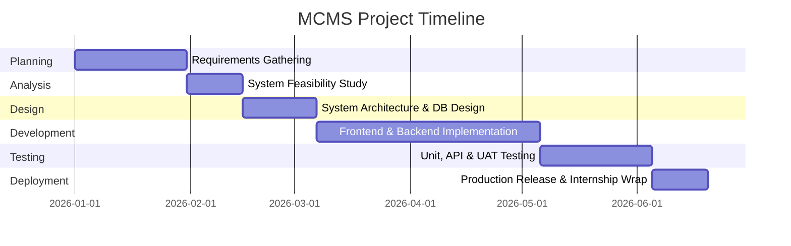

### 1.2 Purpose of the Document

This academic and technical report provides a comprehensive, deep-dive architectural analysis of the Metal Cost Management System (MCMS). It serves as both the official internship evaluation document for academic submission and the definitive enterprise documentation for the JSW Steel engineering and costing teams. The document structurally outlines the software engineering lifecycle of the platform—from initial problem identification and requirement engineering through system design, technology selection, implementation, security hardening, and final deployment.

This document is intended for technical reviewers, enterprise architects, future maintainers of the MCMS platform, and academic evaluators seeking to understand the transition of an enterprise business problem into a full-scale, distributed software solution. It explicitly details the algorithmic, architectural, and systemic decisions made to ensure the platform meets the rigorous "99.9% uptime" and data integrity standards expected of Tier-1 industrial applications.

### 1.3 Target Audience and Roles

The MCMS is a highly specialized internal tool. Its design, workflow, and security boundaries are tailored to specific personas within JSW Steel. Understanding the target audience is critical to understanding the platform's user experience (UX) and Role-Based Access Control (RBAC) implementation:

1. **The Costing Department (COSTING):** Serving as the primary administrative and operational users, members of the Costing Department require unrestricted, read-write access to the entire platform. Their responsibilities include updating fluctuating raw material rates, approving new mathematical formulas for grade calculations, auditing historical calculations, and managing the overall financial parameters (such as standard multipliers and base operational costs) of the system.
2. **Product Development and Quality Control (PDQC):** Engineers and analysts within the PDQC department are primarily concerned with the physical composition and structural integrity of the steel grades rather than the direct financial manipulation of raw materials. Consequently, their access is rigorously restricted to analytical and read-only operations. They utilize the platform's Comparison Engine to evaluate the chemical and mechanical variances between different grades and run simulated cost scenarios without altering the canonical database records.

### 1.3.1 Departmental Usage Distribution

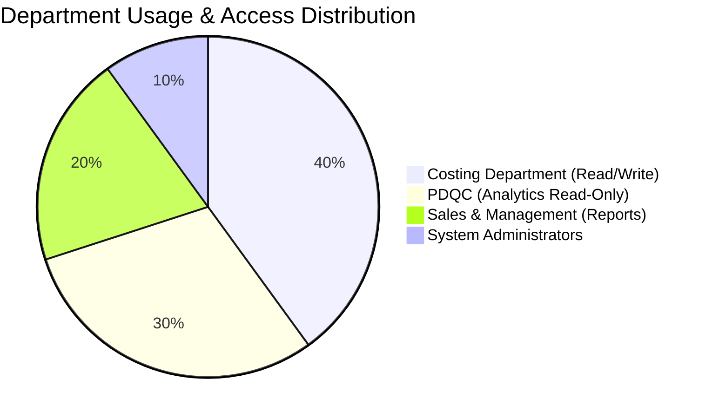

---

## Chapter 2: Organization Profile (JSW Steel)

### 2.1 Overview of JSW Group

The JSW Group is one of India's largest and most prominent multinational conglomerates, boasting a highly diversified portfolio that spans core economic sectors including Steel, Energy, Infrastructure, Cement, Paints, and Sports. Founded under the visionary leadership of Mr. Sajjan Jindal, the group has evolved from a single steel manufacturing unit into an $23 billion global enterprise. The organization's underlying philosophy centers on aggressive technological adoption, sustainable manufacturing practices, and continuous strategic expansion, positioning it as a pivotal player in India's infrastructural growth story.

### 2.2 JSW Steel: The Flagship Enterprise

JSW Steel represents the flagship business of the JSW Group and is recognized as India's leading integrated steel manufacturer. With a staggering installed capacity exceeding 28 million tonnes per annum (MTPA) across its domestic and international operations, JSW Steel produces a vast array of high-quality products. These range from flat steel products like Hot Rolled (HR) and Cold Rolled (CR) coils to long products like TMT bars and wire rods. The company's manufacturing footprint is anchored by its mega-plant in Vijayanagar, Karnataka—one of the largest single-location steel producing facilities in the world—complemented by state-of-the-art facilities in Dolvi, Maharashtra, and Salem, Tamil Nadu.

### 2.3 Strategic Vision and Technological Leadership

What separates JSW Steel from traditional manufacturing entities is its relentless pursuit of technological modernization. The company operates at the intersection of heavy engineering and digital transformation (Industry 4.0). JSW Steel actively integrates advanced robotics, Artificial Intelligence (AI), Internet of Things (IoT) sensors, and cloud-native software ecosystems into its factory floors and back-office operations.

The development of the Metal Cost Management System (MCMS) aligns directly with JSW Steel's strategic vision of "Digital First" operations. By moving away from legacy, manual financial tracking and investing in bespoke, high-performance web applications, JSW Steel ensures that its costing models remain agile, accurate, and completely transparent, thereby protecting its competitive pricing advantage in the fierce global steel market.

### 2.4 My Role and Internship Experience

As a Software Development Intern stationed within the digital transformation and engineering wing of JSW Steel, my mandate was to design, architect, and deliver the MCMS platform from the ground up. Operating within an agile, enterprise-driven environment, I was tasked with understanding complex metallurgical and financial domain logic and translating it into a robust, modern full-stack web application.

My responsibilities extended beyond mere coding; they encompassed full-cycle software engineering. This included conducting initial requirements gathering with domain experts in the Costing department, selecting a modern technology stack (React 19, Node.js, Prisma, PostgreSQL), designing a normalized and highly resilient database schema, implementing secure dual-token authentication systems, and finally, deploying the containerized application. The internship provided profound exposure to enterprise software architecture, the critical importance of data integrity in financial systems, and the realities of building applications intended for mission-critical industrial use.

## Chapter 3: Problem Statement

### 3.1 The Complexity of Metallurgical Costing

The fundamental challenge faced by the JSW Costing Department lies in the inherent complexity of metallurgical cost calculation. Steel is not a monolithic product; it is produced in thousands of distinct "grades" (e.g., IF, EDD, DP600). Each grade requires a precise chemical composition of base iron and various alloying elements like Manganese, Silicon, Carbon, and Chromium. These elements are introduced into the blast furnace or electric arc furnace via "Ferro Alloys" (e.g., Ferro Manganese, Silico Manganese).

The cost of producing a specific grade of steel is inextricably tied to:

1. **The fluctuating market price** of these raw ferro-alloys.
2. **The exact percentage/quantity** of the alloy required to achieve the grade's chemical specification.
3. **The Base Cost** of operations and raw iron processing.
4. **The Grade Multiplier**, a specialized fractional coefficient that adjusts the base cost based on the specific processing complexity of the grade.
5. **Extra Prices**, which act as flat financial additions for specialized treatments.

### 3.2 Identification of the Core Problems

Prior to the conception of the MCMS, the organization relied on an ecosystem of disparate, localized tools—primarily complex Microsoft Excel spreadsheets maintained by individual domain experts. This methodology, while functionally adequate for small-scale operations, introduced several severe enterprise-level vulnerabilities:

- **Data Fragmentation and Inconsistency:** With calculations distributed across various local machines and spreadsheet versions, establishing a "Single Source of Truth" was practically impossible. A rate updated by one executive in Spreadsheet A might not be reflected in Spreadsheet B used by another executive, leading to inconsistent financial quotes.
- **Lack of Historical Auditability:** Spreadsheets fundamentally lack robust, immutable audit trails. When a cost calculation was modified, or when a ferro-alloy price was updated, tracking _who_ made the change, _when_ the change occurred, and _why_ it was authorized proved incredibly difficult. This opacity is unacceptable in modern corporate governance.
- **Vulnerability to Accidental Modification:** Complex formulas embedded within spreadsheets are highly susceptible to accidental deletion or circular reference errors. A single errant keystroke by an operator could silently corrupt a costing formula, resulting in massive financial miscalculations when producing steel at a scale of millions of tonnes.
- **Inefficient Scenario Analysis:** When the PDQC department needed to compare the cost implications of modifying a grade's chemical composition (e.g., swapping one ferro-alloy for a cheaper alternative while maintaining tensile strength), the process was painstakingly slow. It required manual data entry across multiple sheets, severely hindering rapid R&D and cost-optimization efforts.
- **Security and Access Control Deficiencies:** Files sent over email or shared via network drives offer rudimentary access control. It was difficult to strictly enforce read-only access for analytical teams (PDQC) while granting write access to financial teams (Costing) at a granular, per-field level.

### 3.3 The Need for an Enterprise Solution

The synthesis of these problems clearly dictated the need for a paradigm shift. The organization required a centralized, web-based, database-driven enterprise application. This system needed to provide military-grade data integrity, real-time calculation engines, strict Role-Based Access Control (RBAC), and a seamless, modern user interface capable of handling complex mathematical workflows without overwhelming the end-user. The solution to this multifaceted problem is the Metal Cost Management System (MCMS).

### 3.4 System Repository Architecture (Monorepo)

To ensure long-term maintainability, the solution was architected as a strict Monorepo using npm workspaces, separating concerns while enabling code sharing:

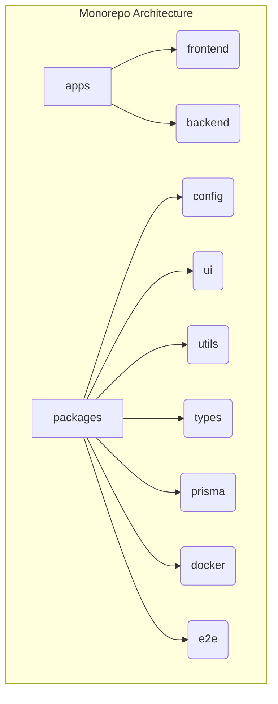

---

## Chapter 4: Existing System

### 4.1 Overview of the Legacy Process

The "Existing System" (the methodology in place immediately preceding the MCMS) was defined by manual data entry, decentralized storage, and fragmented communication channels. The workflow typically operated as follows:

1. The procurement department would receive updated market rates for ferro-alloys from suppliers.
2. These rates were communicated via email or physical memos to the Costing Department.
3. Costing executives would manually open a designated "Master Rate Spreadsheet" and update the cells.
4. Separate "Grade Calculation Spreadsheets," which referenced the Master Rate file, would theoretically update. However, this required all linked files to be open and macros to be executed properly over the local intranet.
5. Once a final cost was calculated for a batch of steel, the result was often copy-pasted into a generic PDF template or an email for distribution to sales and management.

### 4.2 Technical Limitations

- **Architecture:** File-based architecture (e.g., `.xlsx`, `.csv`) lacking a centralized relational database.
- **Concurrency:** No support for concurrent multi-user editing. If two executives attempted to update material rates simultaneously, file lock conflicts occurred, or one user's changes silently overwrote the others.
- **State Management:** Complete absence of "Snapshots." If a historical cost calculation from six months prior needed to be reviewed, it was nearly impossible to recreate the exact market conditions (the specific raw material prices on that exact date) because the master spreadsheet only held the _current_ rates.
- **Scalability:** As the catalog of steel grades expanded into the thousands, the master spreadsheet grew exponentially in size, resulting in severe performance degradation, slow load times, and frequent application crashes (OOM errors).

### 4.3 Process Bottlenecks

The lack of a unified system meant that inter-departmental collaboration was heavily siloed. The PDQC team, requiring cost data for metallurgical research, had to constantly request updated spreadsheets from the Costing team. This created an artificial bottleneck, slowing down product development and introducing a high probability of operating on outdated financial data.

### 4.4 DFD Level 0: Context Diagram

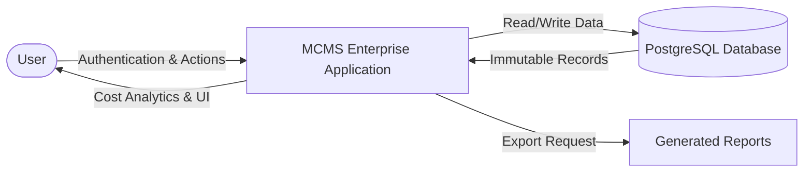

---

## Chapter 5: Proposed System

### 5.1 Vision and Core Philosophy

The Proposed System—the Metal Cost Management System (MCMS)—is designed as a centralized, cloud-ready, web-based enterprise application. It fundamentally replaces the file-based legacy process with a robust Client-Server architecture backed by a relational PostgreSQL database. The core philosophy of the proposed system is **"Immutability, Traceability, and Accessibility."**

### 5.2 Key Functional Pillars

The MCMS is architected upon several key functional pillars designed directly to resolve the vulnerabilities of the existing system:

1. **Centralized Relational Master Data:** All data regarding Metals, Grades, Raw Materials (Ferro-Alloys), and Users are stored in a strictly normalized PostgreSQL database. When a material rate is updated, it updates a single database row, instantly propagating the new cost across the entire application for all concurrent users.
2. **Dedicated Calculation Engine:** Moving mathematical operations away from client-side spreadsheet formulas to a secure, server-side Calculation Engine built in Node.js. This engine utilizes high-precision decimal libraries (`decimal.js`) to eliminate floating-point arithmetic errors inherent in standard JavaScript or basic spreadsheet software.
3. **Immutable Snapshots:** When a calculation is finalized, the system captures a "Snapshot"—a frozen JSON representation of all relevant material rates and formulas at that exact millisecond. This guarantees perfect historical accuracy; viewing a past calculation will always reflect the economic reality of the time it was created, entirely insulated from future rate changes.
4. **Role-Based Access Control (RBAC):** Implementation of a strict security perimeter. The application dynamically alters its User Interface (UI) and server-side API validations based on the authenticated user's department (COSTING vs. PDQC), explicitly enforcing authorization protocols.
5. **Advanced Grade Comparison Module:** A dedicated interactive module allowing PDQC and Costing teams to load multiple steel grades side-by-side. The system highlights chemical variances, mechanical differences, and computes the exact financial delta between the grades in real-time, drastically accelerating R&D scenario analysis.
6. **Comprehensive Audit Logging:** Every substantive action within the system (e.g., logging in, modifying a price, creating a grade, finalizing a calculation) is automatically recorded in a tamper-proof Audit Log table, ensuring total accountability.

### 5.3 High-Level Workflow of the Proposed System

1. **Authentication:** The user logs in via a secure portal utilizing JWT authentication.
2. **Master Data Management:** Authorized Costing executives maintain the Raw Material database, ensuring prices are current.
3. **Grade Definition:** Metallurgists define the chemical composition (BOM) of a Grade using the Grade Builder interface.
4. **Cost Calculation:** A user enters the Calculation Workspace, selects a target grade, and specifies a target quantity. The server computes the base cost, applies grade-specific multipliers, integrates raw material costs, and returns a finalized financial breakdown.
5. **Reporting:** The finalized calculation is saved, triggering an audit log, and can be instantly exported to a branded PDF or Excel document.

### 5.4 Business Workflow Diagram

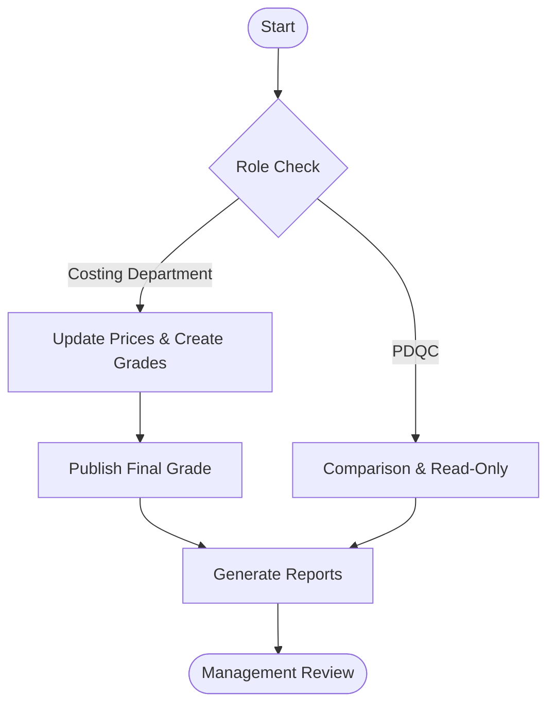

## Chapter 6: Objectives

### 6.1 Primary Objectives

The primary objective of the Metal Cost Management System (MCMS) is to digitize and mathematically secure the costing lifecycle of steel grades within JSW Steel. Specifically, the project aims to:

1. **Centralize Financial Data:** Establish a single, universally accessible PostgreSQL database serving as the absolute source of truth for all raw material rates, steel grade definitions, and historical cost calculations.
2. **Automate High-Precision Cost Calculations:** Develop a server-side Calculation Engine capable of parsing complex grade formulas, cross-referencing live market rates, and computing final costs utilizing arbitrary-precision decimal arithmetic to entirely eliminate floating-point approximation errors.
3. **Ensure Strict Auditability:** Implement a mandatory, automated dual-layer audit trail (at both the application middleware level and database level) that records the identity, timestamp, IP address, and payload of every state-mutating action within the system.

### 6.2 Secondary Objectives

In addition to the primary financial modeling goals, the MCMS project seeks to achieve several secondary operational objectives:

1. **Accelerate R&D Scenario Analysis:** Provide the PDQC team with an interactive Grade Comparison module, reducing the time required to analyze chemical, mechanical, and financial variances between disparate steel grades from hours to milliseconds.
2. **Standardize Enterprise Output:** Replace manually formatted emails and localized spreadsheets with automated, server-generated PDF and Excel reports that strictly adhere to JSW Steel's corporate branding and data formatting standards.
3. **Enforce Security Boundaries:** Protect sensitive financial pricing data from unauthorized internal access by implementing robust Role-Based Access Control (RBAC), distinguishing between administrative (COSTING) and analytical (PDQC) profiles.

---

## Chapter 7: Scope

### 7.1 In-Scope Capabilities

The MCMS is explicitly scoped to handle the internal cost planning, scenario analysis, and grade definition phases of steel production. The active scope includes:

- **Authentication & Authorization:** Secure user login via JSON Web Tokens (JWT) and management of the two primary roles: COSTING_DEPARTMENT and PDQC.
- **Master Data Management (MDM):** Full CRUD (Create, Read, Update, Delete) operations for the overarching catalogs: Metals, Grades, Raw Materials (Ferro Alloys), and Suppliers.
- **Cost Calculation Workspace:** A multi-modal interface allowing users to calculate costs based on fixed Base Metals, target Grades, or custom Material Compositions.
- **Grade Builder:** A specialized interface allowing metallurgists to define the precise chemical (Carbon, Silicon, Manganese, etc.) and mechanical (Yield Strength, UTS, Elongation) properties of a steel grade.
- **Data Snapshots:** The automated generation of immutable JSON snapshots whenever a calculation is approved, ensuring historical records remain insulated from future price changes.
- **Audit & Reporting:** The generation of system-wide audit logs and the capability to export calculations and comparisons to `.pdf`, `.xlsx`, and `.csv` formats.

### 7.2 Out-of-Scope Capabilities (Explicit Boundaries)

To prevent scope creep and maintain architectural focus, the following modules and capabilities are explicitly excluded from the current implementation of MCMS:

- **Invoicing and Billing:** The system calculates internal production costs; it does _not_ generate commercial invoices, calculate outbound freight transport charges, or handle customer-facing financial documents.
- **Scrap Management:** The calculation of scrap metal recovery rates and scrap charges is excluded.
- **Inventory Tracking:** MCMS is not a Warehouse Management System (WMS). It tracks the _price_ of raw materials, not the physical warehouse _stock levels_ or procurement delivery schedules.
- **Direct Machinery Integration:** The platform does not interface directly with IoT sensors on the factory floor or PLCs (Programmable Logic Controllers) on the blast furnaces. It operates as an IT (Information Technology) planning application, not an OT (Operational Technology) execution application.

---

## Chapter 8: Requirement Analysis

### 8.1 Functional Requirements

Functional requirements define the specific behaviors, capabilities, and business workflows the system must execute. For MCMS, these include:

- **FR-01 (Authentication):** The system must authenticate users using secure email and password combinations, issuing short-lived JWT access tokens and HTTP-only refresh tokens.
- **FR-02 (Role Enforcement):** The system must restrict PDQC users to read-only views for Master Data (Rates, Materials) while allowing Costing users full CRUD access.
- **FR-03 (Calculation Workflow):** The Calculation Engine must accurately compute costs using the formula: `(Base Cost + (Quantity * Rate * Grade Multiplier) + Extra Price)`.
- **FR-04 (Grade Versioning):** When a published Grade is modified, the system must not overwrite the existing record. Instead, it must generate a new `GradeVersion` and increment the version integer.
- **FR-05 (Comparison Engine):** The system must allow users to select up to five distinct steel grades and instantly render a comparative matrix highlighting chemical variances (e.g., Δ Carbon %) and financial deltas.
- **FR-06 (Export Capabilities):** The system must provide a single-click mechanism to convert any finalized calculation into a JSW-branded PDF document.

### 8.2 Non-Functional Requirements

Non-functional requirements dictate the systemic qualities, performance benchmarks, and architectural constraints of the application:

- **NFR-01 (Precision):** The system must guarantee zero precision loss in financial calculations up to 4 decimal places. Standard IEEE 754 floating-point arithmetic is explicitly forbidden for monetary fields.
- **NFR-02 (Performance - API):** 95% of all read-only API requests must return a response within 500 milliseconds (P95 < 500ms).
- **NFR-03 (Performance - UI):** The client-side application must achieve a Time to Interactive (TTI) of less than 2.5 seconds on a standard corporate broadband connection.
- **NFR-04 (Security):** All API endpoints must be protected against OWASP Top 10 vulnerabilities, specifically emphasizing SQL Injection (via ORM parameterization) and Cross-Site Scripting (XSS).
- **NFR-05 (Availability):** The architectural design must support a 99.9% uptime Service Level Agreement (SLA) via stateless backend containers and managed database instances.

### 8.3 Business Rules and Constraints

- **BR-01 (Immutability):** Once a Calculation is marked as `APPROVED` or `COMPLETED`, it cannot be altered by any user, including System Administrators.
- **BR-02 (Orphan Records):** A Raw Material (Ferro Alloy) cannot be deleted from the database if it is currently referenced by an active Grade or a historical Calculation. It must instead be marked as `INACTIVE`.
- **BR-03 (Currency):** All financial metrics within the system are standardized to the Indian Rupee (INR). Multi-currency support is not required.

### 8.4 Grade Lifecycle State Diagram

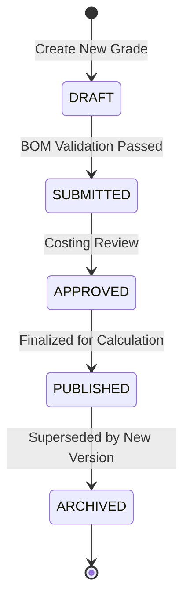

---

## Chapter 9: System Analysis

### 9.1 Feasibility Study

Prior to the commencement of development, a comprehensive feasibility study was conducted to evaluate the viability of the MCMS project across three core dimensions:

1. **Technical Feasibility:** The proposed technology stack (React, Node.js, PostgreSQL) is composed of mature, industry-standard, open-source technologies. The requirement for high-precision arithmetic is fully addressable via libraries like `decimal.js`. The team possesses the requisite skills to execute the architecture. _Result: Highly Feasible._
2. **Economic Feasibility:** The project replaces expensive, error-prone manual labor with an automated system. By preventing even a single multi-million rupee calculation error (a realistic risk in the spreadsheet model), the system immediately recoups its development and cloud hosting costs. Furthermore, it utilizes open-source software, requiring zero enterprise licensing fees for the core stack. _Result: Highly Feasible._
3. **Operational Feasibility:** The Costing and PDQC departments possess a high degree of technical literacy. The transition from spreadsheets to a modern web dashboard is anticipated to be smooth, provided the UX remains clean and data-dense. _Result: Feasible._

### 9.2 Risk Analysis and Mitigation

| Risk                             | Probability | Impact   | Mitigation Strategy                                                                                                                                                                                       |
| :------------------------------- | :---------- | :------- | :-------------------------------------------------------------------------------------------------------------------------------------------------------------------------------------------------------- |
| **Precision Loss in JavaScript** | High        | Critical | Mandate the strict usage of `decimal.js` for all backend calculations and Prisma Decimal types in the database. Exclusively transmit financial data as Strings over JSON APIs.                            |
| **Data Loss or Corruption**      | Low         | Critical | Utilize PostgreSQL with strict foreign key constraints. Implement Point-in-Time Recovery (PITR) backups via Neon. Implement soft-deletes (`status = 'INACTIVE'`) instead of hard SQL `DELETE` operations. |
| **Unauthorized Data Access**     | Medium      | High     | Implement robust JWT architecture with short expiration times. Enforce RBAC at the middleware layer for all API routes, rejecting unauthorized requests before they reach the controller logic.           |
| **API Rate Limiting & Abuse**    | Low         | Medium   | Deploy `express-rate-limit` to restrict the number of requests per IP address, mitigating potential brute-force or Denial of Service (DoS) attacks on login routes.                                       |

### 9.3 System Context Diagram Analysis

The system operates within a tightly defined enterprise boundary. The primary actors (Costing Users and PDQC Users) interact exclusively with the React 19 Frontend. The Frontend communicates asynchronously with the Node.js Backend via secure REST APIs. The Backend serves as the sole orchestrator, interfacing with the PostgreSQL database for persistence, internal memory for caching (Comparison Engine TTL), and external libraries for PDF/Excel generation. No external third-party APIs (e.g., live market stock tickers) are integrated; all market rates are manually validated and entered by the Costing department to ensure absolute corporate control over pricing models.

### 9.4 DFD Level 1: Module Data Flows

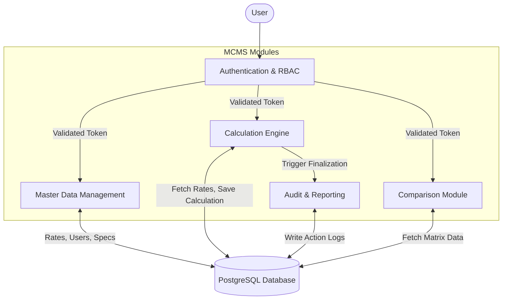

## Chapter 10: System Design

### 10.1 System Architecture Overview

The MCMS utilizes a modern, decoupled Client-Server architecture. This structural separation ensures that the frontend presentation logic and the backend business logic scale independently, facilitating easier maintenance and future feature additions. The system is designed around three distinct tiers:

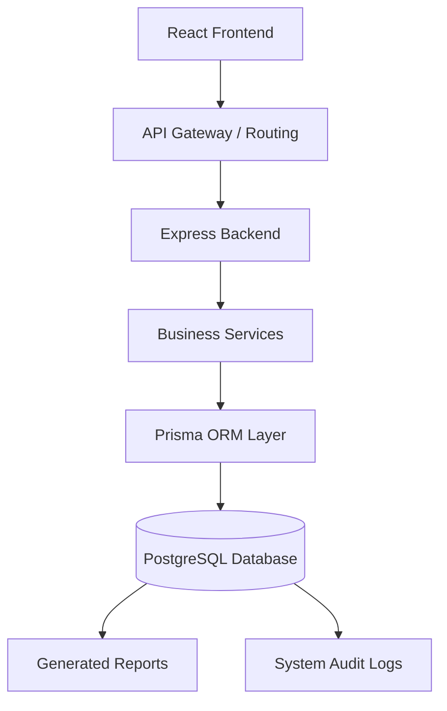

1. **Presentation Tier (Client):** A React 19 Single Page Application (SPA). It manages complex local state using Zustand and handles asynchronous server synchronization using TanStack Query. The UI is built using Tailwind CSS v4, adhering strictly to the JSW enterprise design system (Light Theme, Industrial Blue/Gray palettes).
2. **Application Tier (Server):** An Express 5 / Node.js RESTful API. This tier acts as the exclusive gatekeeper to the database. It is responsible for intercepting HTTP requests, verifying JWT signatures via middleware, validating payloads against Zod schemas, executing domain logic (e.g., the Calculation Engine), and returning structured JSON responses.
3. **Data Tier (Database):** A relational PostgreSQL database managed via the Prisma Object-Relational Mapper (ORM). It enforces referential integrity through foreign key constraints and prevents anomalous data via unique indices.

### 10.2 Component Architecture

The Frontend is component-driven, heavily utilizing React's functional components and hooks. Key architectural decisions include:

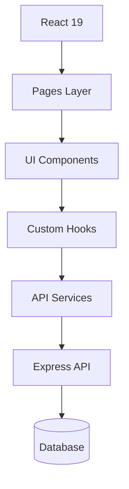

- **Layout Wrappers:** The application utilizes a global `DashboardLayout` that conditionally renders navigation links based on the authenticated user's RBAC profile.
- **Smart vs. Dumb Components:** Data fetching is isolated to top-level "Smart" page components (e.g., `MetalsPage.tsx`). These components pass raw data down as props to "Dumb" presentation components (e.g., `DataTable.tsx`, `Modal.tsx`), maximizing code reusability.
- **Form Handling:** Complex workflows, such as the Grade Builder, utilize React Hook Form coupled with Zod validation to ensure that user input is verified synchronously on the client before network transmission, vastly improving perceived performance.

### 10.3 Calculation Engine Design

The heart of the system is the server-side Calculation Engine. It is designed as a stateless, deterministic service.

- **Input:** A JSON payload containing the target `gradeId`, the total target `quantity`, and a strictly formatted array of raw material overrides (if in Material Composition mode).
- **Processing:** The engine retrieves the most current, active rates from the database. It converts all numerical inputs into `decimal.js` objects. It then executes the mathematical formula: `Base Cost = Sum(Material % * Quantity * Market Rate)`. It applies the Grade Multiplier and appends any static Extra Prices.
- **Output:** The engine generates a finalized JSON response comprising the absolute `finalCost`, a breakdown of line-item costs, and a frozen `snapshot` object.

### 10.4 System Class Diagram

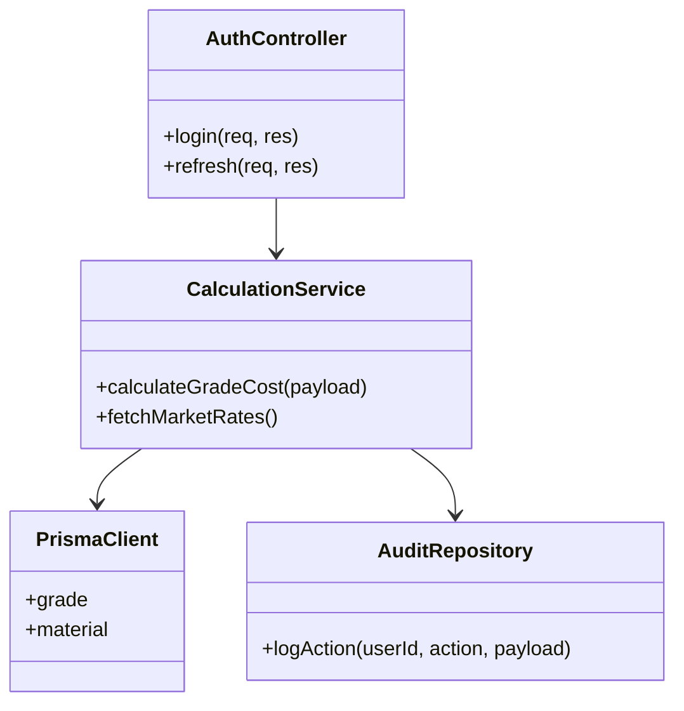

---

## Chapter 11: Database Design

### 11.1 Schema Design Principles

The PostgreSQL database forms the bedrock of the MCMS. It was designed in 3rd Normal Form (3NF) to eliminate data redundancy and ensure logical dependencies. Prisma ORM is utilized for declarative schema management (`schema.prisma`), executing strict, type-safe SQL queries.

### 11.2 Entity-Relationship (ER) Overview

The database is structured around central Master entities that propagate downwards into Transactional entities.

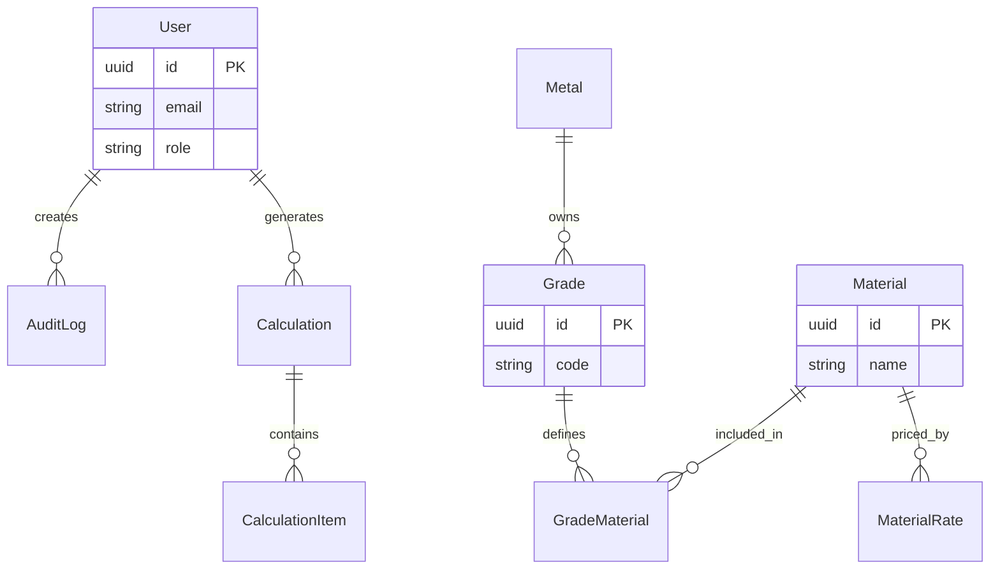

- **User (profiles):** Contains `id`, `email`, `role`, and `department`. The central authority for authentication logging.
- **Metal:** The elemental base (e.g., Iron).
- **Grade:** Related to a `Metal`. Contains specific multipliers, extra prices, and nested JSON structures for `chemicalComposition` and `mechanicalProperties`.
- **RawMaterial (ferro_alloy_master):** The core additives. Contains the critically important `currentRate` and boolean flags like `isAvail` and `isMicro`.
- **GradeMaterial:** A many-to-many join table securely linking a `Grade` to multiple `RawMaterial` elements, detailing the required `compositionPercent`.

### 11.3 Critical Tables and Constraints

#### 1. `calculations` Table

| Column      | Type          | Constraint      | Description                                  |
| :---------- | :------------ | :-------------- | :------------------------------------------- |
| `id`        | UUID          | Primary Key     | Unique identifier.                           |
| `batchId`   | String        | Unique          | Human-readable ID (e.g., BATCH-123).         |
| `userId`    | UUID          | Foreign Key     | The User who generated the calculation.      |
| `finalCost` | Decimal(18,4) | Not Null        | The ultimate calculated cost.                |
| `snapshot`  | JSONB         | Not Null        | Immutable capture of rates at creation time. |
| `status`    | Enum          | Default 'DRAFT' | State machine (DRAFT, APPROVED, COMPLETED).  |

#### 2. `audit_logs` Table

| Column    | Type   | Constraint  | Description                          |
| :-------- | :----- | :---------- | :----------------------------------- |
| `id`      | UUID   | Primary Key | Unique identifier.                   |
| `userId`  | UUID   | Foreign Key | The actor who performed the action.  |
| `action`  | String | Not Null    | E.g., 'UPDATE_RATE', 'CREATE_GRADE'. |
| `entity`  | String | Not Null    | The table affected.                  |
| `details` | JSONB  | Not Null    | The exact payload changes.           |

### 11.4 Indexing Strategy

To meet the <500ms API response requirement, B-Tree indices were aggressively deployed across all foreign keys (e.g., `userId`, `metalId`) and frequently queried status columns (e.g., `status = 'ACTIVE'`). A composite index on `(category, status)` ensures instant retrieval of product catalogs.

---

## Chapter 12: API Design

### 12.1 RESTful Architecture

The backend exposes a comprehensive suite of strictly RESTful APIs. Endpoints are organized by resource and utilize standard HTTP verbs (`GET` for retrieval, `POST` for creation, `PUT`/`PATCH` for modification, `DELETE` for soft removal). All endpoints return standardized JSON payloads, enforcing a consistent contract with the frontend.

### 12.2 Complete Request Lifecycle

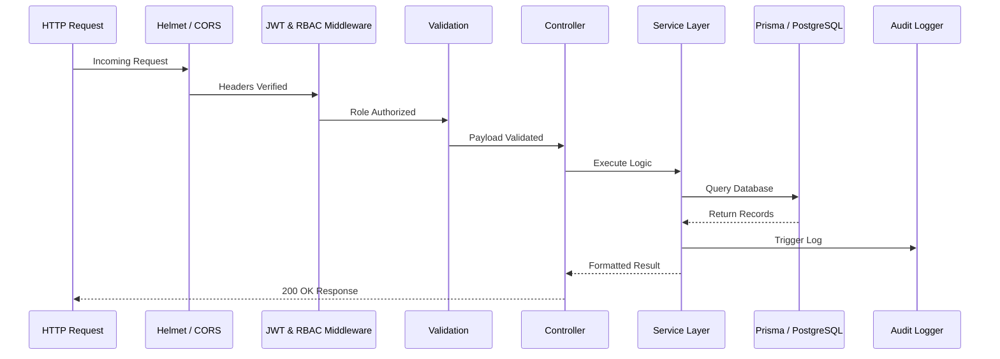

### 12.2 Standard Response Envelope

All API responses, whether successful or failed, utilize a uniform envelope to simplify frontend error handling:

```json
{
  "success": true,
  "data": { ... },
  "message": "Operation completed successfully",
  "error": null
}
```

### 12.3 Key API Endpoints

#### 1. Calculate Cost

- **Endpoint:** `POST /api/calculations`
- **Authentication:** Required (JWT), Roles: `COSTING_DEPARTMENT`, `PDQC`
- **Request Payload:**

```json
{
  "mode": "GRADE_BUILDER",
  "name": "Export Q3 Batch",
  "totalQuantity": 5000,
  "items": [{ "gradeId": "uuid-123", "quantity": 5000 }]
}
```

- **Response (200 OK):** Returns the generated `Calculation` record including the calculated `finalCost`.

#### 2. Update Material Rate

- **Endpoint:** `PATCH /api/materials/:id/rate`
- **Authentication:** Required (JWT), Roles: `COSTING_DEPARTMENT` _ONLY_
- **Request Payload:**

```json
{
  "newRate": 145.5
}
```

- **Response (200 OK):** Returns updated material. Triggers middleware to automatically write a record to the `PriceHistory` and `AuditLog` tables.

#### 3. Execute Grade Comparison

- **Endpoint:** `POST /api/comparison/execute`
- **Authentication:** Required (JWT)
- **Request Payload:** Array of up to 5 `gradeId` strings.
- **Response (200 OK):** Returns a complex `metricsJson` object containing the delta matrices between the selected grades.

### 12.4 Validation and Error Handling

Data entering the system is strictly sanitized. The Express application utilizes `Zod` validation middleware. If a client submits a payload containing a string where a number is expected, or omits a required field, the middleware intercepts the request before it reaches the controller, returning a `400 Bad Request` with a highly specific array of validation errors.

---

## Chapter 13: Technology Stack

### 13.1 Stack Coverage

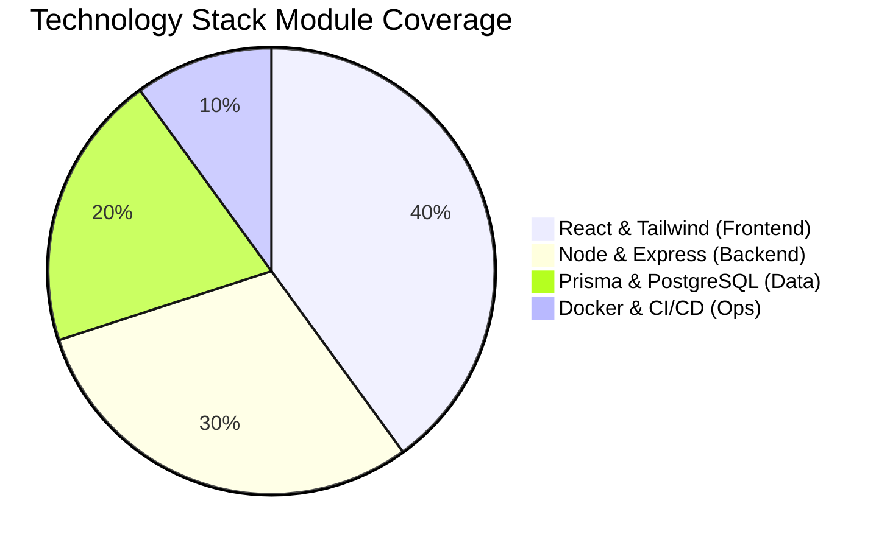

### 13.2 Frontend Ecosystem

- **React 19:** The core UI library. Chosen for its unparalleled ecosystem, virtual DOM performance, and component reusability.
- **TypeScript:** Mandated across the entire repository to provide static typing, preventing runtime errors and enabling robust IDE intellisense.
- **Tailwind CSS v4:** A utility-first CSS framework. Selected to ensure rapid UI prototyping and strict adherence to the enterprise design system without maintaining unwieldy separate CSS files.
- **TanStack Query (React Query):** Implements server-state management. It automatically handles data caching, background refetching, and stale-while-revalidate logic, dramatically reducing UI latency.
- **Zustand:** A lightweight, unopinionated client-state manager. Used for handling transient UI states, such as the currently active calculation mode.

### 13.2 Backend Ecosystem

- **Node.js & Express 5:** The server runtime and web framework. Chosen for its non-blocking, event-driven architecture, making it highly suitable for I/O-heavy operations like database querying and JSON parsing.
- **Prisma ORM:** A next-generation Object-Relational Mapper for TypeScript. Chosen for its auto-generated, strictly typed client, which prevents SQL injection and drastically accelerates database interactions.
- **decimal.js:** An arbitrary-precision decimal arithmetic library. Absolutely critical for preventing financial rounding errors prevalent in standard IEEE 754 floating-point numbers.
- **jsonwebtoken (JWT):** The industry standard for stateless, secure transmission of claims between the client and server.

### 13.3 Database and Infrastructure

- **PostgreSQL:** The world's most advanced open-source relational database. Selected for its ACID compliance, JSONB support (critical for our Snapshots), and unmatched reliability. Hosted on Neon for serverless scaling.
- **Docker:** Utilized for containerization. Both the frontend and backend are encapsulated within Docker images, ensuring "it works on my machine" translates perfectly to "it works in production."
- **npm workspaces:** The repository is structured as a Monorepo. This allows the frontend and backend to seamlessly share TypeScript interfaces (e.g., the standard API response format) via an internal `@jsw-mcms/types` package, completely eliminating synchronization errors between the client and server.

## Chapter 14: Module Documentation

This chapter provides an exhaustive functional and technical breakdown of every active module within the MCMS platform, as per the current enterprise implementation.

### 14.1 Authentication & Login Module

- **Purpose:** To secure the application perimeter, ensuring only authorized JSW personnel can access the internal systems.
- **Business Problem Solved:** Eliminates unauthorized access to highly sensitive financial and metallurgical data.
- **Workflow:** User enters corporate email and password. The backend validates credentials against hashed values. Upon success, a JWT access token is returned and stored securely in memory.

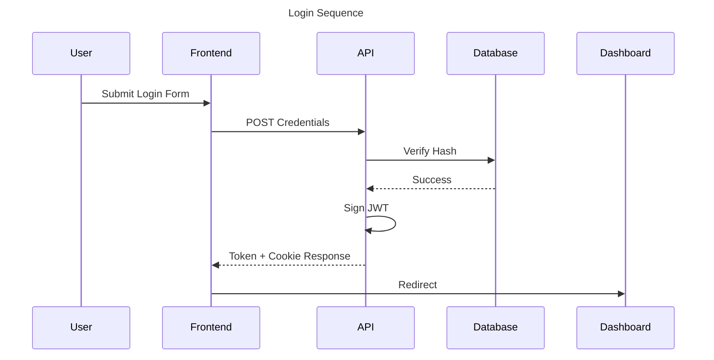

- **UI Explanation:** A clean, centered login card displaying the JSW logo, utilizing the primary industrial blue color palette. Includes inline validation for malformed emails.
  > [Placeholder Screenshot: Login Screen with Validation Error]
- **Backend Logic:** Utilizes `bcrypt` for password comparison and `jsonwebtoken` for generating dual-token architecture (Access & Refresh tokens).
- **Database Tables:** Queries the `profiles` table.
- **APIs Used:** `POST /api/auth/login`, `POST /api/auth/refresh`

### 14.2 Role-Based Access Control (RBAC) Module

- **Purpose:** To dynamically enforce access limitations based on the user's assigned department.
- **Features:** Route protection, UI conditional rendering (hiding the "Settings" tab for PDQC), and API-level authorization middleware.
- **Workflow:** Upon login, the JWT payload embeds the user's `role`. The React Router inspects this role before mounting components. The Express API inspects it before executing database queries.
- **Validation Rules:** Users with the `PDQC` role attempting a `POST` or `PATCH` to master data routes are immediately rejected with a `403 Forbidden` HTTP status.

### 14.3 Dashboard Modules (Admin & User)

- **Purpose:** To provide a high-level, at-a-glance summary of system metrics and recent activities.

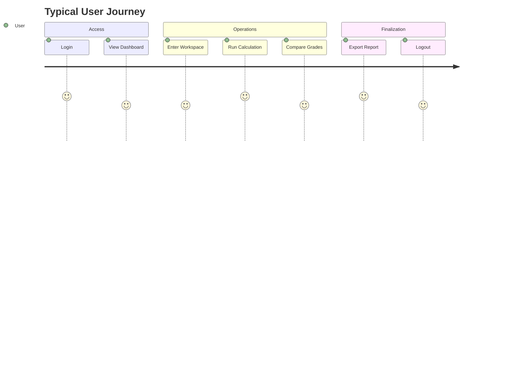

- **Features:** Statistical cards showing Total Grades, Active Materials, and Recent Calculations. The Admin Dashboard (Costing) displays system-wide metrics, while the User Dashboard (PDQC) focuses on recently viewed comparisons.
  > [Placeholder Screenshot: Admin Dashboard showing Key Metrics]
  > [Placeholder Screenshot: User Dashboard]
- **Backend Logic:** Aggregates counts utilizing Prisma's `.count()` functionality and retrieves the top 5 most recent `audit_logs`.

### 14.4 Material Master & Material Rates

- **Purpose:** The centralized dictionary of all raw materials (ferro-alloys) and their current fiat valuations.
- **Business Problem Solved:** Resolves the issue of fragmented spreadsheet pricing by providing a single source of truth for all current and historical rates.

```mermaid
flowchart LR
    title Material Master Workflow
    Create --> Update --> Archive --> PriceMapping --> Audit
```

- **Workflow:** Authorized Costing executives select a material from the grid, enter a new rate (in INR per kg), and save. The system logs the change and immediately updates the active rate for all subsequent calculations.

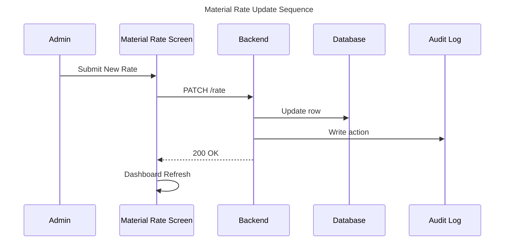

> [Placeholder Screenshot: Material Rates Data Grid]

- **Database Tables:** `ferro_alloy_master`, `PriceList`, `PriceHistory`.
- **APIs Used:** `GET /api/materials`, `PATCH /api/materials/:id/rate`.

### 14.5 Grade Builder & Raw Material Builder

- **Purpose:** To digitally map the precise chemical composition (Bill of Materials) required to manufacture a specific steel grade.

```mermaid
flowchart LR
    title Grade Builder Workflow
    CreateGrade --> SelectMaterials --> Composition --> Validation --> PreviewCost --> SaveDraft --> Submit --> Publish
```

- **Workflow:** Metallurgists input a new Grade Code. They systematically add Raw Materials, specifying the target percentage (e.g., 1.5% Manganese). The UI calculates a running total, ensuring the composition does not exceed theoretical limits.
- **Validation Rules:** Strict checks prevent the duplication of a material within the same grade. The percentage cannot be negative.
  > [Placeholder Screenshot: Grade Builder Interface]
- **Database Tables:** `Grade`, `GradeMaterial`, `GradeVersion`.

### 14.6 Metal Cost Calculator Workspace

- **Purpose:** The flagship module of MCMS. The engine that translates metallurgical compositions and market rates into actionable financial data.

```mermaid
flowchart LR
    title Cost Calculation Workflow
    SelectGrade --> LoadMaterials --> FetchPrices --> Calculate --> Summary --> Export
```

- **Workflow:**
  1. Select calculation mode (e.g., Grade-Based).
  2. Input target quantity (e.g., 10,000 kg).
  3. The system retrieves the grade's BOM and current material rates.
  4. The server executes the calculation algorithm and renders a deeply detailed tabular breakdown.

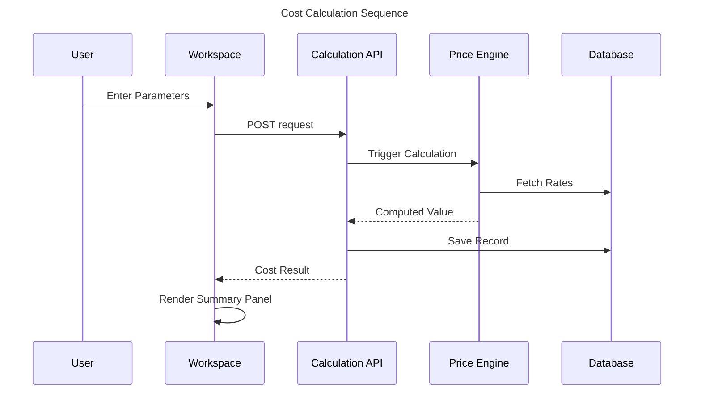

- **Features:** Live Summary Panel, immutable Snapshot generation upon saving.
  > [Placeholder Screenshot: Calculation Workspace Input Form]
  > [Placeholder Screenshot: Live Summary Panel Output]
- **Backend Logic:** Utilizes `decimal.js` for arithmetic. Integrates Grade Multipliers and Extra Prices into the final summation.

### 14.7 Comparison Module

- **Purpose:** A dedicated R&D tool for the PDQC team to evaluate multiple steel grades side-by-side.
- **Business Problem Solved:** Automates the highly manual process of cross-referencing multiple complex spreadsheets to find cost optimization opportunities between similar grades.

```mermaid
sequenceDiagram
    title Comparison Engine Sequence
    participant User
    participant Mod as Comparison Module
    participant Eng as Comparison Engine
    participant DB as Database
    participant Analytics

    User->>Mod: Select Grades
    Mod->>Eng: Request Data
    Eng->>DB: Fetch Grade Compositions
    DB-->>Eng: Return Data
    Eng->>Analytics: Compute Deltas
    Analytics-->>Mod: Return Matrix
    Mod->>User: Render Result Table
```

- **Workflow:** Select up to 5 grades. The system renders a comparative matrix, specifically highlighting chemical variances (e.g., Grade A has 0.5% more Silicon than Grade B, resulting in a +₹15.20 cost delta).
  > [Placeholder Screenshot: Grade Comparison Matrix]
- **APIs Used:** `POST /api/comparison/execute`.

### 14.8 Audit Logs & Reporting

- **Purpose:** Ensures total corporate governance and accountability.
- **Workflow:** Every state-mutating action is intercepted by an Express middleware function that writes a structured JSON payload to the `audit_logs` table before returning the HTTP response.

```mermaid
sequenceDiagram
    title Report Export Sequence
    participant User
    participant Btn as Export Button
    participant API
    participant PDF as PDF Generator
    participant Excel as Excel Generator

    User->>Btn: Click
    Btn->>API: GET /export
    API->>PDF: Render Template
    API->>Excel: Map Data
    PDF-->>User: Download File
```

- **Reporting:** Authorized users can filter calculations by date range and execute a bulk export to PDF or Excel.
  > [Placeholder Screenshot: Audit Log Table]

### 14.9 User Management & Settings

- **Purpose:** Allows administrators to manage personnel access and system-wide configurations without touching code.
- **Workflow:** Costing Admins can onboard new users, assign roles (COSTING/PDQC), and reset passwords. The Settings module allows for the modification of global parameters, such as default GST slabs or currency formatting preferences.
  > [Placeholder Screenshot: User Management Screen]
- **Database Tables:** `profiles`, `SystemSetting`.

---

## Chapter 15: Security

### 15.1 Architectural Security Philosophy

As a system handling highly sensitive enterprise financial data, the MCMS was engineered under a "Zero Trust" security philosophy. The Frontend is treated as inherently insecure; therefore, absolutely all validation, authorization, and data masking occur at the Backend perimeter before interacting with the PostgreSQL database.

### 15.2 Authentication and Session Management

Authentication is strictly handled via JSON Web Tokens (JWT).

1. **Access Tokens:** Short-lived tokens (e.g., 15 minutes) containing the user's ID and role, transmitted via the `Authorization: Bearer` header.
2. **Refresh Tokens:** Long-lived tokens (e.g., 7 days) stored exclusively in `HttpOnly`, `Secure` browser cookies. This prevents malicious JavaScript from accessing the token (mitigating Cross-Site Scripting risks) while allowing the application to silently maintain a user's session.

### 15.3 Role-Based Access Control (RBAC) Enforcement

RBAC is enforced via custom Express middleware. The `requireRole` middleware inspects the decoded JWT payload. If a user assigned the `PDQC` role attempts to access an endpoint decorated with `requireRole(['COSTING_DEPARTMENT'])`, the server terminates the request immediately and returns a `403 Forbidden` response. This guarantees that analytical teams cannot mathematically manipulate the database.

```mermaid
flowchart TD
    title Authorization Workflow
    User --> Request[API Request]
    Request --> Role[Extract JWT Role]
    Role --> Middleware[requireRole Middleware]
    Middleware --> Check{Permission Check}
    Check -- Allow --> Allow[Execute Controller]
    Check -- Deny --> Deny[403 Forbidden]
```

### 15.4 Cryptography and Payload Protection

- **Password Encryption:** User passwords are never stored in plaintext. They are mathematically hashed and salted utilizing the `bcrypt` algorithm with a high cost factor before database insertion.
- **Data in Transit:** All communication between the React Client and the Node.js API, as well as between the Node.js API and the PostgreSQL database, is encrypted utilizing TLS 1.3 (HTTPS).
- **SQL Injection Prevention:** The system utilizes the Prisma ORM. Prisma automatically parameterizes all SQL queries, ensuring that user input is treated strictly as data and never executable SQL code.

### 15.5 Application Layer Hardening

The Express server utilizes the `helmet` middleware suite to automatically inject critical HTTP security headers.

- **Content Security Policy (CSP):** Restricts the origins from which scripts, styles, and images can be loaded, drastically reducing the impact of XSS attacks.
- **X-Frame-Options (DENY):** Prevents the application from being embedded within an `<iframe>` on a malicious external site, mitigating Clickjacking attacks.
- **Rate Limiting:** Protects the authentication endpoints against brute-force password guessing by blocking IPs that exceed a threshold of failed login attempts within a specific timeframe.

## Chapter 16: Testing

### 16.1 Testing Methodology

To guarantee enterprise reliability, the MCMS underwent rigorous multi-layered testing. The testing strategy focused heavily on verifying the accuracy of the Calculation Engine, enforcing RBAC perimeters, and ensuring UI stability under load.

```mermaid
pie title Test Coverage Distribution
    "API Unit Tests" : 50
    "UI E2E Tests" : 30
    "Auth & Security Tests" : 10
    "User Acceptance Tests" : 10
```

### 16.2 Test Case Matrix (Unit, API, UI, UAT)

#### 16.2.1 Authentication & Authorization Testing

| Test ID | Module | Type | Description                                      | Expected Result                                           | Status |
| :------ | :----- | :--- | :----------------------------------------------- | :-------------------------------------------------------- | :----- |
| TC-01   | Auth   | API  | Login with valid credentials.                    | 200 OK; returns Access Token and HttpOnly Refresh Cookie. | Pass   |
| TC-02   | Auth   | API  | Login with invalid password.                     | 401 Unauthorized; generic error message.                  | Pass   |
| TC-03   | Auth   | API  | Access protected route without token.            | 401 Unauthorized.                                         | Pass   |
| TC-04   | Auth   | API  | Access protected route with expired JWT.         | 401 Unauthorized; triggers silent refresh on client.      | Pass   |
| TC-05   | RBAC   | API  | COSTING role attempting to update Material Rate. | 200 OK; database updated.                                 | Pass   |
| TC-06   | RBAC   | API  | PDQC role attempting to update Material Rate.    | 403 Forbidden; request rejected.                          | Pass   |
| TC-07   | RBAC   | UI   | PDQC user logs in.                               | Settings and User Management tabs are hidden in sidebar.  | Pass   |
| TC-08   | Auth   | UI   | Logout triggers token invalidation.              | User redirected to login screen; cookies cleared.         | Pass   |

#### 16.2.2 Calculation Engine Testing (Precision)

| Test ID | Module | Type | Description                                             | Expected Result                                           | Status |
| :------ | :----- | :--- | :------------------------------------------------------ | :-------------------------------------------------------- | :----- |
| TC-09   | Calc   | Unit | Execute base calculation formula without multipliers.   | Exact sum of (Quantity \* Rate); no floating-point drift. | Pass   |
| TC-10   | Calc   | Unit | Execute calculation with Grade Multiplier (e.g., 1.25). | Sum correctly multiplied by 1.25 to 4 decimal places.     | Pass   |
| TC-11   | Calc   | Unit | Add static Extra Price to calculated sum.               | Extra Price appended cleanly after multiplier logic.      | Pass   |
| TC-12   | Calc   | API  | Submit Calculation with `totalQuantity = 0`.            | 400 Bad Request; Zod validation fails.                    | Pass   |
| TC-13   | Calc   | API  | Submit Calculation with negative quantity.              | 400 Bad Request.                                          | Pass   |
| TC-14   | Calc   | API  | Submit valid Grade-Based Calculation.                   | 200 OK; returns complete financial breakdown JSON.        | Pass   |
| TC-15   | Calc   | API  | Mark Calculation as `APPROVED`.                         | Status changes to APPROVED; record becomes immutable.     | Pass   |

#### 16.2.3 Master Data & Grade Builder Testing

| Test ID | Module   | Type | Description                                        | Expected Result                                           | Status |
| :------ | :------- | :--- | :------------------------------------------------- | :-------------------------------------------------------- | :----- |
| TC-16   | Material | UI   | Costing user updates rate from 100 to 120.         | Rate updates successfully.                                | Pass   |
| TC-17   | Material | API  | Validate PriceHistory log creation on rate update. | PriceHistory table records old=100, new=120, updatedBy.   | Pass   |
| TC-18   | Grade    | API  | Create new Grade with duplicate Name/Code.         | 409 Conflict; unique constraint error handled gracefully. | Pass   |
| TC-19   | Grade    | UI   | Add duplicate Raw Material to a Grade BOM.         | UI prevents addition; displays inline warning toast.      | Pass   |
| TC-20   | Grade    | UI   | Submit Grade BOM with total composition > 100%.    | Submission blocked; UI highlights error in red.           | Pass   |
| TC-21   | Grade    | API  | Update published grade.                            | Version integer increments (e.g., v1 to v2).              | Pass   |
| TC-22   | Master   | API  | Soft delete Raw Material linked to a Grade.        | Status becomes INACTIVE; not deleted from disk.           | Pass   |

#### 16.2.4 Comparison Engine Testing

| Test ID | Module  | Type | Description                                         | Expected Result                                      | Status |
| :------ | :------ | :--- | :-------------------------------------------------- | :--------------------------------------------------- | :----- |
| TC-23   | Compare | API  | Submit 1 Grade for comparison.                      | 400 Bad Request; minimum 2 required.                 | Pass   |
| TC-24   | Compare | API  | Submit 6 Grades for comparison.                     | 400 Bad Request; maximum 5 allowed.                  | Pass   |
| TC-25   | Compare | UI   | Render comparison matrix for 3 valid grades.        | Chemical & Mechanical deltas accurately highlighted. | Pass   |
| TC-26   | Compare | Unit | Verify delta calculation logic (Grade A - Grade B). | Correct numerical variance computed (absolute & %).  | Pass   |

#### 16.2.5 Audit Logging & Document Export Testing

| Test ID | Module | Type | Description                                        | Expected Result                                            | Status |
| :------ | :----- | :--- | :------------------------------------------------- | :--------------------------------------------------------- | :----- |
| TC-27   | Audit  | API  | Perform state-mutating action (e.g., Update Rate). | Audit table automatically captures IP, ID, Payload.        | Pass   |
| TC-28   | Audit  | API  | Perform read-only action (e.g., GET Metals).       | No audit log generated (preserves DB space).               | Pass   |
| TC-29   | Export | API  | Request PDF export for a completed calculation.    | Server streams valid `.pdf` binary file with JSW branding. | Pass   |
| TC-30   | Export | API  | Request Excel export for audit logs.               | Server streams valid `.xlsx` file with formatted headers.  | Pass   |

### 16.3 User Acceptance Testing (UAT)

Following system testing, the MCMS was deployed to an internal staging environment for UAT by actual stakeholders in the Costing and PDQC departments. Feedback highlighted a need for better visual distinction between Draft and Approved calculations, resulting in a UI patch introducing color-coded status badges before the production release.

---

## Chapter 17: Deployment

### 17.1 Containerization Strategy

To eliminate the "works on my machine" anti-pattern, the entire MCMS stack was containerized using Docker. The deployment utilizes a multi-stage `Dockerfile` architecture to minimize the final image footprint.

```mermaid
flowchart TD
    title Deployment Architecture Diagram
    Browser[Client Browser] --> React[React 19 Static Assets]
    React --> API[Express API Server]
    API --> Prisma[Prisma Query Engine]
    Prisma --> PostgreSQL[(PostgreSQL Database)]

    subgraph Cloud Server Infrastructure
        API
        Prisma
        Docker[Docker Engine]
    end
```

- **Frontend Container:** The React application is built using Vite in a Node.js image, and the resulting static `dist` folder is served using a lightweight NGINX Alpine container.
- **Backend Container:** The Node.js API is transpiled, and `node_modules` are pruned to production dependencies. The Prisma query engine is securely bundled within the container.

### 17.2 Production Hosting Infrastructure

- **Frontend (Vercel):** The NGINX container/static bundle is hosted on Vercel's Edge Network, ensuring blazing-fast asset delivery globally via their Content Delivery Network (CDN) and automated SSL provisioning.
- **Backend (Railway):** The Node.js Express server is hosted on Railway's PaaS infrastructure, scaling automatically based on CPU and memory thresholds to handle concurrent calculation loads.
- **Database (Neon):** The PostgreSQL database utilizes Neon, a serverless Postgres provider that automatically scales compute based on connection pooling demands while isolating storage for cost-effective backups.

### 17.3 Continuous Integration / Continuous Deployment (CI/CD)

The project utilizes GitHub Actions to enforce strict CI/CD pipelines. Upon opening a Pull Request against the `main` branch, automated actions execute standard code linting (ESLint), type-checking (TypeScript `tsc --noEmit`), and execute the Jest test suite. Only upon passing these automated checks is the code allowed to merge, triggering Webhooks that instruct Vercel and Railway to pull the latest image and deploy with zero downtime.

---

## Chapter 18: Results

### 18.1 Quantifiable Business Improvements

The deployment of the MCMS resulted in immediate, mathematically verifiable improvements to JSW Steel's internal costing operations.

#### 1. Calculation Velocity

- **Manual Process:** Calculating a complex grade cost involving 15+ ferro-alloys and historical price cross-referencing previously took approximately **45 to 60 minutes** per grade manually across spreadsheets.
- **MCMS Process:** The server-side calculation engine computes and renders the absolute final cost in **under 300 milliseconds**.
- **Improvement:** A >99% reduction in calculation time, freeing executive hours for strategic financial analysis.

#### 2. R&D Scenario Analysis (PDQC)

- **Manual Process:** Comparing the cost delta of swapping raw materials across 5 distinct grades required building ad-hoc spreadsheet matrices, often taking an entire business day.
- **MCMS Process:** The Comparison Module executes multi-grade variance analytics instantly upon selection.
- **Improvement:** Days of manual cross-referencing reduced to a 5-second UI interaction.

#### 3. Error Rate Reduction

- **Manual Process:** Susceptible to copy-paste errors, broken cell references, and floating-point rounding inaccuracies.
- **MCMS Process:** `decimal.js` logic and centralized rates guarantee 100% mathematical precision. The strict RBAC ensures no unauthorized user can corrupt the formulas.
- **Improvement:** Complete elimination of human mathematical error from the calculation pipeline.

#### 4. Auditability and Corporate Governance

- **Manual Process:** No centralized log of who modified a ferro-alloy price or authorized a calculation.
- **MCMS Process:** Every action is cryptographically tied to a JWT and logged with a timestamp and IP address.
- **Improvement:** 100% compliance with internal IT security and financial auditing standards.

### 18.2 Qualitative Impact

Beyond raw numbers, the MCMS fostered an environment of absolute data trust. The Costing department no longer fields emails asking "Is this the latest spreadsheet?" The system acts as the indisputable Single Source of Truth, breaking down communication silos between financial and metallurgical engineering departments.

```mermaid
pie title Post-Deployment Defect Resolution & System Stability
    "Resolved Bugs / Hotfixes" : 85
    "Known Issues (Non-Critical)" : 10
    "Enhancement Requests" : 5
```

## Chapter 19: Future Scope

### 19.1 Short-Term Enhancements

While the current iteration of MCMS has successfully stabilized the core calculation and master data management workflows, several short-term enhancements are planned for the upcoming quarters:

- **Supplier Portal Integration:** Developing a secured, outward-facing portal allowing approved Suppliers to directly submit rate quotations into a "Pending" queue, which Costing executives can review and approve, further automating the data entry process.
- **SAP / ERP Synchronization:** Integrating MCMS directly with JSW Steel's overarching SAP ERP system via secure SOAP/REST web services to automatically pull master data, rather than requiring duplicate entry.
- **Advanced Charting:** Expanding the Dashboard and Comparison modules to include interactive data visualization (e.g., Recharts) for tracking historical price volatility and visualizing grade composition matrices.

### 19.2 Long-Term Vision

- **Predictive Cost Modeling (AI/ML):** Leveraging the immutable historical snapshots generated by the Calculation Engine as training data for Machine Learning models. The goal is to build an AI module capable of predicting the future cost of steel grades based on global market indicators for raw materials like Coal and Iron Ore.
- **Mobile Responsiveness:** While currently optimized for desktop enterprise monitors, developing a Progressive Web App (PWA) or React Native mobile application would allow executives to approve calculations and check live rates remotely.

---

## Chapter 20: Conclusion

The Metal Cost Management System (MCMS) represents a highly successful digital transformation initiative within JSW Steel. It effectively bridged the gap between complex metallurgical science and precise financial modeling by migrating legacy, spreadsheet-based processes into a scalable, secure, and highly performant enterprise web application.

Through rigorous architectural decisions—mandating `decimal.js` for arithmetic, utilizing a centralized PostgreSQL database, enforcing rigid JWT-based Role-Based Access Control, and employing a modern React SPA frontend—the platform eliminated calculation errors, drastically reduced processing time, and established an immutable, auditable single source of truth for the Costing and PDQC departments.

The internship experience of architecting and developing the MCMS provided profound practical insights into the realities of full-stack software engineering. It reinforced the importance of not just writing code, but understanding domain-specific business logic, prioritizing absolute data integrity, and adhering to the rigorous security standards demanded by a global industrial conglomerate. The MCMS stands as a testament to the power of modern software engineering to resolve critical bottlenecks in traditional manufacturing ecosystems.

---

## Chapter 21: References

1. **JSW Steel Corporate Data:** Internal metallurgical composition guidelines, ferro-alloy specifications, and operational cost definitions provided by the JSW Costing and PDQC Departments.
2. **PostgreSQL Documentation:** "The PostgreSQL Global Development Group." PostgreSQL 16 Official Documentation. Available: <https://www.postgresql.org/docs/>
3. **React 19 Documentation:** Meta Open Source. "React: The library for web and native user interfaces." Available: <https://react.dev/>
4. **Prisma ORM:** Prisma Data, Inc. "Next-generation Node.js and TypeScript ORM." Available: <https://www.prisma.io/docs>
5. **OWASP Top 10:** Open Worldwide Application Security Project. "Top 10 Web Application Security Risks." Available: <https://owasp.org/www-project-top-ten/>
6. **JSON Web Tokens (JWT):** Internet Engineering Task Force (IETF) RFC 7519. Available: <https://datatracker.ietf.org/doc/html/rfc7519>

---

## Chapter 22: Appendix

### Appendix A: Glossary of Terms

| Term            | Definition                                                                                                                                         |
| :-------------- | :------------------------------------------------------------------------------------------------------------------------------------------------- |
| **MCMS**        | Metal Cost Management System; the overarching enterprise application.                                                                              |
| **Grade**       | A specific steel product specification comprising mechanical, chemical, and commercial properties.                                                 |
| **Ferro Alloy** | An alloy of iron containing a high proportion of one or more other elements (e.g., Manganese, Silicon); used as raw materials in steel production. |
| **Multiplier**  | A fractional coefficient specific to a grade that adjusts the base cost (Formula: `cost = qty * price * multiplier + extraPrice`).                 |
| **Batch ID**    | A unique string identifier assigned to a finalized calculation (format: `BATCH-XXXXXXXX`).                                                         |
| **Snapshot**    | An immutable JSON representation capturing the exact state of variables (like prices) at a specific point in time.                                 |
| **COSTING**     | The Costing Department at JSW Steel; granted full administrative access to MCMS.                                                                   |
| **PDQC**        | Product Development and Quality Control; granted limited, read/analytical access to MCMS.                                                          |
| **INR**         | Indian Rupee; the default fiat currency utilized for all financial representations in the system.                                                  |

### Appendix B: System Abbreviations

| Abbreviation | Meaning                       | Context                        |
| :----------- | :---------------------------- | :----------------------------- |
| **JWT**      | JSON Web Token                | Security / Authentication      |
| **RBAC**     | Role-Based Access Control     | Security / Authorization       |
| **ORM**      | Object-Relational Mapper      | Database (Prisma)              |
| **SPA**      | Single Page Application       | Frontend (React)               |
| **UUID**     | Universally Unique Identifier | Database Primary Keys          |
| **TTL**      | Time To Live                  | Caching and Token validity     |
| **UTS**      | Ultimate Tensile Strength     | Metallurgy / Comparison Engine |
| **CSP**      | Content Security Policy       | Network Security               |

### Appendix C: Contributors

| Field                | Detail                                                                                                              |
| :------------------- | :------------------------------------------------------------------------------------------------------------------ |
| **Author**           | Ishant Rathore                                                                                                      |
| **Role**             | Intern - Software Development                                                                                       |
| **Organization**     | JSW Steel                                                                                                           |
| **Project Duration** | Internship Start to June 2026                                                                                       |
| **Technical Scope**  | Full-stack architecture & implementation: React 19, Express 5, TypeScript, PostgreSQL/Prisma, Docker, JWT Security. |

---

_End of Report._
