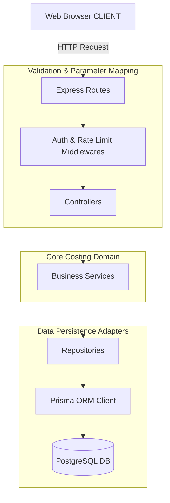
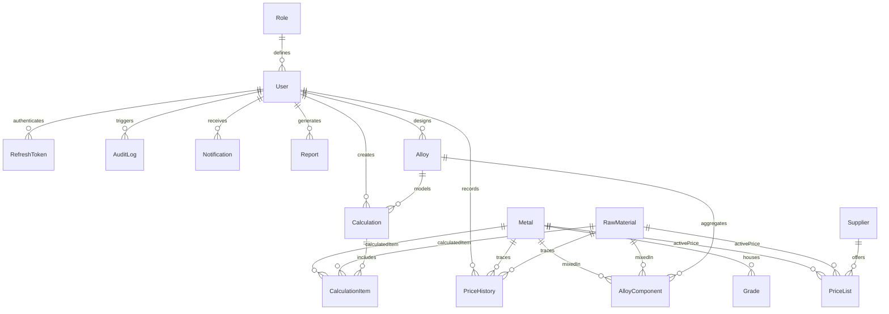

# ⚙️ PRODUCT REQUIREMENTS DOCUMENT (PRD)
## Project Name: Metal Cost Management System (MCMS)
### Client: JSW Steel
**Document Version:** 1.0.0  
**Date:** May 31, 2026  
**Document Status:** Approved  
**Target Environment:** Centralized Web Platform  

---

## 📋 1. Executive Summary

The **JSW Metal Cost Management System (MCMS)** is an enterprise-grade, industrial decision-support and price modeling application designed specifically for **JSW Steel**. Within steel manufacturing and metallurgy operations, cost calculation is historically prone to errors caused by fragmented price sheets, complex grade multipliers, and dynamic tax structures. MCMS centralizes raw metal pricing data, manages complex grade parameters, provides an interactive workspace for cost calculation, and enables side-by-side comparison modeling.

> [!IMPORTANT]
> **Definitive Architectural Boundary:** MCMS is strictly a specialized costing worksheet calculator and decision-support workspace. It is **not** an Enterprise Resource Planning (ERP) platform. It purposefully excludes physical inventory tracking, supply chain logistics, direct procurement transactions, vendor invoicing, and general ledger accounting. It acts as a high-precision, read-and-evaluate companion workspace that interfaces with core data inputs.

Through this centralized pricing engine, JSW Steel engineering, finance, and procurement departments can perform real-time costing projections with mathematical precision (using arbitrary-precision decimal libraries to eliminate floating-point rounding errors), generate immutable auditing footprints, and export standardized calculation receipts for commercial clearances.

---

## 🏢 2. Business Problem

Historically, JSW Steel costing departments have encountered significant commercial and operational friction due to decentralized data systems and manual costing workflows:

1. **Fragmentation of Price Masterlists:** Procurement teams update raw material price lists across separate local spreadsheets. Production engineers calculating alloy costs frequently utilize outdated raw material prices, leading to inaccurate sales and production costing quotes.
2. **Precision Auditing Failures (IEEE 754 Floating-Point Errors):** Standard spreadsheet tools (like Excel) and standard Javascript engines evaluate calculations using binary floating-point representation. Over large-scale batches (e.g., thousands of metric tons of raw alloys), microscopic floating-point rounding errors aggregate into thousands of Rupees of discrepancy.
3. **Immutable History and Compliance Gaps:** When an administrator or procurement specialist updates a raw metal's base price in the database, historically finalized calculations dynamically recalculate if they reference live tables. This breaks the financial audit trail. Calculations completed in the past must remain permanently locked to the exact prices and coefficients active at the precise millisecond of their creation.
4. **Alloy Building & Comparison Complexity:** Production engineers spend hours manualizing and comparing the economic trade-offs between different grade compositions (e.g., comparing chemical tolerances of SS-304 vs. SS-316 under dynamic tariff changes). The lack of a side-by-side cost modeling workspace delays procurement decisions and procurement agility.

---

## 🎯 3. Objectives

The primary engineering and business objectives of JSW MCMS are:

- **Centralization of Pricing Truth:** Establish a single, authoritative repository for raw metals, grades, suppliers, raw materials, and tax configurations (GST Slabs).
- **High-Precision Evaluation Engine:** Centralize costing formulas into a robust backend calculation service utilizing `Decimal.js` to ensure 100% mathematical auditability.
- **Historical Data Freeze:** Implement a robust **Transaction Snapshot Pattern** where completed calculations store full JSON dumps of grades, suppliers, and locked prices, shielding finalized receipts from future master table updates.
- **Granular Security Controls:** Implement a rigid Role-Based Access Control (RBAC) matrix separating Administrative, Procurement, Financial, and Production Engineering domains.
- **Optimized Performance:** Ensure quick visual feedback with a dashboard loading in less than 2 seconds, and calculator API responses in under 500 milliseconds.

---

## 📊 4. Scope

To guarantee engineering focus and maintain a high-velocity development cycle, the scope of MCMS is strictly bounded:

### 4.1. In-Scope Features
*   **Authentication & Session Control:** JWT-based stateless request authorization with secure, rotating, cross-site scripting (XSS) resistant `HttpOnly` refresh token cookies.
*   **Granular RBAC Guards:** Authoritative server-side middleware and reactive client-side route intercepters for four dedicated roles: `ADMIN`, `PROCUREMENT`, `FINANCE`, and `PRODUCTION`.
*   **Metal & Raw Material Master:** Interactive CRUD systems for raw metals, raw materials, and suppliers.
*   **Grade Parameterization System:** Mapping of specific alloy grade coefficients, extra chemical surcharges, and mechanical properties.
*   **Costing Worksheet Engine:** Live, reactive workspace that handles single-metal or multi-component alloy costing computations in a multi-step wizard.
*   **Comparison & Simulation Matrix:** Interactive tool for comparing metals and grades side-by-side with dynamic visual highlight indicators.
*   **Server-Sent Events (SSE) Alerts:** Real-time push updates for system notifications (e.g., price modifications, authentication failures).
*   **Document Exports:** Compiling binary PDF cost receipts using PDFKit and downloading tabular report aggregates via ExcelJS.

### 4.2. Out-of-Scope Features
*   **Physical Inventory / Warehouse Tracking:** No tracking of physical warehouses, bin coordinates, stock levels, or reorder points.
*   **Procurement / Billing Transactions:** No generation of active purchase orders, vendor invoices, or direct wire transfers.
*   **AI/ML Price Forecasting:** No integration of predictive modeling networks or forecasting algorithms.
*   **Native Mobile Application:** The project is engineered solely as a responsive Web Application (Desktop-optimized with adaptive Tablet/Mobile viewing support).

---

## 👥 5. User Personas

To guide the user experience (UX) layout and interaction design of MCMS, we define four core operational personas at JSW Steel:

### 5.1. Amit Sharma — Production Engineer
*   **Department:** Metallurgy and Production Planning (JSW Dolvi Plant)
*   **Role in System:** Production User (`PRODUCTION`)
*   **Pain Points:** Spends too much time manually looking up prices for chemical composition batches. Excel calculations often drift from actual vendor contract prices.
*   **Usage Pattern:** Amit utilizes the Cost Calculation Workspace daily. He inputs required alloy structures, compares cost profiles between different grades, saves draft calculations, and downloads PDF receipts to hand off to manufacturing coordinators.

### 5.2. Priya Patel — Procurement Specialist
*   **Department:** Global Raw Material Sourcing
*   **Role in System:** Procurement Specialist (`PROCUREMENT`)
*   **Pain Points:** Communicating price fluctuations of base metals (Steel, Aluminum, Zinc, Nickel) to engineering teams is slow. Needs a centralized place to record supplier price updates and audit old price sheets.
*   **Usage Pattern:** Priya focuses entirely on the Metal Master, Raw Material listings, and Supplier directories. She uses the Price Master update workspace to adjust price-per-unit metrics and views price revision graphs.

### 5.3. Rajesh Iyer — Finance Controller
*   **Department:** Commercial Clearances & Corporate Audit
*   **Role in System:** Finance Auditor (`FINANCE`)
*   **Pain Points:** Cost calculations are frequently audited, but Excel files can be edited after approvals, leaving no secure transaction trail.
*   **Usage Pattern:** Rajesh audits completed calculations. He configures official GST tax slabs, reviews locked costing calculations, and exports monthly calculation sheets in Excel format for administrative reporting.

### 5.4. Sanjay Gupta — IT & Systems Administrator
*   **Department:** JSW Corporate IT Services
*   **Role in System:** Admin (`ADMIN`)
*   **Pain Points:** Needs absolute visibility into security incidents. Must easily block or re-verify personnel access during transitions.
*   **Usage Pattern:** Sanjay utilizes the administration dashboard to manage user credentials, override emergency parameters, track login attempts, and monitor detailed security audit logs.

---

## 🔑 6. User Roles & Permissions

The application enforces a highly strict authorization boundaries utilizing standard JSON Web Tokens (JWT) signed by an HM-SHA256 secret.

### 6.1. Role Definitions
1.  **`ADMIN` (System Administrator):** Complete operational clearance. Possesses user management, database override capabilities, system settings adjustments, and complete audit log access.
2.  **`PROCUREMENT` (Procurement Specialist):** Responsible for raw material tables, suppliers, and active price listings.
3.  **`FINANCE` (Finance Controller):** Manages regulatory parameters (GST Slabs), reviews locked sheets, and performs audit verification exports.
4.  **`PRODUCTION` (Production Engineer):** Builds costing worksheets, designs custom alloys, and runs grade simulations.

### 6.2. Permissions Authorization Matrix

| Feature Module | Endpoint Path Prefix | Admin | Procurement | Finance | Production |
| :--- | :--- | :---: | :---: | :---: | :---: |
| **User Management** | `/api/users/*` | **Write / Read** | Denied | Denied | Denied |
| **Audit Logs View** | `/api/audit-logs/*` | **Read Only** | Denied | Denied | Denied |
| **System Settings** | `/api/settings/*` | **Write / Read** | Denied | **Read Only** | Denied |
| **GST Slabs Setup** | `/api/gst-slabs/*` | **Write / Read** | Denied | **Write / Read** | Denied |
| **Manage Metals Master** | `/api/metals/*` | **Write / Read** | **Write / Read** | Read Only | Read Only |
| **Update Metal Prices** | `/api/prices/*` | **Write / Read** | **Write / Read** | Read Only | Read Only |
| **Workspace Calculations**| `/api/calculations/*` | **Read Only** | Denied | Read Only | **Write / Read** |
| **Grade Comparisons** | `/api/comparisons/*` | Read Only | Denied | **Read Only** | **Write / Read** |
| **Notifications SSE** | `/api/notifications/*` | **Read Only** | **Read Only** | **Read Only** | **Read Only** |

---

## ⚙️ 7. Functional Requirements

### 7.1. Dashboard Module
*   **Dashboard KPI Cards:** Displays core administrative metrics. For administrators, it lists Total Calculations, Active Users, and Active Alerts. For engineers, it shows Own Calculations, Draft Worksheets, and Recent System Price Updates.
*   **Price Revision Trends:** Renders visual representations of base metal price trajectories using a high-performance chart component.
*   **Real-time Activity Stream:** Connects to a Server-Sent Events (SSE) listener to display immediate alerts when procurement personnel update master prices or when access violations occur.
*   **Quick Actions Panel:** Provides rapid navigation shortcuts (e.g., "Build New Calculation", "Compare Grades", "Modify Price List").

### 7.2. Metal Master Module
*   **Central Metal Registry:** Full CRUD framework for defining industrial raw metals (e.g., Stainless Steel, Carbon Steel, Aluminum, Nickel, Copper, Zinc).
*   **Code Unique Indexing:** Every metal must carry a unique industrial designation code (e.g., `SS-304`, `CS-102`).
*   **Measurement Standard:** Supports setting default industrial units (e.g., `kg`, `metric ton`, `unit`).
*   **Search & Dynamic Filters:** Integrates search fields with dropdown selectors filtering by Category (Ferrous vs. Non-Ferrous) and Status (Active vs. Inactive).

### 7.3. Grade Management Module
*   **Grade Profiling:** Enables nesting multiple custom grades under a specific parent metal.
*   **Math Coefficients:**
    *   `multiplier`: A decimal value representing chemical and process modifiers (e.g., `1.0500` for premium high-strength alloys).
    *   `extraPrice`: A static direct surcharge (e.g., `500.00 INR/kg` for custom polish or protective treatments).
*   **Property Mapping:** Stores JSON structures defining:
    *   `mechanicalProperties` (Yield strength, Tensile limits, Elongation rates).
    *   `chemicalComposition` (Carbon % caps, Chromium levels, Nickel content).
    *   `toleranceProperties` (Dimensional accuracy limits).

### 7.4. Cost Calculation Workspace
*   **Dual Computation Modes:**
    1.  *Single Metal Mode:* Calculates the cost structure of a single metal type.
    2.  *Alloy Builder Mode:* Integrates multiple base metals, grades, and raw materials into a complex composite composition percentage.
*   **Live Preview Service:** Computes calculation items instantly in-memory, displaying cost structures before committing changes to PostgreSQL.
*   **Draft Preservation:** Saves the cost calculation worksheet as a `DRAFT` status, allowing ongoing adjustments.
*   **Transaction Snapshot Locking:** When the calculation status moves to `COMPLETED`, the costing engine:
    1.  Locks the current `pricePerUnit` of all included items.
    2.  Saves a complete JSON payload containing the grades, prices, and multipliers into the database `snapshot` column.
    3.  Marks the worksheet status as `COMPLETED`, rendering it fully immune to future price updates.

### 7.5. Comparison Table Module
*   **Multi-Item Matrix:** Supports selecting up to 4 distinct metals or grades and displaying their properties in a side-by-side alignment dashboard.
*   **Visual Delta Highlighting:** Dynamically colors price differentials (e.g., green indicators for cheaper alternatives, red indicators for cost premiums).
*   **Tolerance Overlay:** Compares mechanical tensile values alongside cost metrics, assisting engineers in choosing cost-optimal grades that meet mechanical specifications.

### 7.6. Reports Module
*   **Paginated Audit Reports:** List calculations by Date Range, Department, Metal Type, and Creator User.
*   **Receipt PDF Compilation:** Generates structured binary PDF invoices containing corporate headers, mathematical formula blocks, locked snapshot metadata, and QR verification codes.
*   **Aggregated Data Exports:** Downloads records in Excel/CSV formats with auto-sized column widths, correct cell types, and dynamic financial summaries.

### 7.7. Audit Logs Module
*   **Security Logs Table:** Automatically records critical changes in the database.
*   **Session Logs:** Records login attempts, successful sessions, dynamic IP address headers, and repeated password failures.
*   **Audit Actions Schema:**
    *   *System Price Updates:* Logs the editor's User ID, modified metal code, previous price, and new price.
    *   *Calculation Completion:* Records the finalized batch ID and cost sums.

### 7.8. Notifications Module
*   **Server-Sent Events Stream:** Maintains a persistent connection to immediate alerts.
*   **Notification Priorities:** Categorizes warnings:
    *   `HIGH` (Emergency price overrides, locked accounts).
    *   `MEDIUM` (Procurement price list adjustments).
    *   `LOW` (General report completions).

---

## 🧮 8. Cost Calculation Formulation

To guarantee mathematical auditing and eliminate discrepancies, cost calculations are centralized inside the backend engine (`CalculationService.ts`) and use the **`Decimal.js`** library to prevent floating-point calculation drift.

### 8.1. Base Calculations
For every active line item in the calculation workspace, the base cost is evaluated using:

$$\text{ItemBaseCost} = (\text{Quantity} \times \text{LockedUnitPrice} \times \text{GradeMultiplier}) + \text{GradeExtraFee}$$

Where:
*   **`Quantity`** $\mathbf{(Q)}$: The mass or count of the raw metal.
*   **`LockedUnitPrice`** $\mathbf{(UP_L)}$: The master-locked unit cost sourced from the active `PriceList` for the specified metal/raw material.
*   **`GradeMultiplier`** $\mathbf{(M_G)}$: The coefficient defined on the grade profile (e.g., `1.0500`).
*   **`GradeExtraFee`** $\mathbf{(F_{G\_Extra})}$: The direct surcharge added for specific custom grades.

The overall costing metrics are then compiled across all items:

$$\text{CalculatedBaseCost} = \sum_{i=1}^{n} \text{ItemBaseCost}_i$$

$$\text{GstAmount} = \text{CalculatedBaseCost} \times \text{GstSlabRate}$$

$$\text{FinalCost} = \text{CalculatedBaseCost} + \text{GstAmount}$$

Where **`GstSlabRate`** is the active tax percentage parsed from the selected `GstSlab` (e.g., `0.1800` for 18% GST).

---

## 📐 9. Non-Functional Requirements

### 9.1. Performance & Latency
*   **Dashboard Interactive Time:** Dashboard data widgets must load within **< 2.0 seconds** under 100 concurrent system requests.
*   **API Latency Target:** Standard REST API database transactions (writes/reads) must resolve in **< 500ms** (95th percentile).
*   **Optimized Price Queries:** Price master lookups must leverage optimized indexing, resolving database queries in **< 10ms**.
*   **Asset Footprint:** Frontend SPA build assets must yield less than **500 KB** total gzip-compressed footprint.

### 9.2. Security & Compliance
*   **Stateless JWT Authentication:** Short-lived access tokens valid for 15 minutes, passed in the HTTP `Authorization: Bearer` header.
*   **Token Rotation:** Long-lived `HttpOnly`, `Secure`, `SameSite=Strict` rotating refresh cookies stored within database hashes to prevent Session Hijacking.
*   **Password Hashing:** Enforces Argon2 or bcrypt password hashing (minimum 10 salt rounds).
*   **Input Sanitization:** Uses Zod schemas for server-side payload validation, blocking raw SQL injection and Cross-Site Scripting (XSS).

### 9.3. Scalability & Database
*   **Monorepo Workspaces:** Clean partition between Express REST API micro-services, React UI layers, and modular config types.
*   **Connection Pooling:** Connects to PostgreSQL using pooled database transactions, capping active server pool connections to prevent performance degradation under concurrent loads.
*   **Indexing Strategy:** Enforces specific multi-column composite indices on high-lookup tables (e.g., `PriceList`, `Calculation`, `Notification`).

### 9.4. Usability & Ergonomics
*   **Corporate Aesthetics:** Built using professional JSW corporate dark/light design systems, high-quality typography, and clear financial tables.
*   **Responsive Adaptations:** Fully responsive grid and flexbox structures that adjust layouts cleanly for Desktop, Tablet, and Mobile views.
*   **Error Messaging:** Standardized user notifications with clear error codes, preventing technical stack trace exposures.

---

## 🏛️ 10. System Architecture

The JSW MCMS is organized as a high-performance **npm Workspaces Monorepo**. This structure isolates the concerns of the API server, frontend React SPA, and shared packages, ensuring rapid local building and flexible deployment models.

### 10.1. Codebase Directory Topology
```text
jsw-mcms/
├── .github/                      # CI/CD Workflows
│   └── workflows/
│       └── ci.yml                # Automatic build, lint, and test runner
├── apps/                         # Deployable Applications
│   ├── backend/                  # Authoritative Costing Express API
│   └── frontend/                 # Interactive React ERP Dashboard Client
├── packages/                     # Shared Monorepo Workspaces
│   ├── config/                   # Shared TSConfig & Prettier settings
│   ├── types/                    # Shared TypeScript interfaces & types
│   ├── ui/                       # Reusable styling & styling primitives
│   └── utils/                    # Shared utility helper methods
├── infra/                        # Self-Hosted VPS/Deployment assets
│   └── nginx.conf                # Nginx proxy mapping & gzip server configuration
├── docker-compose.yml            # Local PostgreSQL db orchestration
├── package.json                  # Workspace definitions & run tasks
├── tsconfig.json                 # Core TypeScript settings
└── README.md                     # Welcome Portal & Developer Map
```

### 10.2. Clean Architecture Data Flow Pattern
Backend services follow a strict, one-way dependency model to decouple business logic from framework adapters:



---

## 🗄️ 11. Database Design & Relational Schema

MCMS leverages PostgreSQL. Below are the structural model layouts written to correspond with the Prisma ORM schema.



### 11.1. Core System Tables Definition

#### Table: `roles`
*   **Purpose:** Stores role configurations.
*   **Fields:**
    *   `id` (String, PK, UUID)
    *   `name` (String, Unique) - e.g., `ADMIN`, `PROCUREMENT`, `FINANCE`, `PRODUCTION`
    *   `description` (String, Optional)
    *   `createdAt` (DateTime)

#### Table: `users`
*   **Purpose:** Stores system personnel authentication credentials and roles.
*   **Fields:**
    *   `id` (String, PK, UUID)
    *   `name` (String)
    *   `email` (String, Unique)
    *   `passwordHash` (String)
    *   `department` (String, Optional)
    *   `status` (String) - e.g., `ACTIVE`, `INACTIVE`
    *   `failedLoginCount` (Integer)
    *   `lockedUntil` (DateTime, Optional)
    *   `lastLoginAt` (DateTime, Optional)
    *   `roleId` (String, FK -> `roles.id`)
    *   `createdAt` (DateTime)
    *   `updatedAt` (DateTime)
*   **Indexes:**
    *   `@@index([roleId])`

#### Table: `refresh_tokens`
*   **Purpose:** Tracks rotating cryptographic user login sessions.
*   **Fields:**
    *   `id` (String, PK, UUID)
    *   `tokenHash` (String, Unique)
    *   `userId` (String, FK -> `users.id` on Cascade Delete)
    *   `expiresAt` (DateTime)
    *   `revokedAt` (DateTime, Optional)
    *   `replacedByHash` (String, Optional)
    *   `createdAt` (DateTime)
*   **Indexes:**
    *   `@@index([userId, expiresAt])`

#### Table: `metals`
*   **Purpose:** Master list of base industrial metals.
*   **Fields:**
    *   `id` (String, PK, UUID)
    *   `name` (String)
    *   `code` (String, Unique) - e.g., `SS-304`, `AL-6061`
    *   `category` (String) - e.g., `Ferrous`, `Non-Ferrous`
    *   `unit` (String) - default `"kg"`
    *   `status` (String) - default `"ACTIVE"`
    *   `description` (String, Optional)
    *   `createdAt` (DateTime)
    *   `updatedAt` (DateTime)
*   **Indexes:**
    *   `@@index([name])`
    *   `@@index([category, status])`

#### Table: `grades`
*   **Purpose:** Stores specific alloys and mechanical property details mapped to base metals.
*   **Fields:**
    *   `id` (String, PK, UUID)
    *   `metalId` (String, FK -> `metals.id` on Cascade Delete)
    *   `name` (String)
    *   `subGrade` (String, Optional)
    *   `multiplier` (Decimal(10,4))
    *   `extraPrice` (Decimal(14,2)) - default `0.00`
    *   `mechanicalProperties` (JSON) - Yield strength, Elongation, etc.
    *   `chemicalComposition` (JSON) - Carbon, Nickel, Chromium, Manganese % thresholds
    *   `toleranceProperties` (JSON) - Dimensional bounds
    *   `bendProperties` (JSON)
    *   `status` (String) - default `"ACTIVE"`
    *   `createdAt` (DateTime)
    *   `updatedAt` (DateTime)
*   **Constraints & Indexes:**
    *   `@@unique([metalId, name, subGrade])`
    *   `@@index([metalId, status])`

#### Table: `raw_materials`
*   **Purpose:** Tracks raw ingredients and alloys used in calculations and compositions.
*   **Fields:**
    *   `id` (String, PK, UUID)
    *   `name` (String)
    *   `code` (String, Unique)
    *   `unit` (String) - default `"kg"`
    *   `status` (String) - default `"ACTIVE"`
    *   `description` (String, Optional)
    *   `createdAt` (DateTime)
    *   `updatedAt` (DateTime)
*   **Indexes:**
    *   `@@index([name, status])`

#### Table: `alloys`
*   **Purpose:** Standard compositions designed by engineers.
*   **Fields:**
    *   `id` (String, PK, UUID)
    *   `name` (String)
    *   `code` (String, Unique)
    *   `type` (String)
    *   `createdById` (String, Optional, FK -> `users.id`)
    *   `status` (String) - default `"ACTIVE"`
    *   `createdAt` (DateTime)
    *   `updatedAt` (DateTime)
*   **Indexes:**
    *   `@@index([name, status])`

#### Table: `alloy_components`
*   **Purpose:** Stores ingredient compositions for composite alloys.
*   **Fields:**
    *   `id` (String, PK, UUID)
    *   `alloyId` (String, FK -> `alloys.id` on Cascade Delete)
    *   `metalId` (String, Optional, FK -> `metals.id`)
    *   `gradeId` (String, Optional, FK -> `grades.id`)
    *   `rawMaterialId` (String, Optional, FK -> `raw_materials.id`)
    *   `compositionPercent` (Decimal(7,4))
    *   `quantity` (Decimal(16,4), Optional)
    *   `createdAt` (DateTime)
*   **Indexes:**
    *   `@@index([alloyId])`

#### Table: `suppliers`
*   **Purpose:** Records approved vendors supplying metals and raw materials.
*   **Fields:**
    *   `id` (String, PK, UUID)
    *   `name` (String)
    *   `code` (String, Unique)
    *   `contactName` (String, Optional)
    *   `email` (String)
    *   `phone` (String, Optional)
    *   `status` (String) - default `"ACTIVE"`
    *   `createdAt` (DateTime)
    *   `updatedAt` (DateTime)
*   **Indexes:**
    *   `@@index([name, status])`

#### Table: `price_lists`
*   **Purpose:** Tracks active master unit pricing indexes.
*   **Fields:**
    *   `id` (String, PK, UUID)
    *   `metalId` (String, Optional, FK -> `metals.id`)
    *   `rawMaterialId` (String, Optional, FK -> `raw_materials.id`)
    *   `supplierId` (String, Optional, FK -> `suppliers.id`)
    *   `pricePerUnit` (Decimal(16,4))
    *   `currency` (String) - default `"INR"`
    *   `unit` (String) - default `"kg"`
    *   `source` (String) - e.g., `"LME"`, `"Vendor Quote"`
    *   `location` (String) - default `"India"`
    *   `effectiveFrom` (DateTime)
    *   `active` (Boolean) - default `true`
    *   `createdAt` (DateTime)
    *   `updatedAt` (DateTime)
*   **Indexes:**
    *   `@@index([metalId, active, effectiveFrom])`
    *   `@@index([rawMaterialId, active, effectiveFrom])`
    *   `@@index([supplierId])`

#### Table: `price_histories`
*   **Purpose:** Immutable historical audit path tracking base price changes.
*   **Fields:**
    *   `id` (String, PK, UUID)
    *   `metalId` (String, Optional, FK -> `metals.id`)
    *   `rawMaterialId` (String, Optional, FK -> `raw_materials.id`)
    *   `oldPrice` (Decimal(16,4), Optional)
    *   `newPrice` (Decimal(16,4))
    *   `updatedById` (String, FK -> `users.id`)
    *   `reason` (String, Optional)
    *   `updatedAt` (DateTime)
*   **Indexes:**
    *   `@@index([metalId, updatedAt])`
    *   `@@index([rawMaterialId, updatedAt])`

#### Table: `calculations`
*   **Purpose:** Represents overall calculation workspaces.
*   **Fields:**
    *   `id` (String, PK, UUID)
    *   `batchId` (String, Unique)
    *   `mode` (String) - e.g., `"SINGLE_METAL"`, `"ALLOY_BUILDER"`
    *   `name` (String)
    *   `userId` (String, FK -> `users.id`)
    *   `alloyId` (String, Optional, FK -> `alloys.id`)
    *   `totalQuantity` (Decimal(16,4))
    *   `baseCost` (Decimal(18,4))
    *   `gstAmount` (Decimal(18,4)) - default `0.00`
    *   `finalCost` (Decimal(18,4))
    *   `snapshot` (JSON) - Complete frozen system parameters snapshot
    *   `status` (CalculationStatus ENUM) - default `DRAFT`
    *   `createdAt` (DateTime)
    *   `updatedAt` (DateTime)
    *   `completedAt` (DateTime, Optional)
*   **Indexes:**
    *   `@@index([userId, createdAt])`
    *   `@@index([status, createdAt])`
    *   `@@index([alloyId])`

#### Table: `calculation_items`
*   **Purpose:** Line items nested within a parent cost calculation.
*   **Fields:**
    *   `id` (String, PK, UUID)
    *   `calculationId` (String, FK -> `calculations.id` on Cascade Delete)
    *   `metalId` (String, Optional, FK -> `metals.id`)
    *   `rawMaterialId` (String, Optional, FK -> `raw_materials.id`)
    *   `gradeId` (String, Optional, FK -> `grades.id`)
    *   `itemName` (String)
    *   `quantity` (Decimal(16,4))
    *   `compositionPct` (Decimal(7,4), Optional)
    *   `unitPrice` (Decimal(16,4))
    *   `gradeMultiplier` (Decimal(10,4))
    *   `extraPrice` (Decimal(16,4))
    *   `baseCost` (Decimal(18,4))
    *   `snapshot` (JSON) - Line-item specific frozen data structure
*   **Indexes:**
    *   `@@index([calculationId])`

#### Table: `audit_logs`
*   **Purpose:** Stores operational events for administrator verification.
*   **Fields:**
    *   `id` (String, PK, UUID)
    *   `userId` (String, Optional, FK -> `users.id`)
    *   `action` (String) - e.g., `"LOGIN_SUCCESS"`, `"PRICE_UPDATE"`
    *   `entity` (String)
    *   `entityId` (String, Optional)
    *   `ipAddress` (String, Optional)
    *   `details` (JSON) - Context parameters
    *   `createdAt` (DateTime)
*   **Indexes:**
    *   `@@index([entity, createdAt])`
    *   `@@index([userId, createdAt])`

#### Table: `notifications`
*   **Purpose:** Tracks notifications for active personnel screens.
*   **Fields:**
    *   `id` (String, PK, UUID)
    *   `userId` (String, Optional, FK -> `users.id`)
    *   `title` (String)
    *   `message` (String)
    *   `category` (String)
    *   `priority` (NotificationPriority ENUM) - default `MEDIUM`
    *   `readAt` (DateTime, Optional)
    *   `createdAt` (DateTime)
*   **Indexes:**
    *   `@@index([userId, readAt, createdAt])`
    *   `@@index([category, createdAt])`

#### Table: `reports`
*   **Purpose:** Tracks files compiled by personnel.
*   **Fields:**
    *   `id` (String, PK, UUID)
    *   `name` (String)
    *   `type` (String) - e.g., `"PDF_RECEIPT"`, `"MONTHLY_SUMMARY"`
    *   `filters` (JSON)
    *   `generatedById` (String, FK -> `users.id`)
    *   `calculationId` (String, Optional)
    *   `createdAt` (DateTime)
*   **Indexes:**
    *   `@@index([type, createdAt])`

#### Table: `system_settings`
*   **Purpose:** Enterprise-wide system settings key-value index.
*   **Fields:**
    *   `id` (String, PK, UUID)
    *   `key` (String, Unique)
    *   `value` (String)
    *   `label` (String)
    *   `category` (String) - default `"GENERAL"`
    *   `description` (String, Optional)
    *   `updatedById` (String, Optional)
    *   `updatedAt` (DateTime)
    *   `createdAt` (DateTime)
*   **Indexes:**
    *   `@@index([category])`

#### Table: `gst_slabs`
*   **Purpose:** Official regulatory GST tax rates mapped to calculations.
*   **Fields:**
    *   `id` (String, PK, UUID)
    *   `name` (String)
    *   `code` (String, Unique) - e.g., `"GST_18"`
    *   `rate` (Decimal(7,4))
    *   `description` (String, Optional)
    *   `active` (Boolean) - default `true`
    *   `createdAt` (DateTime)
    *   `updatedAt` (DateTime)

---

## 🔌 12. API Specification

All API requests enforce a root mapping route under `/api` and expect JSON payload packages. Secure endpoints require the header `Authorization: Bearer <JWT_Token>`.

### 12.1. Authentication Services

#### `POST /api/auth/login`
*   **Description:** Validates credentials, issues JWT access token, and sets the secure HttpOnly refresh cookie.
*   **Request Payload:**
    ```json
    {
      "email": "amit.sharma@jsw.in",
      "password": "SecurePassword123!"
    }
    ```
*   **Validation Rules:**
    *   `email`: Valid format, non-empty.
    *   `password`: Minimum 8 characters.
*   **Response Payload (`200 OK`):**
    ```json
    {
      "success": true,
      "accessToken": "eyJhbGciOiJIUzI1NiIsIn...",
      "user": {
        "id": "usr-8812-421",
        "name": "Amit Sharma",
        "email": "amit.sharma@jsw.in",
        "role": "PRODUCTION",
        "department": "Dolvi Casting Unit"
      }
    }
    ```
*   **Cookies Set:** `refreshToken` (Secure, HttpOnly, SameSite=Strict, Path=/api/auth)
*   **Error Responses:**
    *   `400 Bad Request`: Payload validation failures.
    *   `401 Unauthorized`: Invalid credentials, locked account.

#### `POST /api/auth/logout`
*   **Description:** Terminates active credentials and invalidates the session database token.
*   **Request Payload:** None.
*   **Response Payload (`200 OK`):**
    ```json
    {
      "success": true,
      "message": "Session successfully terminated."
    }
    ```

---

### 12.2. Metal Master Services

#### `GET /api/metals`
*   **Description:** Returns paginated list of metals. Supports search, categories, and status filters.
*   **Query Parameters:**
    *   `page`: default `1`
    *   `limit`: default `20`
    *   `search`: String (searches by Name or Code)
    *   `category`: String (`Ferrous` or `Non-Ferrous`)
*   **Response Payload (`200 OK`):**
    ```json
    {
      "success": true,
      "data": [
        {
          "id": "met-2029-331a",
          "name": "Stainless Steel",
          "code": "SS-304",
          "category": "Ferrous",
          "unit": "kg",
          "status": "ACTIVE",
          "description": "Standard industrial grade base chromium alloy."
        }
      ],
      "meta": {
        "currentPage": 1,
        "totalPages": 1,
        "totalRecords": 1
      }
    }
    ```

#### `POST /api/metals`
*   **Description:** Creates a base raw metal configuration.
*   **Security Clearance:** `ADMIN`, `PROCUREMENT`
*   **Request Payload:**
    ```json
    {
      "name": "Nickel Alloy",
      "code": "NI-200",
      "category": "Non-Ferrous",
      "unit": "kg",
      "status": "ACTIVE",
      "description": "Commercially pure wrought nickel."
    }
    ```
*   **Validation Rules:**
    *   `name`: String, 2 to 100 characters.
    *   `code`: String, must be unique.
    *   `category`: Must be either `Ferrous` or `Non-Ferrous`.
*   **Response Payload (`201 Created`):** Returns the created Metal object.

#### `PUT /api/metals/:id`
*   **Description:** Modifies an existing metal profile.
*   **Security Clearance:** `ADMIN`, `PROCUREMENT`
*   **Response Payload (`200 OK`):** Returns the updated Metal object.

#### `DELETE /api/metals/:id`
*   **Description:** Deactivates or removes a metal if no completed calculations depend on it.
*   **Security Clearance:** `ADMIN`, `PROCUREMENT`
*   **Response Payload (`200 OK`):**
    ```json
    {
      "success": true,
      "message": "Metal record successfully deactivated."
    }
    ```

---

### 12.3. Grade Management Services

#### `GET /api/grades`
*   **Description:** Returns grades linked to parent metals.
*   **Query Parameters:**
    *   `metalId`: String (Optional)
    *   `search`: String
*   **Response Payload (`200 OK`):**
    ```json
    {
      "success": true,
      "data": [
        {
          "id": "grd-102-99a",
          "metalId": "met-2029-331a",
          "name": "Premium High Strength",
          "subGrade": "Grade A",
          "multiplier": "1.0500",
          "extraPrice": "50.00",
          "status": "ACTIVE"
        }
      ]
    }
    ```

#### `POST /api/grades`
*   **Description:** Assigns a grade sub-profile to a metal.
*   **Security Clearance:** `ADMIN`, `PROCUREMENT`
*   **Request Payload:**
    ```json
    {
      "metalId": "met-2029-331a",
      "name": "Standard Chrome",
      "subGrade": "B-2",
      "multiplier": 1.0200,
      "extraPrice": 25.00,
      "mechanicalProperties": { "yieldStrength": "250 MPa", "tensileStrength": "400 MPa" },
      "chemicalComposition": { "C": 0.08, "Cr": 18.0, "Ni": 8.0 },
      "toleranceProperties": { "thicknessTolerance": "+/- 0.05 mm" },
      "bendProperties": { "minBendRadius": "2t" }
    }
    ```
*   **Validation Rules:**
    *   `metalId`: Valid UUID reference.
    *   `multiplier`: Positive decimal $\ge 1.0$.
    *   `extraPrice`: Decimal $\ge 0.0$.
*   **Response Payload (`201 Created`):** Returns the created Grade object.

---

### 12.4. Cost Calculation Services

#### `POST /api/calculations`
*   **Description:** Initiates a pricing calculation. The status defaults to `DRAFT`.
*   **Security Clearance:** `PRODUCTION`, `ADMIN`
*   **Request Payload:**
    ```json
    {
      "name": "Dolvi Batch E-4",
      "mode": "SINGLE_METAL",
      "items": [
        {
          "metalId": "met-2029-331a",
          "gradeId": "grd-102-99a",
          "quantity": 1500.00,
          "extraPrice": 100.00
        }
      ],
      "gstSlabId": "gst-slab-18"
    }
    ```
*   **Validation Rules:**
    *   `items`: Minimum 1 line item.
    *   `quantity`: Decimal $> 0$.
*   **Response Payload (`201 Created`):**
    ```json
    {
      "success": true,
      "data": {
        "id": "calc-8831-992",
        "batchId": "BATCH-2026-0531-992A",
        "name": "Dolvi Batch E-4",
        "mode": "SINGLE_METAL",
        "status": "DRAFT",
        "totalQuantity": "1500.0000",
        "baseCost": "78750.0000",
        "gstAmount": "14175.0000",
        "finalCost": "92925.0000",
        "createdAt": "2026-05-31T01:00:00Z"
      }
    }
    ```

#### `GET /api/calculations`
*   **Description:** Retrieves calculations generated by or shared with the authenticated personnel profile.
*   **Query Parameters:**
    *   `status`: `DRAFT` | `COMPLETED` | `CANCELLED`
    *   `page`: default `1`
*   **Response Payload (`200 OK`):** Paginated array of Calculation objects.

---

### 12.5. Reports & System Audit Services

#### `GET /api/reports`
*   **Description:** Downloads aggregate operation records.
*   **Security Clearance:** `ADMIN`, `FINANCE`, `EMPLOYEE`
*   **Query Parameters:**
    *   `startDate`: ISO string
    *   `endDate`: ISO string
    *   `format`: `excel` | `csv`
*   **Response Payload (`200 OK`):** Binary attachment download interface containing file output buffers.

#### `GET /api/audit-logs`
*   **Description:** Returns operational event listings for verification.
*   **Security Clearance:** `ADMIN`
*   **Query Parameters:**
    *   `action`: String
    *   `page`: default `1`
*   **Response Payload (`200 OK`):**
    ```json
    {
      "success": true,
      "data": [
        {
          "id": "log-9921-22",
          "action": "PRICE_UPDATE",
          "entity": "PriceList",
          "ipAddress": "192.168.12.110",
          "details": { "metalCode": "SS-304", "oldPrice": 220.00, "newPrice": 225.50 },
          "createdAt": "2026-05-30T10:00:00Z"
        }
      ]
    }
    ```

---

## 🔒 13. Security Architecture Requirements

To safely store operational pricing assets and protect them from unauthorized modifications, the system utilizes multiple security safeguards:

```text
               JSW Steel Personnel Browser
                            |
                 [Client Guard Router]
                            |
                   ( HTTPS / TLS 1.3 )
                            |
                 [Reverse Proxy Nginx Gate]
                            |
               [Express Auth Gateway (JWT)]
                            |
              [authorizeRoles RBAC Middleware]
              /             |                \
    ( ADMIN )         ( PROCUREMENT )      ( PRODUCTION )
        |                   |                    |
  System Setup        Price Tables          Calculators
```

1.  **Transport Encryption:** Enforces TLS 1.3 across all communication nodes. Standard non-secure HTTP request paths must auto-redirect immediately to HTTPS port interfaces.
2.  **Stateless Session Validation:** Authenticated REST API operations are validated using JSON Web Tokens (JWT). The token payload stores structural claims (`userId`, `role`, `department`) signed by the server's cryptographic keys.
3.  **Cross-Site Scripting (XSS) Safeguards:** Access tokens are stored solely within short-lived runtime memory. Long-lived session maintenance leverages rotating Refresh Tokens locked within Secure, `HttpOnly`, and `SameSite=Strict` cookies, preventing Javascript retrieval.
4.  **Database Protection:** Raw queries are mapped using Prisma parameterization bindings, preventing SQL Injection. Incoming payloads are scrubbed by Zod schema validators before query assembly.
5.  **Dynamic Rate Limiting:** Limits standard route interactions (e.g., login attempts capped at a maximum of 5 iterations every 15 minutes per IP address) to prevent brute-force attacks.

---

## ✅ 14. Quality & Acceptance Criteria

To ensure the core business features function correctly, the following Gherkin-style testing criteria must be validated before release:

### 14.1. Workspace Live Costing Verification
```gherkin
Scenario: Dynamically previewing cost calculations in the workspace
  Given an authenticated Production Engineer is working in the Cost Calculation Workspace
  When they select the Metal "Stainless Steel" (Base price = 200.00 INR/kg)
  And they select the Grade "A-1" (Multiplier = 1.0500, Surcharge = 50.00 INR/kg)
  And they input a Quantity of 1000 kg
  And they select the GST tax rate slab of 18%
  Then the costing workspace must calculate the preview values:
    | Base Unit Price     | 200.00 INR/kg |
    | Grade Multiplier   | 1.0500        |
    | Grade Surcharge     | 50.00 INR/kg  |
    | Calculated Base Cost| 260,000.00 INR|
    | GST Amount          | 46,800.00 INR |
    | Final Cost          | 306,800.00 INR|
  And the evaluation must be processed using high-precision Decimal math to prevent binary floating-point rounding errors.
```

### 14.2. Transaction Snapshot Freeze Verification
```gherkin
Scenario: Freezing price records on completed calculations
  Given a saved calculation with status "DRAFT" that includes Stainless Steel (Base price = 200.00 INR/kg)
  When the Production Engineer submits the calculation as "COMPLETED"
  Then the costing engine must generate a unique "batchId"
  And it must capture a complete JSON snapshot of all active prices and grade parameters
  And when a Procurement Specialist subsequently updates the master price of Stainless Steel to 220.00 INR/kg
  Then returning to view the completed calculation receipt must load directly from the frozen JSON snapshot
  And the calculations must display the historical cost using the original 200.00 INR/kg price.
```

### 14.3. RBAC Restriction Verification
```gherkin
Scenario: Restricting access to non-permitted modules
  Given an authenticated Production Engineer is logged into the system
  When they attempt to send a POST request to "/api/users" (User Management)
  Or when they attempt to send a POST request to "/api/prices" (Update Metal Prices)
  Then the backend middleware must block the transaction
  And return an HTTP status code 403 Forbidden
  And it must record the unauthorized attempt in the system security Audit Logs.
```

---

## 📈 15. Operational Success Metrics

The business and technical success of the MCMS platform will be evaluated using the following key performance indicators (KPIs):

| Target Indicator | Metric Category | Success Threshold |
| :--- | :--- | :--- |
| **API Transaction Speed** | Technical Performance | 95% of REST API writes and reads resolve in `< 500ms`. |
| **Dashboard Interactive Load** | Technical Performance | Dashboard interactive elements load in `< 2.0 seconds`. |
| **Calculations Mathematical Precision** | Business Accuracy | Zero mathematical rounding differences reported between the calculator engine and financial audits. |
| **Historical Price Trail Gaps** | Regulatory Compliance| Zero instances of historically finalized calculations changing after master price list updates. |
| **Role Clearance Integrity** | Platform Security | Zero unauthorized role elevation incidents or missed audit logs. |
| **Operational Workflow Speed** | User Experience | Over 90% of engineers report completing cost calculations in under 3 minutes. |

---

## ⚡ 16. Risks, Assumptions, and Dependencies

*   **Assumption - Reliable Local Area Connectivity:** It is assumed that all operational plants (e.g., JSW Dolvi, Vijayanagar) possess stable local network connections to reach the centralized web server.
*   **Dependency - Standardized Base Units:** The costing calculations depend on procurement specialists recording prices using standard units (e.g., INR per kilogram). If a supplier price is entered in tons without conversion, cost calculations will drift.
*   **Risk - Volatility of Raw Metal Markets:** High market volatility means base prices can change multiple times a day. If price tables are updated during active calculation drafts, it could lead to minor calculation mismatches before the draft is officially saved. This risk is mitigated by encouraging engineers to use the dynamic "Refresh Draft Prices" action before final completion.

---

## 🚀 17. Future System Enhancements

While excluded from the current MVP phase, the system architecture must be designed to support the following enhancements:

1.  **Enterprise ERP Sync:** Integrating read-only event pipelines to sync master metal lists and vendor contract rates from SAP ERP via secure Kafka topics.
2.  **Dynamic Alloy Chemical Simulation:** A modeling workspace where metallurgy engineers can adjust chromium/nickel sliders, and the system automatically calculates the grade multiplier based on the dynamic composition cost.
3.  **Automated Price Upload Parsers:** A spreadsheet upload tool that uses natural language pattern matching to parse raw vendor quotes directly into the database price tables, reducing manual data entry.
