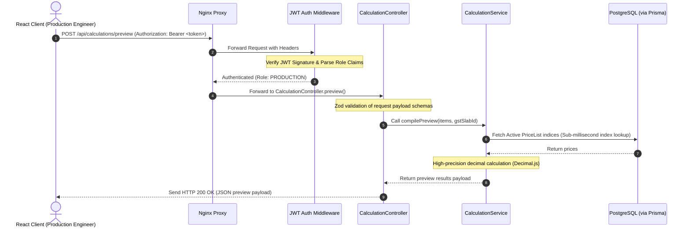
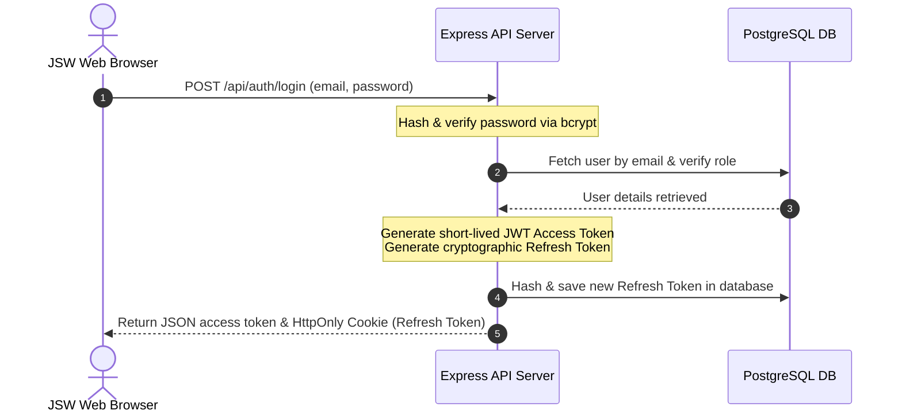
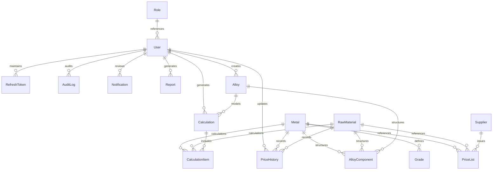

# ⚙️ TECHNICAL REQUIREMENTS DOCUMENT (TRD)
## Project Name: Metal Cost Management System (MCMS)
### Client: JSW Steel
**Document Version:** 1.0.0  
**Date:** May 31, 2026  
**Document Status:** Approved  
**Target Environment:** npm Workspaces Monorepo (React & Node.js SPA)

---

## 📋 1. Purpose & Document Control

This **Technical Requirements Document (TRD)** translates the JSW Metal Cost Management System (MCMS) Product Requirements Document (PRD) into low-level architectural blueprints, schema specifications, and coding patterns. It acts as the primary technical guide for software architects, backend engineers, frontend developers, database administrators (DBAs), QA automation testers, and DevOps specialists.

The specifications in this document are bound strictly to the **calculator-focused operations** of JSW Steel's metallurgical division. The system provides immediate in-memory evaluation and locked transaction logs for raw metals, custom alloys, and tax mappings, purposefully bypassing general ledger ERP systems and active warehouse bin logs.

---

## 🏗️ 2. System Architecture & Request Flows

MCMS is structured as a modern **Three-Tier Architecture** inside a centralized high-performance **npm Workspaces Monorepo**. This structure isolates the concerns of the API server, frontend React SPA, and shared packages, ensuring rapid local building and simplified deployment.

### 2.1. System Architecture Layout
```text
      [ React Client SPA ]  <--- (TypeScript / Tailwind CSS)
               │
      ( HTTPS / TLS 1.3 )
               │
     [ Nginx Reverse Proxy ]
               │
   [ Express API Backend Layer ] <--- (Node.js / TypeScript)
               │
        [ Prisma ORM ]
               │
    [ PostgreSQL Database ]
```

### 2.2. Request-Response Lifecycle Flow
The sequence diagram below details the operational path of an authenticated calculation preview request:



---

## 💻 3. Frontend Technical Design

The frontend is a single-page application (SPA) optimized for Vite, React 18, TypeScript, Zustand, and TanStack Query. It uses highly customized styling tokens via Tailwind CSS and accessible ShadCN primitives to deliver a premium JSW corporate dashboard interface.

### 3.1. Directory Structure (`/apps/frontend`)
```text
apps/frontend/
├── src/
│   ├── assets/             # Branding vector graphics & corporate logos
│   ├── components/         # Atomic UI widgets (Buttons, Input cards, Modals)
│   ├── data/               # Local diagnostic fallback mock fixtures
│   ├── hooks/              # Custom React hooks (useLocalStorage, useDebounce)
│   ├── layouts/            # Page shells (AdminLayout, CostingLayout)
│   ├── pages/              # Screen components (Login, Calculator, Matrix, Setup)
│   ├── routes/             # Client-side router declarations & Guard components
│   ├── services/           # Axios API connectors & Interceptor rules
│   ├── store/              # Zustand global client-side state engines
│   ├── styles/             # Global Tailwind entry configurations
│   ├── types/              # Frontend TypeScript definitions
│   ├── utils/              # Decimal formatting, financial rounding models
│   ├── App.tsx             # Root Router provider & QueryClient boundaries
│   └── main.tsx            # Virtual DOM mounting point
├── tsconfig.json           # Compiler targets (ESNext / Bundler)
└── vite.config.ts          # Build configs, proxy setups & chunk split settings
```

### 3.2. Zustand Global State Management
Global client state is partitioned into isolated, focused Zustand stores to minimize component re-renders:

*   **`useAuthStore`:** Holds active JWT tokens, token expiration timestamps, user details, and authentication states.
*   **`useCalculationStore`:** Controls the current state of active costing drafts, dynamic list additions, and preview valuations.
*   **`useNotificationStore`:** Connects client components to real-time alerts pushed from the Server-Sent Events stream.

#### Sample Implementation: `useAuthStore.ts`
```typescript
import { create } from 'zustand';
import { persist, createJSONStorage } from 'zustand/middleware';

interface User {
  id: string;
  name: string;
  email: string;
  role: 'ADMIN' | 'PROCUREMENT' | 'FINANCE' | 'PRODUCTION';
  department?: string;
}

interface AuthState {
  token: string | null;
  user: User | null;
  setAuth: (token: string, user: User) => void;
  clearAuth: () => void;
}

export const useAuthStore = create<AuthState>()(
  persist(
    (set) => ({
      token: null,
      user: null,
      setAuth: (token, user) => set({ token, user }),
      clearAuth: () => set({ token: null, user: null }),
    }),
    {
      name: 'jsw-mcms-auth-storage',
      storage: createJSONStorage(() => localStorage),
    }
  )
);
```

### 3.3. API Layer Connector & Axios Interceptors
The client implements a unified Axios connection service. To ensure seamless session lifetimes, an interceptor catches `401 Unauthorized` responses and triggers a token refresh before retrying failed requests.

#### Axios Client Specification (`src/services/api.ts`)
```typescript
import axios, { AxiosInstance } from 'axios';
import { useAuthStore } from '../store/useAuthStore';

const api: AxiosInstance = axios.create({
  baseURL: import.meta.env.VITE_API_BASE_URL || '/api',
  timeout: 10000,
  headers: {
    'Content-Type': 'application/json',
  },
  withCredentials: true, // Crucial to include the secure HttpOnly refresh cookie
});

// Request Interceptor: Inject JWT token into Authorization header
api.interceptors.request.use(
  (config) => {
    const token = useAuthStore.getState().token;
    if (token && config.headers) {
      config.headers.Authorization = `Bearer ${token}`;
    }
    return config;
  },
  (error) => Promise.reject(error)
);

// Response Interceptor: Silent automatic token renewal
api.interceptors.response.use(
  (response) => response,
  async (error) => {
    const originalRequest = error.config;
    if (error.response?.status === 401 && !originalRequest._retry) {
      originalRequest._retry = true;
      try {
        // Trigger the backend token refresh endpoint
        const refreshResponse = await axios.post('/api/auth/refresh', {}, { withCredentials: true });
        const { accessToken, user } = refreshResponse.data;
        
        // Save the new token in Zustand
        useAuthStore.getState().setAuth(accessToken, user);
        
        // Retry the original request
        originalRequest.headers.Authorization = `Bearer ${accessToken}`;
        return api(originalRequest);
      } catch (refreshError) {
        // Refresh token has expired, force logout
        useAuthStore.getState().clearAuth();
        window.location.href = '/login';
        return Promise.reject(refreshError);
      }
    }
    return Promise.reject(error);
  }
);

export default api;
```

### 3.4. Routing and Route Guards
React Router DOM v6 structures client routes, dividing endpoints into Public, Protected, and Role-Protected tiers.

```text
/ (Root)
├── Public
│   └── /login
└── Protected (Authenticated session required)
    ├── /dashboard (Main KPI panel)
    ├── /calculator (Workspace calculation worksheet)
    ├── /metals (Metal master CRUD)
    ├── /grades (Grade configurations)
    ├── /reports (Financial outputs)
    ├── /audit-logs (Strictly for ADMIN role)
    └── /settings (General system settings)
```

#### Route Guard Structure (`src/routes/ProtectedRoute.tsx`)
```typescript
import React from 'react';
import { Navigate, Outlet } from 'react-router-dom';
import { useAuthStore } from '../store/useAuthStore';

interface ProtectedRouteProps {
  allowedRoles?: string[];
}

export const ProtectedRoute: React.FC<ProtectedRouteProps> = ({ allowedRoles }) => {
  const { token, user } = useAuthStore();

  if (!token) {
    return <Navigate to="/login" replace />;
  }

  if (allowedRoles && user && !allowedRoles.includes(user.role)) {
    return <Navigate to="/403-forbidden" replace />;
  }

  return <Outlet />;
};
```

---

## ⚙️ 4. Backend Technical Design

The backend is built with Node.js, Express, TypeScript, and Prisma ORM, utilizing Clean Architecture patterns to separate boundaries.

### 4.1. Directory Structure (`/apps/backend`)
```text
apps/backend/
├── prisma/
│   ├── schema.prisma       # Prisma ORM Database Models
│   └── seed.ts             # Default industrial seeding parameters
├── src/
│   ├── config/             # DB pools, rate limit counts, Winston transports
│   ├── controllers/        # Parses HTTP packets, validates payloads, passes to services
│   ├── middleware/         # Security headers, rate limit buffers, RBAC guards
│   ├── models/             # Custom TypeScript types and domain definitions
│   ├── repositories/       # Prisma query executions (Decoupled DB layer)
│   ├── routes/             # Endpoints to controller bindings
│   ├── services/           # CORE domain logic (Cost calculations, Excel formatting)
│   ├── utils/              # Winston logs, high-precision decimals
│   ├── validations/        # Zod request validators
│   ├── app.ts              # Connects the Express pipeline middleware
│   └── server.ts           # Binds to designated operational port
├── tests/                  # Backend unit, integration, and mock suites
└── Dockerfile              # Multi-stage production container build
```

### 4.2. Responsibilities of backend layers
1.  **Routes:** Interfaces requests with controllers and applies basic middlewares (`authenticateJWT`, `rateLimit`).
2.  **Controllers:** Validates incoming payloads using Zod schemas, extracts URL/query parameters, calls the domain service layer, and formats JSON outputs via standardized envelopes.
3.  **Services:** Authoritative domain boundary for business rules. Executes core costing calculations, builds comparisons, generates PDF kits, and generates Excel worksheets.
4.  **Repositories:** Abstracts database interactions via Prisma. Services communicate only with repositories, making database technology changes highly isolated.
5.  **Prisma Client:** Authoritative transactional engine providing direct object-relational query mappings into PostgreSQL.

---

## 🔒 5. Authentication & Session Flow Specs

The system uses a secure, stateless JWT-based authentication system with rotating, secure cookies to mitigate typical token-stealing vectors (e.g., cross-site scripting attacks).

### 5.1. Session Token Specifications
*   **Access Token:** Short-lived (15 minutes). Sent via standard `Authorization: Bearer <Token>` header. Cryptographically signed with HMAC-SHA256 containing role parameters.
*   **Refresh Token:** Long-lived (7 days). Stored in the database inside secure, `HttpOnly`, `SameSite=Strict`, `Secure` cookies. Revoked and regenerated upon each transaction (Token Rotation).

### 5.2. Login Sequence Flow


---

## 🔑 6. Authorization Design & Permissions Matrix

Authorization is managed via backend role-based route guards that inspect token claims using Express middleware.

### 6.1. Custom RBAC Guards Middleware
```typescript
import { Request, Response, NextFunction } from 'express';

export const authorizeRoles = (...allowedRoles: string[]) => {
  return (req: Request, res: Response, next: NextFunction) => {
    const userRole = req.user?.role; // Parsed by the upstream authenticateJWT middleware

    if (!userRole || !allowedRoles.includes(userRole)) {
      return res.status(403).json({
        success: false,
        error: "Forbidden: You do not have sufficient clearance to access this module.",
        timestamp: new Date().toISOString()
      });
    }

    next();
  };
};
```

---

## 🗄️ 7. Database Design & Relational Tables

### 7.1. Database Schema Model Design


### 7.2. Detailed Table Architecture Specifications

#### Table 1: `roles`
*   **Engine Type:** PostgreSQL Entity Table
*   **Prisma Model Representation:** `model Role`

| Field Column | Technical Data Type | Keys / Attributes | Description |
| :--- | :--- | :--- | :--- |
| `id` | `VARCHAR(36)` / UUID | PRIMARY KEY, default UUID | Unique role identifier. |
| `name` | `VARCHAR(50)` | UNIQUE, NOT NULL | e.g. `ADMIN`, `PROCUREMENT`, `FINANCE`, `PRODUCTION`. |
| `description` | `TEXT` | NULLABLE | Detailed role summary. |
| `createdAt` | `TIMESTAMP(3)` | NOT NULL, default NOW() | Role creation timestamp. |

#### Table 2: `users`
*   **Engine Type:** PostgreSQL Entity Table
*   **Prisma Model Representation:** `model User`

| Field Column | Technical Data Type | Keys / Attributes | Description |
| :--- | :--- | :--- | :--- |
| `id` | `VARCHAR(36)` / UUID | PRIMARY KEY, default UUID | Unique user identifier. |
| `name` | `VARCHAR(100)` | NOT NULL | User's full name. |
| `email` | `VARCHAR(150)` | UNIQUE, NOT NULL | User's email. |
| `passwordHash`| `VARCHAR(255)` | NOT NULL | Hashed password. |
| `department` | `VARCHAR(100)` | NULLABLE | Mapped corporate department. |
| `status` | `VARCHAR(20)` | NOT NULL, default `"ACTIVE"` | `ACTIVE` | `INACTIVE`. |
| `failedLoginCount` | `INTEGER` | NOT NULL, default 0 | Tracks invalid login attempts. |
| `lockedUntil` | `TIMESTAMP(3)` | NULLABLE | Lockout expiry timestamp. |
| `lastLoginAt` | `TIMESTAMP(3)` | NULLABLE | Last login timestamp. |
| `roleId` | `VARCHAR(36)` / UUID | FOREIGN KEY $\rightarrow$ `roles(id)` | User's system role. |
| `createdAt` | `TIMESTAMP(3)` | NOT NULL, default NOW() | User registration timestamp. |
| `updatedAt` | `TIMESTAMP(3)` | NOT NULL, default NOW() | User profile update timestamp. |

*   **Indices:**
    *   `@@index([roleId])` - Optimizes role checks.

#### Table 3: `refresh_tokens`
*   **Engine Type:** PostgreSQL Transaction Table
*   **Prisma Model Representation:** `model RefreshToken`

| Field Column | Technical Data Type | Keys / Attributes | Description |
| :--- | :--- | :--- | :--- |
| `id` | `VARCHAR(36)` / UUID | PRIMARY KEY, default UUID | Unique token identifier. |
| `tokenHash` | `VARCHAR(255)` | UNIQUE, NOT NULL | Cryptographic refresh token hash. |
| `userId` | `VARCHAR(36)` / UUID | FOREIGN KEY $\rightarrow$ `users(id)` | Target user on Cascade Delete. |
| `expiresAt` | `TIMESTAMP(3)` | NOT NULL | Token expiration timestamp. |
| `revokedAt` | `TIMESTAMP(3)` | NULLABLE | Token revocation timestamp. |
| `replacedByHash` | `VARCHAR(255)` | NULLABLE | Rotated token hash value. |
| `createdAt` | `TIMESTAMP(3)` | NOT NULL, default NOW() | Token creation timestamp. |

*   **Indices:**
    *   `@@index([userId, expiresAt])` - Optimizes token validation.

#### Table 4: `metals`
*   **Engine Type:** PostgreSQL Master Entity Table
*   **Prisma Model Representation:** `model Metal`

| Field Column | Technical Data Type | Keys / Attributes | Description |
| :--- | :--- | :--- | :--- |
| `id` | `VARCHAR(36)` / UUID | PRIMARY KEY, default UUID | Unique metal identifier. |
| `name` | `VARCHAR(100)` | NOT NULL | Metal name. |
| `code` | `VARCHAR(50)` | UNIQUE, NOT NULL | Unique metal designation code. |
| `category` | `VARCHAR(50)` | NOT NULL | `Ferrous` | `Non-Ferrous`. |
| `unit` | `VARCHAR(10)` | NOT NULL, default `"kg"` | Metric tracking standard. |
| `status` | `VARCHAR(20)` | NOT NULL, default `"ACTIVE"` | `ACTIVE` | `INACTIVE`. |
| `description` | `TEXT` | NULLABLE | Detailed metal description. |
| `createdAt` | `TIMESTAMP(3)` | NOT NULL, default NOW() | Metal registration timestamp. |
| `updatedAt` | `TIMESTAMP(3)` | NOT NULL, default NOW() | Metal profile update timestamp. |

*   **Indices:**
    *   `@@index([name])` - Optimizes searches.
    *   `@@index([category, status])` - Optimizes dashboard lists.

#### Table 5: `grades`
*   **Engine Type:** PostgreSQL Configuration Table
*   **Prisma Model Representation:** `model Grade`

| Field Column | Technical Data Type | Keys / Attributes | Description |
| :--- | :--- | :--- | :--- |
| `id` | `VARCHAR(36)` / UUID | PRIMARY KEY, default UUID | Unique grade identifier. |
| `metalId` | `VARCHAR(36)` / UUID | FOREIGN KEY $\rightarrow$ `metals(id)` | Mapped parent metal. |
| `name` | `VARCHAR(100)` | NOT NULL | Grade identifier. |
| `subGrade` | `VARCHAR(50)` | NULLABLE | Sub-grade category. |
| `multiplier` | `DECIMAL(10,4)` | NOT NULL | Cost modifier coefficient. |
| `extraPrice` | `DECIMAL(14,2)` | NOT NULL, default `0.00` | Process surcharges per unit (INR). |
| `mechanicalProperties` | `JSONB` | NOT NULL | JSON storing tensile limits. |
| `toleranceProperties` | `JSONB` | NOT NULL | JSON storing sizing thresholds. |
| `bendProperties` | `JSONB` | NOT NULL | JSON storing pliability bounds. |
| `chemicalComposition` | `JSONB` | NOT NULL | JSON storing chemical limits. |
| `status` | `VARCHAR(20)` | NOT NULL, default `"ACTIVE"` | `ACTIVE` | `INACTIVE`. |
| `createdAt` | `TIMESTAMP(3)` | NOT NULL, default NOW() | Grade registration timestamp. |
| `updatedAt` | `TIMESTAMP(3)` | NOT NULL, default NOW() | Grade profile update timestamp. |

*   **Unique Constraints & Indices:**
    *   `@@unique([metalId, name, subGrade])` - Prevents duplicate entries.
    *   `@@index([metalId, status])` - Optimizes workspace calculator dropdowns.

#### Table 6: `price_lists`
*   **Engine Type:** PostgreSQL Pricing Master Table
*   **Prisma Model Representation:** `model PriceList`

| Field Column | Technical Data Type | Keys / Attributes | Description |
| :--- | :--- | :--- | :--- |
| `id` | `VARCHAR(36)` / UUID | PRIMARY KEY, default UUID | Unique price list identifier. |
| `metalId` | `VARCHAR(36)` / UUID | FOREIGN KEY $\rightarrow$ `metals(id)` | Optional target metal. |
| `rawMaterialId`| `VARCHAR(36)` / UUID | FOREIGN KEY $\rightarrow$ `raw_materials(id)`| Optional target material. |
| `supplierId` | `VARCHAR(36)` / UUID | FOREIGN KEY $\rightarrow$ `suppliers(id)` | Mapped vendor resource. |
| `pricePerUnit` | `DECIMAL(16,4)` | NOT NULL | Material unit cost. |
| `currency` | `VARCHAR(10)` | NOT NULL, default `"INR"` | Default currency (INR). |
| `unit` | `VARCHAR(10)` | NOT NULL, default `"kg"` | Metric tracking standard. |
| `source` | `VARCHAR(100)` | NOT NULL | e.g. `LME`, `Supplier Direct`. |
| `location` | `VARCHAR(100)` | NOT NULL, default `"India"` | Origin location. |
| `effectiveFrom`| `TIMESTAMP(3)` | NOT NULL | Expiry calculation date. |
| `active` | `BOOLEAN` | NOT NULL, default `true` | Pricing search visibility status. |
| `createdAt` | `TIMESTAMP(3)` | NOT NULL, default NOW() | Pricing registry timestamp. |
| `updatedAt` | `TIMESTAMP(3)` | NOT NULL, default NOW() | Pricing update timestamp. |

*   **Indices:**
    *   `@@index([metalId, active, effectiveFrom])` - Optimizes metal price lookups.
    *   `@@index([rawMaterialId, active, effectiveFrom])` - Optimizes material price lookups.
    *   `@@index([supplierId])` - Optimizes vendor query performance.

#### Table 7: `calculations`
*   **Engine Type:** PostgreSQL Transaction Table
*   **Prisma Model Representation:** `model Calculation`

| Field Column | Technical Data Type | Keys / Attributes | Description |
| :--- | :--- | :--- | :--- |
| `id` | `VARCHAR(36)` / UUID | PRIMARY KEY, default UUID | Unique calculation identifier. |
| `batchId` | `VARCHAR(100)` | UNIQUE, NOT NULL | Audit-compliant batch ID string. |
| `mode` | `VARCHAR(50)` | NOT NULL | `SINGLE_METAL` | `ALLOY_BUILDER`. |
| `name` | `VARCHAR(200)` | NOT NULL | Calculation workspace name. |
| `userId` | `VARCHAR(36)` / UUID | FOREIGN KEY $\rightarrow$ `users(id)` | Creator User ID. |
| `alloyId` | `VARCHAR(36)` / UUID | FOREIGN KEY $\rightarrow$ `alloys(id)` | Optional target alloy mapping. |
| `totalQuantity` | `DECIMAL(16,4)` | NOT NULL | Cumulative weight parameters. |
| `baseCost` | `DECIMAL(18,4)` | NOT NULL | Total base cost metrics. |
| `gstAmount` | `DECIMAL(18,4)` | NOT NULL, default `0.00` | Aggregated GST. |
| `finalCost` | `DECIMAL(18,4)` | NOT NULL | Base Cost + GST. |
| `snapshot` | `JSONB` | NOT NULL | IMMUTABLE JSON parameters snapshot. |
| `status` | `VARCHAR(20)` | NOT NULL, default `"DRAFT"` | `DRAFT` | `COMPLETED` | `CANCELLED`. |
| `createdAt` | `TIMESTAMP(3)` | NOT NULL, default NOW() | Creation timestamp. |
| `updatedAt` | `TIMESTAMP(3)` | NOT NULL, default NOW() | Last update timestamp. |
| `completedAt` | `TIMESTAMP(3)` | NULLABLE | Execution completion date. |

*   **Indices:**
    *   `@@index([userId, createdAt])` - Optimizes user report lists.
    *   `@@index([status, createdAt])` - Optimizes dashboard lists.

#### Table 8: `calculation_items`
*   **Engine Type:** PostgreSQL Transaction Item Table
*   **Prisma Model Representation:** `model CalculationItem`

| Field Column | Technical Data Type | Keys / Attributes | Description |
| :--- | :--- | :--- | :--- |
| `id` | `VARCHAR(36)` / UUID | PRIMARY KEY, default UUID | Unique item identifier. |
| `calculationId`| `VARCHAR(36)` / UUID | FOREIGN KEY $\rightarrow$ `calculations(id)` | Mapped parent calculation batch. |
| `metalId` | `VARCHAR(36)` / UUID | FOREIGN KEY $\rightarrow$ `metals(id)` | Optional target metal mapping. |
| `rawMaterialId`| `VARCHAR(36)` / UUID | FOREIGN KEY $\rightarrow$ `raw_materials(id)`| Optional target material mapping. |
| `gradeId` | `VARCHAR(36)` / UUID | FOREIGN KEY $\rightarrow$ `grades(id)` | Optional target grade mapping. |
| `itemName` | `VARCHAR(200)` | NOT NULL | Evaluated label. |
| `quantity` | `DECIMAL(16,4)` | NOT NULL | Target item weight. |
| `compositionPct`| `DECIMAL(7,4)` | NULLABLE | Alloy percentage weights. |
| `unitPrice` | `DECIMAL(16,4)` | NOT NULL | Locked unit price (INR). |
| `gradeMultiplier`| `DECIMAL(10,4)` | NOT NULL | Locked grade multiplier coefficient. |
| `extraPrice` | `DECIMAL(16,4)` | NOT NULL | Locked grade extra surcharge. |
| `baseCost` | `DECIMAL(18,4)` | NOT NULL | Item base cost. |
| `snapshot` | `JSONB` | NOT NULL | Locked item data snapshot. |

*   **Indices:**
    *   `@@index([calculationId])` - Optimizes batch details lookups.

---

## 🧮 8. Cost Calculation Engine Design

The Cost Calculation Engine is built with high-precision business math, utilizing `Decimal.js` to eliminate float-point rounding errors and ensure auditing accuracy.

### 8.1. Pricing Formulation
For each line item added to the workspace, the item cost is calculated using:

$$\text{ItemBaseCost} = (\text{Quantity} \times \text{LockedUnitPrice} \times \text{GradeMultiplier}) + \text{GradeExtraFee}$$

The overall batch totals are then compiled across all items:

$$\text{CalculatedBaseCost} = \sum_{i=1}^{n} \text{ItemBaseCost}_i$$

$$\text{GstAmount} = \text{CalculatedBaseCost} \times \text{GstSlabRate}$$

$$\text{FinalCost} = \text{CalculatedBaseCost} + \text{GstAmount}$$

### 8.2. Calculation Service Specification (`src/services/CalculationService.ts`)
```typescript
import { Decimal } from 'decimal.js';
import prisma from '../config/prisma';

// Define the high-precision configuration parameters
Decimal.set({ precision: 20, rounding: Decimal.ROUND_HALF_UP });

interface CalculationItemInput {
  metalId?: string;
  rawMaterialId?: string;
  gradeId?: string;
  quantity: number;
}

export class CalculationService {
  public static async evaluateCalculation(
    itemsInput: CalculationItemInput[],
    gstSlabId: string
  ) {
    let totalQuantity = new Decimal(0);
    let cumulativeBaseCost = new Decimal(0);
    const calculatedItems = [];

    // Fetch the target GST slab parameters
    const gstSlab = await prisma.gstSlab.findUnique({ where: { id: gstSlabId } });
    if (!gstSlab || !gstSlab.active) {
      throw new Error("Invalid or inactive GST Slab rate selected.");
    }
    const gstRate = new Decimal(gstSlab.rate);

    for (const item of itemsInput) {
      let unitPrice = new Decimal(0);
      let gradeMultiplier = new Decimal(1.0);
      let gradeExtraFee = new Decimal(0);
      let itemName = "Raw Component";

      if (item.metalId) {
        // Fetch the active price index for the metal
        const priceRecord = await prisma.priceList.findFirst({
          where: { metalId: item.metalId, active: true },
          orderBy: { effectiveFrom: 'desc' },
        });
        if (!priceRecord) throw new Error(`Active price not found for Metal: ${item.metalId}`);
        unitPrice = new Decimal(priceRecord.pricePerUnit.toString());

        // Fetch Grade details if selected
        if (item.gradeId) {
          const gradeRecord = await prisma.grade.findUnique({ where: { id: item.gradeId } });
          if (!gradeRecord) throw new Error("Grade option not found.");
          gradeMultiplier = new Decimal(gradeRecord.multiplier.toString());
          gradeExtraFee = new Decimal(gradeRecord.extraPrice.toString());
          itemName = `${gradeRecord.name} (Sub-grade: ${gradeRecord.subGrade || 'Standard'})`;
        }
      } else if (item.rawMaterialId) {
        const priceRecord = await prisma.priceList.findFirst({
          where: { rawMaterialId: item.rawMaterialId, active: true },
          orderBy: { effectiveFrom: 'desc' },
        });
        if (!priceRecord) throw new Error("Raw Material price not found.");
        unitPrice = new Decimal(priceRecord.pricePerUnit.toString());
      }

      const qty = new Decimal(item.quantity);
      totalQuantity = totalQuantity.plus(qty);

      // Core calculation formula: (Quantity * Price * Multiplier) + Extra Surcharges
      const itemBase = qty.times(unitPrice).times(gradeMultiplier).plus(qty.times(gradeExtraFee));
      cumulativeBaseCost = cumulativeBaseCost.plus(itemBase);

      calculatedItems.push({
        itemName,
        quantity: qty.toNumber(),
        unitPrice: unitPrice.toNumber(),
        gradeMultiplier: gradeMultiplier.toNumber(),
        extraPrice: gradeExtraFee.toNumber(),
        baseCost: itemBase.toNumber(),
        snapshot: {
          itemName,
          unitPrice: unitPrice.toString(),
          gradeMultiplier: gradeMultiplier.toString(),
          extraPrice: gradeExtraFee.toString(),
          baseCost: itemBase.toString()
        }
      });
    }

    const gstAmount = cumulativeBaseCost.times(gstRate);
    const finalCost = cumulativeBaseCost.plus(gstAmount);

    return {
      totalQuantity: totalQuantity.toNumber(),
      baseCost: cumulativeBaseCost.toNumber(),
      gstAmount: gstAmount.toNumber(),
      finalCost: finalCost.toNumber(),
      items: calculatedItems,
      snapshot: {
        gstRateApplied: gstRate.toString(),
        calculatedBaseCost: cumulativeBaseCost.toString(),
        gstAmount: gstAmount.toString(),
        finalCost: finalCost.toString()
      }
    };
  }
}
```

---

## 🔌 9. REST API Endpoint Specifications

All endpoints require a root mapping under `/api` and expect JSON payload packages. Secure endpoints require the header `Authorization: Bearer <JWT_Token>`.

### 9.1. Authentication APIs

#### `POST /api/auth/login`
*   **Method:** `POST`
*   **Description:** Authenticates user and sets session.
*   **Request Payload:**
    ```json
    {
      "email": "amit.sharma@jsw.in",
      "password": "SecurePassword123!"
    }
    ```
*   **Response Payload (`200 OK`):**
    ```json
    {
      "success": true,
      "accessToken": "eyJhbGciOiJIUzI1NiIsIn...",
      "user": {
        "id": "usr-8812-421",
        "name": "Amit Sharma",
        "email": "amit.sharma@jsw.in",
        "role": "PRODUCTION",
        "department": "Dolvi Casting Unit"
      }
    }
    ```
*   **Cookies Set:** `refreshToken` (Secure, HttpOnly, SameSite=Strict, Path=/api/auth)
*   **Status Codes:** `200 OK`, `400 Bad Request`, `401 Unauthorized`

#### `POST /api/auth/refresh`
*   **Method:** `POST`
*   **Description:** Rotates the refresh token and issues a new access token.
*   **Request Payload:** None (Expects the `refreshToken` HttpOnly cookie).
*   **Response Payload (`200 OK`):** Same as Login.
*   **Status Codes:** `200 OK`, `401 Unauthorized`

---

### 9.2. Metal Master APIs

#### `GET /api/metals`
*   **Method:** `GET`
*   **Description:** Retrieves paginated metals list with query filters.
*   **Query Parameters:** `page`, `limit`, `search`, `category`.
*   **Response Payload (`200 OK`):**
    ```json
    {
      "success": true,
      "data": [
        {
          "id": "met-2029-331a",
          "name": "Stainless Steel",
          "code": "SS-304",
          "category": "Ferrous",
          "unit": "kg",
          "status": "ACTIVE"
        }
      ],
      "meta": { "currentPage": 1, "totalPages": 1, "totalRecords": 1 }
    }
    ```

#### `POST /api/metals`
*   **Method:** `POST`
*   **Description:** Configures a new base metal.
*   **Authorization:** `ADMIN`, `PROCUREMENT`
*   **Request Payload:**
    ```json
    {
      "name": "Nickel Alloy",
      "code": "NI-200",
      "category": "Non-Ferrous",
      "unit": "kg",
      "status": "ACTIVE"
    }
    ```
*   **Response Payload (`201 Created`):** Returns the saved Metal object.
*   **Status Codes:** `201 Created`, `400 Bad Request`, `403 Forbidden`

---

### 9.3. Cost Calculation APIs

#### `POST /api/calculations`
*   **Method:** `POST`
*   **Description:** Saves a cost calculation draft.
*   **Authorization:** `PRODUCTION`, `ADMIN`
*   **Request Payload:**
    ```json
    {
      "name": "Dolvi Batch E-4",
      "mode": "SINGLE_METAL",
      "items": [
        {
          "metalId": "met-2029-331a",
          "gradeId": "grd-102-99a",
          "quantity": 1500.00
        }
      ],
      "gstSlabId": "gst-slab-18"
    }
    ```
*   **Response Payload (`201 Created`):**
    ```json
    {
      "success": true,
      "data": {
        "id": "calc-8831-992",
        "batchId": "BATCH-2026-0531-992A",
        "name": "Dolvi Batch E-4",
        "status": "DRAFT",
        "totalQuantity": 1500.00,
        "baseCost": 78750.00,
        "gstAmount": 14175.00,
        "finalCost": 92925.00,
        "createdAt": "2026-05-31T01:00:00Z"
      }
    }
    ```

#### `POST /api/calculations/:id/complete`
*   **Method:** `POST`
*   **Description:** Validates and locks the calculation draft into a `COMPLETED` status snapshot.
*   **Authorization:** `PRODUCTION`, `ADMIN`
*   **Response Payload (`200 OK`):**
    ```json
    {
      "success": true,
      "message": "Calculation successfully completed and locked."
    }
    ```
*   **Status Codes:** `200 OK`, `400 Bad Request`, `403 Forbidden`, `404 Not Found`

---

## 🔒 10. Security Hardening Configurations

1.  **Strict Content Security Policies (CSP):** Express API runs `helmet()` middleware to enforce secure HTTP headers and prevent clickjacking attacks.
2.  **Rate Limiting Limits:**
    *   Authentication endpoints: max 5 login requests per 15 minutes per IP address.
    *   Standard business API routes: capped at 100 requests per minute per IP address.
3.  **Cross-Origin Isolation (CORS):**
    ```typescript
    app.use(cors({
      origin: process.env.ALLOWED_CLIENT_ORIGIN || 'https://jsw-mcms.jsw.in',
      credentials: true,
      methods: ['GET', 'POST', 'PUT', 'DELETE'],
      allowedHeaders: ['Content-Type', 'Authorization']
    }));
    ```
4.  **SQL Injection Safeguards:** Uses Prisma ORM, which implements parameterization bindings under-the-hood. Direct raw queries (`$queryRaw`) are restricted to absolute emergencies and require typed schema parameters.
5.  **XSS & Payload Sanitization:** Zod schemas validate and scrub payload tags, sanitizing inputs before database storage.
6.  **Secrets & Environment Variables:** Database URIs, JWT signing secrets, cookie salts, and server ports are loaded strictly from `/apps/backend/.env` files and managed via secure cloud secret services in production.

---

## 📈 11. Performance Optimization & Scale Specifications

*   **Vite Bundle Chunk Splitting Configuration (`vite.config.ts`):**
    ```typescript
    export default defineConfig({
      build: {
        rollupOptions: {
          output: {
            manualChunks: {
              vendor: ['react', 'react-dom', 'react-router-dom'],
              ui: ['lucide-react', 'recharts'],
              math: ['decimal.js'],
            },
          },
        },
        chunkSizeWarningLimit: 500,
      },
    });
    ```
*   **Database Query Optimization:** Composite indices (e.g. `PriceList(metalId, active, effectiveFrom)`) ensure pricing query responses remain **< 10ms**.
*   **Pagination Standards:** All listing endpoints (metals, logs, calculations) enforce backend pagination, limiting payloads to `20` records per page.
*   **Static Asset Gzip Caching:** Nginx reverse proxy enforces gzip level 6 compression on production builds, saving up to $70\%$ static asset network bandwidth.

---

## 🚀 12. DevOps Requirements & CI/CD Pipelines

### 12.1. Backend Dockerfile Configuration (`apps/backend/Dockerfile`)
```dockerfile
# Multi-stage production build runner
FROM node:18-alpine AS builder
WORKDIR /app
COPY package*.json ./
COPY apps/backend/package*.json apps/backend/
COPY packages/types/package*.json packages/types/
RUN npm ci
COPY . .
RUN npm run build -w apps/backend

FROM node:18-alpine AS runner
WORKDIR /app
COPY --from=builder /app/package*.json ./
COPY --from=builder /app/apps/backend/package*.json apps/backend/
COPY --from=builder /app/apps/backend/dist apps/backend/dist
COPY --from=builder /app/apps/backend/prisma apps/backend/prisma
RUN npm ci --omit=dev
EXPOSE 5000
ENV NODE_ENV=production
CMD ["node", "apps/backend/dist/server.js"]
```

### 12.2. CI Workflow Pipeline (`.github/workflows/ci.yml`)
```yaml
name: JSW MCMS CI Pipeline

on:
  push:
    branches: [ main, develop ]
  pull_request:
    branches: [ main ]

jobs:
  build-test:
    runs-on: ubuntu-latest
    steps:
      - name: Checkout repository
        uses: actions/checkout@v3

      - name: Setup Node.js Env
        uses: actions/setup-node@v3
        with:
          node-version: 18
          cache: 'npm'

      - name: Install Monorepo Dependencies
        run: npm ci

      - name: Run Schema Linter
        run: npx prisma validate --schema=apps/backend/prisma/schema.prisma

      - name: Run Build Check
        run: npm run build

      - name: Run Test Suites
        run: npm run test
```

### 12.3. Disaster Recovery & Backup Schedules
*   **PostgreSQL Backups:** Automated nightly snapshots pushed to secure, encrypted AWS S3 storage with a 30-day retention policy.
*   **Disaster Recovery Target:** RPO (Recovery Point Objective) $\le$ 24 hours, RTO (Recovery Time Objective) $\le$ 2 hours.

---

## 🧪 13. Quality Assurance & Testing Matrix

*   **Unit Testing:** Evaluates costing formulas and model schemas locally. Enforces a minimum coverage threshold of **80%** using Vitest.
*   **Integration Testing:** Validates backend router responses, Zod validation boundaries, and DB transaction flows using supertest.
*   **End-to-End (E2E) Browser Testing:** Simulates active user workflows (e.g. login, workspace calculations, comparing grades, and exports) using Playwright.
*   **Performance Load Testing:** Evaluates platform response benchmarks under peak user loads (e.g., 500 concurrent connections over 10 minutes) using k6.
*   **Security Assessment:** Regular automated checks for dependency vulnerabilities using `npm audit` and static application security testing (SAST) tools.

---

## 🛠️ 14. Global Error Handling & Logging Strategy

### 14.1. Express Global Error Middleware (`apps/backend/src/middleware/errorHandler.ts`)
```typescript
import { Request, Response, NextFunction } from 'express';
import winston from 'winston';

// Instantiate the winston file-logger engine
const logger = winston.createLogger({
  level: 'error',
  format: winston.format.json(),
  transports: [
    new winston.transports.File({ filename: 'logs/error.log' }),
  ],
});

export const errorHandler = (
  err: any,
  req: Request,
  res: Response,
  next: NextFunction
) => {
  const statusCode = err.status || 500;
  const message = err.message || "Internal Server Error";

  // Log error parameters
  logger.error({
    message,
    statusCode,
    path: req.path,
    ip: req.ip,
    timestamp: new Date().toISOString(),
    stack: process.env.NODE_ENV === 'production' ? undefined : err.stack,
  });

  return res.status(statusCode).json({
    success: false,
    error: process.env.NODE_ENV === 'production' ? "An unexpected system error occurred." : message,
    timestamp: new Date().toISOString(),
  });
};
```

---

## 📈 15. Monitoring, Observability, and Metrics

1.  **Application Logs:** Managed via Winston, generating JSON-formatted logs suitable for collection by log aggregators (e.g., Elasticsearch, Datadog).
2.  **Performance Metrics:** System states (e.g., database connection pool exhaustion, CPU peaks, request durations) are exposed on Prometheus metrics scraping targets.
3.  **Active Health Verification (`GET /api/health`):**
    *   Monitors memory footprints.
    *   Verifies database ping connectivity speeds.
    *   Checks the read/write health of underlying file directories (for PDF generations).

---

## ✅ 16. Technical Acceptance Criteria Checklist

### 16.1. Frontend Acceptance Criteria
*   [ ] 100% of dashboard views dynamically adapt layouts between Desktop, Tablet, and Mobile viewport resolutions.
*   [ ] Zustand state stores clear successfully upon logout actions.
*   [ ] Axios request interceptors automatically refresh expired JWT sessions without requiring user re-authentication.

### 16.2. Backend Acceptance Criteria
*   [ ] Cost calculation inputs are validated using schema models before DB processing.
*   [ ] Completed calculation documents are saved as immutable JSON payloads inside database snapshot columns.
*   [ ] Backend validation logic rejects non-permitted requests with clear HTTP `403 Forbidden` status codes.

### 16.3. Database Acceptance Criteria
*   [ ] Pricing queries leverage database indexing, returning lookups in under 10ms.
*   [ ] Transactional changes (e.g., calculations or price updates) generate audit logs in PostgreSQL.

### 16.4. Security & Deployment Acceptance Criteria
*   [ ] Production HTTP connections redirect to secure TLS 1.3/HTTPS interfaces.
*   [ ] Docker files build and run locally without configuration issues.
*   [ ] CI pipelines run builds, linters, and tests successfully before main deployments.
