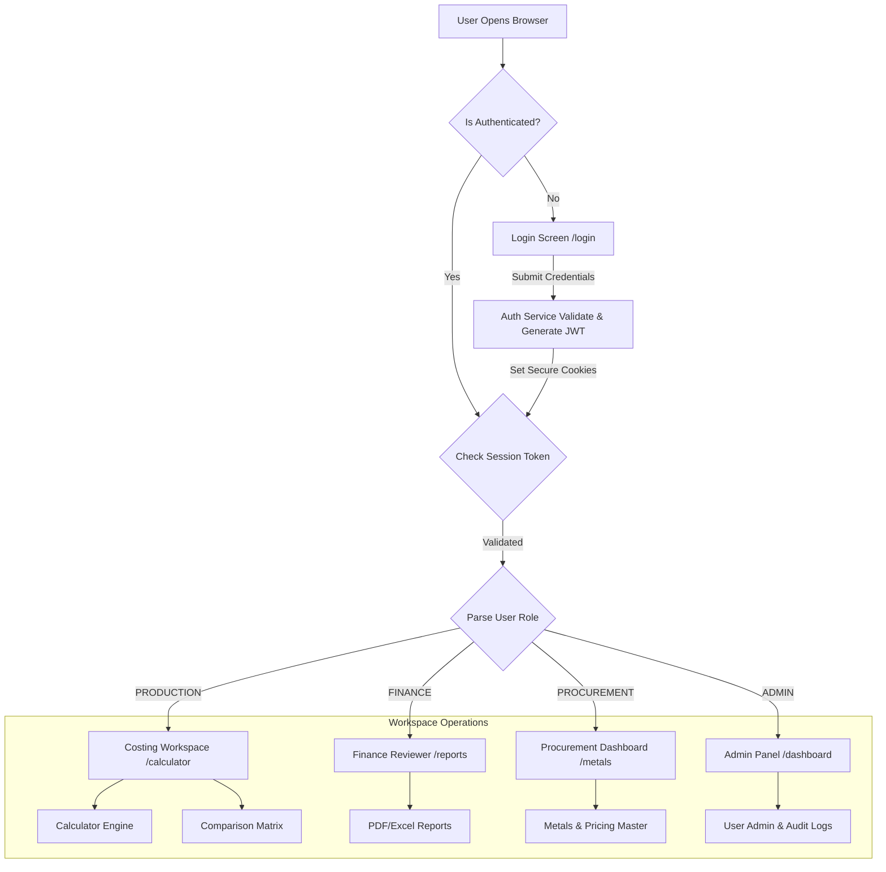
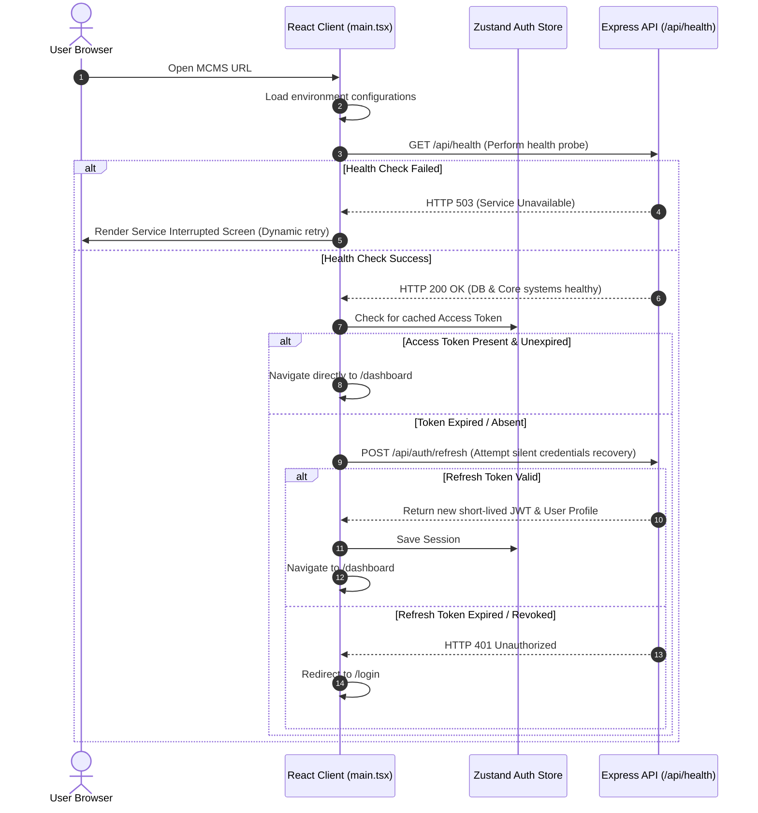
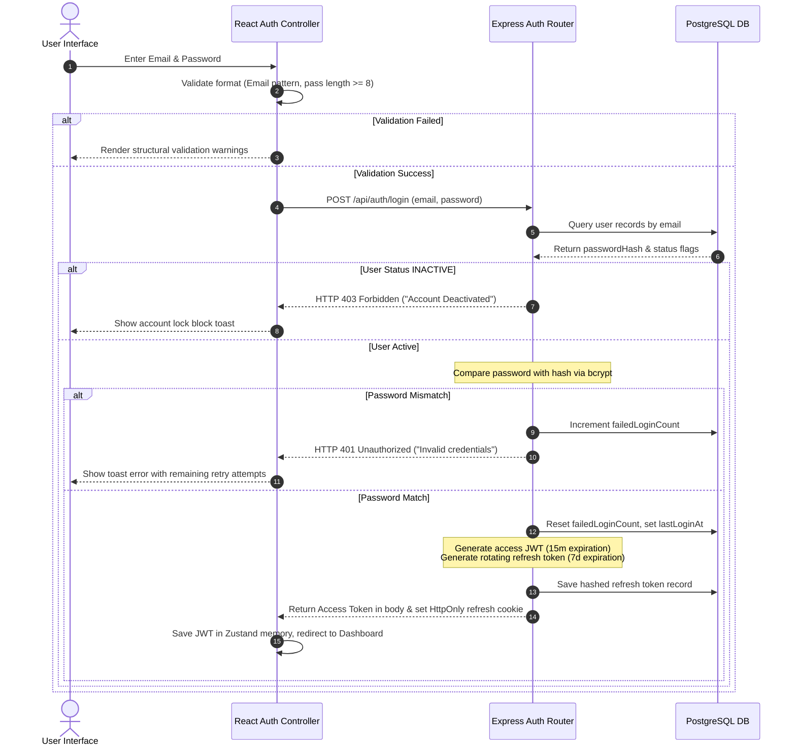
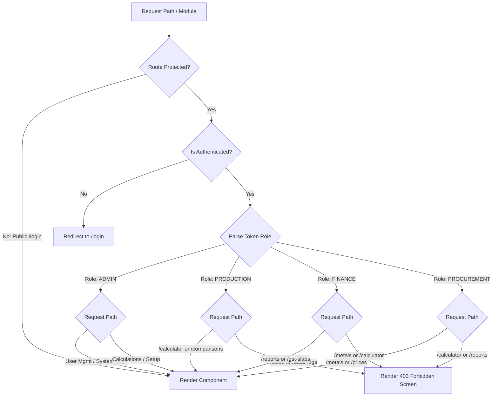
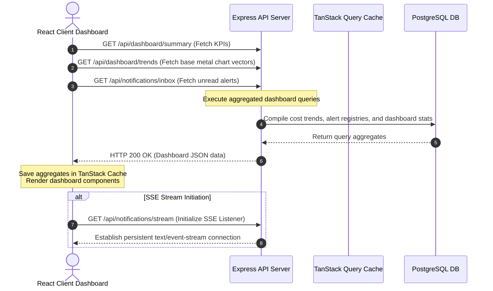
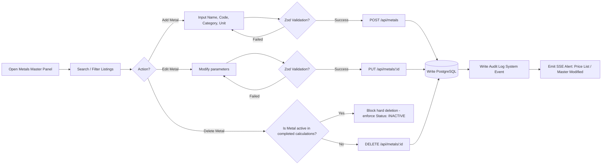
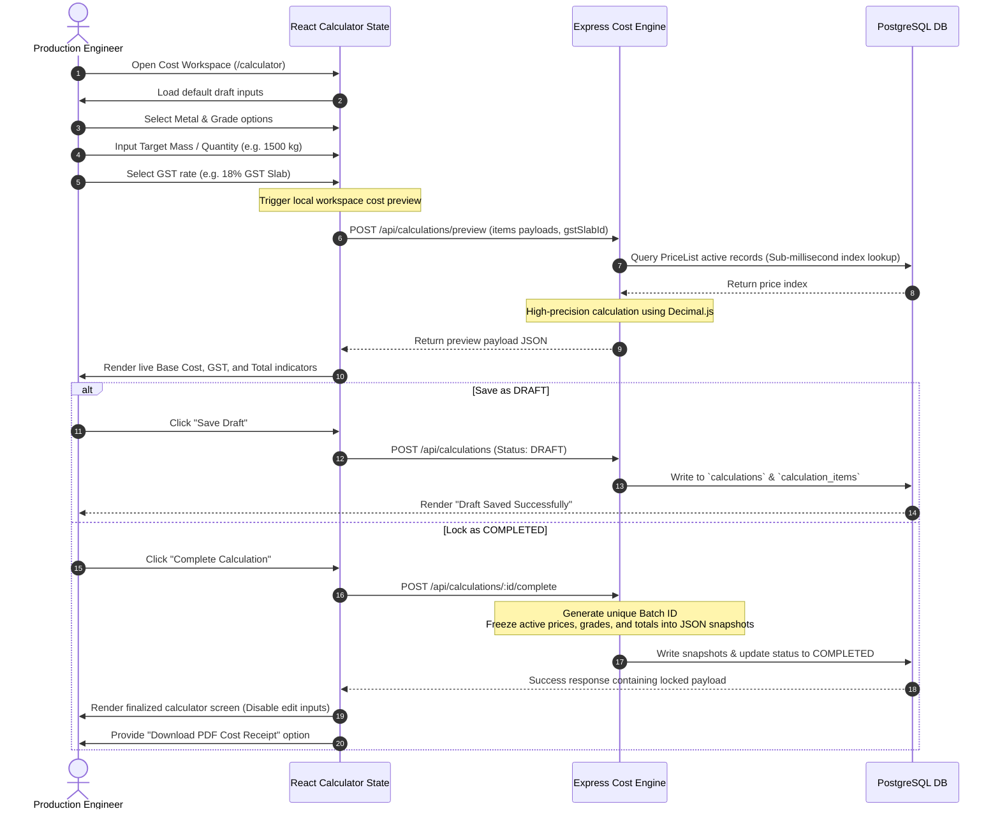
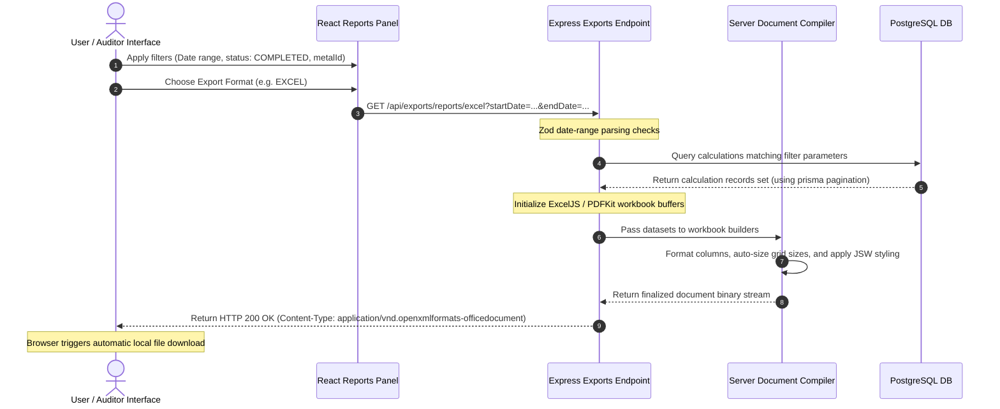
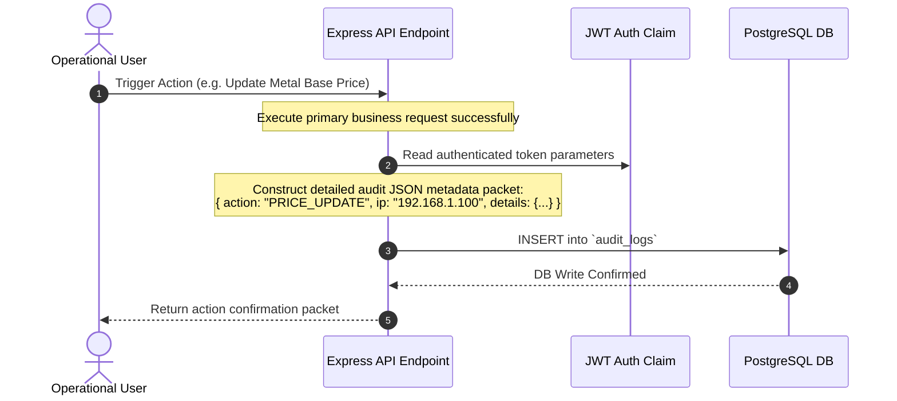
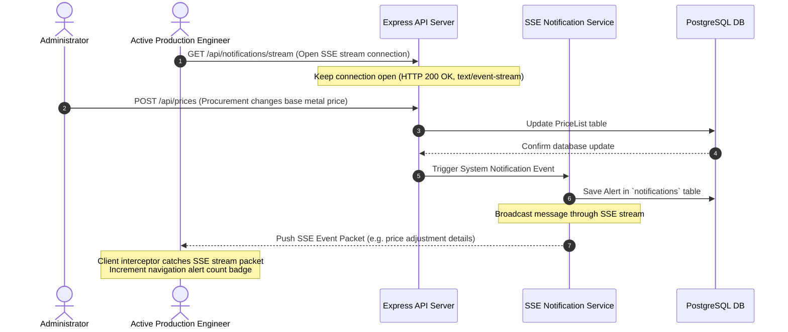

# 🗺️ APPLICATION FLOW DOCUMENT
## Project Name: Metal Cost Management System (MCMS)
### Client: JSW Steel
**Document Version:** 1.0.0  
**Date:** May 31, 2026  
**Document Status:** Approved  
**Target Environment:** Centralized Web Platform

---

## 📋 1. Purpose & Target Audience

This **Application Flow Document** maps the comprehensive end-to-end interactive journeys, system routines, navigation paths, and backend transaction lifecycles of the **Metal Cost Management System (MCMS)**. 

This document serves as the primary cross-functional guide for:
*   **Software Engineers:** To align on route architectures, API sequences, state transitions, and component mounts.
*   **UI/UX Designers:** To verify views, user inputs, notifications, and interaction touchpoints.
*   **QA Automation Teams:** To establish end-to-end user-acceptance scripts, testing boundaries, and mock-evaluation constraints.
*   **Enterprise Stakeholders:** To verify commercial clearance features, audit log parameters, and data-flow integrity.

---

## 🏛️ 2. High-Level Application Map

Below is the master operational layout of the MCMS platform:



---

## 🚀 3. Core Journeys & Detailed Flow Specifications

---

### 🟢 FLOW 1 — Application Startup Flow
This flow initializes the React Single Page Application (SPA), checks runtime configurations, and ensures the backend environment is healthy before routing the user.



---

### 🔑 FLOW 2 — Authentication Flow
Handles secure login, token exchanges, session tracking, and user redirection.



---

### 🛡️ FLOW 3 — Role-Based Access Control (RBAC) Flow
Ensures users are strictly confined to their authorized administrative and operational domains.



---

### 📊 FLOW 4 — Dashboard Loading Flow
Generates data widgets, costing summaries, notifications, and price trend charts immediately after a successful login.



---

### 📑 FLOW 5 — Metal Master Management Flow
Provides administrators and procurement specialists with CRUD processes to maintain base raw metals.



---

### ⚙️ FLOW 6 — Grade Parameterization Flow
Nests specific grade attributes under base raw metals to define multiplier coefficients and processing fees.

```text
Grade Master Dashboard
  ├── Select Base Metal (e.g. Stainless Steel SS-304)
  ├── Open "Add Grade Profile" Form
  │     ├── Input Grade Name (e.g. Premium Mirror-Finish)
  │     ├── Set Multiplier Coefficient (e.g. 1.0500)
  │     ├── Set Processing Surcharge (e.g. 75.00 INR/kg)
  │     └── Input Properties (JSON: Chemical limits, tensile strength)
  ├── Frontend Validation (Multiplier >= 1.00, extraPrice >= 0)
  ├── API Call: POST /api/grades
  ├── Backend Validation (Validate UUID, check unique constraint: [metalId, name, subGrade])
  ├── Save to Database Table: `grades`
  └── Write Audit Event: "GRADE_CREATE" (Details: name, metalId)
```

---

### 🧮 FLOW 7 — Cost Calculation Workspace Flow
The core operational flow. Production engineers select materials, validate tolerances, calculate costing previews, and lock finalized calculation snapshots.



---

### ⚡ FLOW 8 — Live Summary Recalculation Flow
Ensures the client interface recalculates and displays costing variations in real-time as users modify calculator parameters.

```text
User Modifies Input (Quantity / Extra Price / Grade Dropdown)
  │
  ├── 1. Zustand React State updates in local store
  ├── 2. Trigger debounce controller (200ms delay to prevent server network hammering)
  ├── 3. Fire API Request: POST /api/calculations/preview
  ├── 4. Express calculates costs using locked pricing metrics
  ├── 5. Return updated preview calculations payload
  ├── 6. Zustand Store overrides visual costing indices
  └── 7. Summary Sidebar dynamically renders updated cost cards with transition animations
```

---

### 🔀 FLOW 9 — Calculation Comparison Flow
Enables engineers and finance controllers to load up to 4 calculations side-by-side to review dynamic pricing variations.

```text
User Opens Grade Comparison Workspace (/comparisons)
  │
  ├── 1. Select up to 4 calculations from historic list
  ├── 2. Fetch locked calculations payloads from DB
  ├── 3. Generate structured Comparison Matrix:
  │      ├── Quantity Metrics
  │      ├── Base metal locked price per unit
  │      ├── Grade process coefficients
  │      ├── Applied GST levels
  │      └── Final calculated cost
  ├── 4. Highlight price differences (Cheapest option: Green border, Premium options: Red border)
  └── 5. User clicks "Export Comparison Matrix" -> Generates Excel workbook
```

---

### 📤 FLOW 10 — Report Generation & Aggregation Flow
Processes large costing sets, filters logs by dates and users, and exports them in binary PDF, CSV, or Excel formats.



---

### 📝 FLOW 11 — Audit Logging Flow
Automatically records all critical system transactions to ensure compliance and traceability.



---

### 🔔 FLOW 12 — SSE Real-Time Notification Flow
Streams price changes, system status warnings, and authorization failures directly to active user screens without polling.



---

### ⚙️ FLOW 13 — Settings Management Flow
Enforces adjustments to general system parameters (GST, default scrap factors, currency standards).

```text
Admin navigates to /settings
  │
  ├── 1. Fetch current settings constants from DB Table: `system_settings`
  ├── 2. Admin adjusts parameters (e.g. Enforce Transport Base Surcharge: 120.00 INR/ton)
  ├── 3. Zod validates payload formats
  ├── 4. API Request: PUT /api/settings
  ├── 5. Save settings to DB
  └── 6. Write Audit Event: "SETTINGS_MODIFY" (Records previous parameters & updated values)
```

---

### 🛑 FLOW 14 — Error Recovery Flow
A multi-tier error catching structure that keeps the application stable when issues occur in the frontend, backend, or database.

```text
Error Occurrence Point
  │
  ├── [ FRONTEND EXCEPTION ]
  │     ├── React Error Boundary intercepts runtime exception
  │     ├── Render fallback "UI Crashed" layout page
  │     └── Display quick reload action button
  │
  ├── [ BACKEND API ERROR ]
  │     ├── Controller encounters exception (e.g., duplicate unique index)
  │     ├── Global Express Error Handler middleware catches exception
  │     ├── Winston logs exception stack traces inside secure logs file
  │     └── Send standardized JSON: { success: false, error: "System Error occurred." }
  │
  └── [ DATABASE TRANSACTION TIMEOUT ]
        ├── PostgreSQL pool capacity depleted
        ├── Prisma ORM client catches timeout exception
        ├── Return HTTP 503 database unavailable warning
        └── Alert system administrator via real-time SSE stream
```

---

### 🚪 FLOW 15 — System Logout & Session Expiry Flow
Securely terminates active personnel sessions and clears cryptographic credentials.

```text
Termination Trigger (Manual Click / Session Idle / 7-Day Expiration)
  │
  ├── 1. Express clear HTTP HttpOnly Cookie (refreshToken)
  ├── 2. Express deletes matching session ID record from `refresh_tokens` DB table
  ├── 3. React Client state wipes Zustand JWT tokens from browser memory
  └── 4. Navigation redirect intercepts further actions, routing the browser back to /login
```

---

## 📈 4. Operational Success Metrics

The platform evaluates workflow efficiency and system stability using these indicators:

| Category | KPI Indicator | Measurement Method | Target Baseline |
| :--- | :--- | :--- | :--- |
| **System Flow** | Health Check Resolution | Startup Health probe time-limit. | $\le 100\text{ ms}$ |
| **Authentication** | Silent Token Renewals | Axios silent token refresh interceptor time. | $\le 150\text{ ms}$ |
| **Cost Calculator** | Live Cost Preview Time | Network API payload return limit. | $\le 500\text{ ms}$ |
| **Audit Compliance** | Audit Capture rate | Auto-verification checks on modified fields. | 100% logging rate |
| **Data Exports** | PDF Compilation latency | Generation time for a single invoice. | $\le 1.5\text{ seconds}$ |

---

## ⚡ 5. Risks & Operational Assumptions

*   **Continuous Network Connection:** The calculator's live cost summaries assume continuous network access. If connectivity is lost, the frontend falls back to a clean offline banner and disables calculator updates until connection is restored.
*   **Manual Excel Adjustments:** Users exporting data to Excel might adjust formulas manually offline. The TRD mitigates this by embedding locked calculations and a unique Batch ID validation string in the exported worksheets, ensuring the source database remains the single source of truth during audits.
*   **Supplier Price Expirations:** If a supplier's pricing contract expires without a new price list being recorded, calculation engines will throw warning notifications. Procurement teams must keep active supplier contracts up to date.
