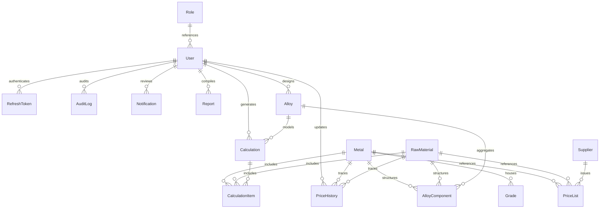

# 🗄️ DATABASE SYSTEM SPECIFICATION & SCHEMA DESIGN
## Project Name: Metal Cost Management System (MCMS)
### Client: JSW Steel
**Document Version:** 1.0.0  
**Date:** May 31, 2026  
**Document Status:** Approved  
**Target Environment:** PostgreSQL v15.x / 16.x (Serverless Neon DB in Cloud)

---

## 📋 1. Purpose & Design Intent

This document details the complete physical and logical database design for the **JSW Metal Cost Management System (MCMS)**. 

The MCMS database is engineered for high-precision costing operations, fast lookups, and strict compliance tracking:
*   **Precision Standard:** Floating-point numbers are strictly avoided for financial data. All monetary, multipliers, and weight columns are modeled as PostgreSQL `DECIMAL` types to ensure absolute precision.
*   **Audit Compliant:** Implements the **Transaction Snapshot Pattern**. Finalized calculations freeze and store active prices and multipliers inside permanent JSON columns, shielding historic data from future master table updates.
*   **Performance Indexing:** Employs optimized multi-column composite indices to support pricing lookups in under 10ms.

---

## 📐 2. Entity-Relationship Diagram (ERD)

The following diagram maps the database entity tables and relationships:



---

## 🗂️ 3. Table Catalog & Column Specifications

All UUID column identifiers use standard 36-character formats. PostgreSQL `JSONB` is used for property fields to optimize indexing and search speeds.

---

### Table 1: `Role` (User Role Registry)
*   **Purpose:** Configures user permissions.
*   **Prisma Mapping:** `model Role`

| Field | Data Type | Attributes | Description |
| :--- | :--- | :--- | :--- |
| `id` | `VARCHAR(36)` | PRIMARY KEY, default UUID | Unique role identifier. |
| `name` | `VARCHAR(50)` | UNIQUE, NOT NULL | e.g. `ADMIN`, `PROCUREMENT`, `FINANCE`, `PRODUCTION`. |
| `description` | `TEXT` | NULLABLE | Detailed description of the role's scope. |
| `createdAt` | `TIMESTAMP(3)`| NOT NULL, default `now()` | Role creation date. |

---

### Table 2: `User` (Credential & Profile Registry)
*   **Purpose:** Manages system user credentials and profiles.
*   **Prisma Mapping:** `model User`

| Field | Data Type | Attributes | Description |
| :--- | :--- | :--- | :--- |
| `id` | `VARCHAR(36)` | PRIMARY KEY, default UUID | Unique user identifier. |
| `name` | `VARCHAR(100)`| NOT NULL | Full name of the user. |
| `email` | `VARCHAR(150)`| UNIQUE, NOT NULL | Corporate email address. |
| `passwordHash` | `VARCHAR(255)`| NOT NULL | Hashed password. |
| `department` | `VARCHAR(100)`| NULLABLE | User's department. |
| `status` | `VARCHAR(20)` | NOT NULL, default `"ACTIVE"`| User account status. |
| `failedLoginCount`| `INTEGER` | NOT NULL, default `0` | Number of failed login attempts. |
| `lockedUntil` | `TIMESTAMP(3)`| NULLABLE | Lockout expiry timestamp. |
| `lastLoginAt` | `TIMESTAMP(3)`| NULLABLE | Last login date. |
| `roleId` | `VARCHAR(36)` | FOREIGN KEY $\rightarrow$ `Role(id)`| User's system role. |
| `createdAt` | `TIMESTAMP(3)`| NOT NULL, default `now()` | User creation date. |
| `updatedAt` | `TIMESTAMP(3)`| NOT NULL, default `now()` | User update date. |

*   **Indices:**
    *   `@@index([roleId])` - Optimizes user authorization checks.

---

### Table 3: `RefreshToken` (Active Session Registry)
*   **Purpose:** Tracks rotating refresh tokens for active sessions.
*   **Prisma Mapping:** `model RefreshToken`

| Field | Data Type | Attributes | Description |
| :--- | :--- | :--- | :--- |
| `id` | `VARCHAR(36)` | PRIMARY KEY, default UUID | Unique token identifier. |
| `tokenHash` | `VARCHAR(255)`| UNIQUE, NOT NULL | Cryptographic token hash. |
| `userId` | `VARCHAR(36)` | FOREIGN KEY $\rightarrow$ `User(id)`| User target on Cascade Delete. |
| `expiresAt` | `TIMESTAMP(3)`| NOT NULL | Token expiration date. |
| `revokedAt` | `TIMESTAMP(3)`| NULLABLE | Token revocation date. |
| `replacedByHash`| `VARCHAR(255)`| NULLABLE | Rotated token hash. |
| `createdAt` | `TIMESTAMP(3)`| NOT NULL, default `now()` | Token creation date. |

*   **Indices:**
    *   `@@index([userId, expiresAt])` - Optimizes token checks.

---

### Table 4: `Metal` (Base Metals Master)
*   **Purpose:** Central database registry of industrial base metals.
*   **Prisma Mapping:** `model Metal`

| Field | Data Type | Attributes | Description |
| :--- | :--- | :--- | :--- |
| `id` | `VARCHAR(36)` | PRIMARY KEY, default UUID | Unique metal identifier. |
| `name` | `VARCHAR(100)`| NOT NULL | Metal name. |
| `code` | `VARCHAR(50)` | UNIQUE, NOT NULL | Unique industrial designation code. |
| `category` | `VARCHAR(50)` | NOT NULL | `Ferrous` | `Non-Ferrous`. |
| `unit` | `VARCHAR(10)` | NOT NULL, default `"kg"` | Metric standard. |
| `status` | `VARCHAR(20)` | NOT NULL, default `"ACTIVE"`| Metal status. |
| `description` | `TEXT` | NULLABLE | Detailed metal description. |
| `createdAt` | `TIMESTAMP(3)`| NOT NULL, default `now()` | Metal creation date. |
| `updatedAt` | `TIMESTAMP(3)`| NOT NULL, default `now()` | Metal update date. |

*   **Indices:**
    *   `@@index([name])` - Optimizes searches.
    *   `@@index([category, status])` - Optimizes dashboard lists.

---

### Table 5: `Grade` (Grade Parameter Config)
*   **Purpose:** Configures custom grade parameters and multipliers under a parent metal.
*   **Prisma Mapping:** `model Grade`

| Field | Data Type | Attributes | Description |
| :--- | :--- | :--- | :--- |
| `id` | `VARCHAR(36)` | PRIMARY KEY, default UUID | Unique grade identifier. |
| `metalId` | `VARCHAR(36)` | FOREIGN KEY $\rightarrow$ `Metal(id)`| Parent metal. |
| `name` | `VARCHAR(100)`| NOT NULL | Grade identifier. |
| `subGrade` | `VARCHAR(50)` | NULLABLE | Sub-grade category. |
| `multiplier` | `DECIMAL(10,4)`| NOT NULL | Cost modifier coefficient. |
| `extraPrice` | `DECIMAL(14,2)`| NOT NULL, default `0.00` | Surcharges per unit (INR). |
| `mechanicalProperties`| `JSONB` | NOT NULL | JSON storing tensile limits. |
| `toleranceProperties` | `JSONB` | NOT NULL | JSON storing sizing thresholds. |
| `bendProperties` | `JSONB` | NOT NULL | JSON storing pliability bounds. |
| `chemicalComposition` | `JSONB` | NOT NULL | JSON storing chemical limits. |
| `status` | `VARCHAR(20)` | NOT NULL, default `"ACTIVE"`| Grade status. |
| `createdAt` | `TIMESTAMP(3)`| NOT NULL, default `now()` | Grade creation date. |
| `updatedAt` | `TIMESTAMP(3)`| NOT NULL, default `now()` | Grade update date. |

*   **Unique Constraints & Indices:**
    *   `@@unique([metalId, name, subGrade])` - Prevents duplicate entries.
    *   `@@index([metalId, status])` - Optimizes dropdown menus.

---

### Table 6: `PriceList` (Active Pricing Master)
*   **Purpose:** Tracks active raw material pricing indexes.
*   **Prisma Mapping:** `model PriceList`

| Field | Data Type | Attributes | Description |
| :--- | :--- | :--- | :--- |
| `id` | `VARCHAR(36)` | PRIMARY KEY, default UUID | Unique price list identifier. |
| `metalId` | `VARCHAR(36)` | FOREIGN KEY $\rightarrow$ `Metal(id)`| Optional target metal. |
| `rawMaterialId`| `VARCHAR(36)` | FOREIGN KEY $\rightarrow$ `RawMaterial(id)`| Optional target material. |
| `supplierId` | `VARCHAR(36)` | FOREIGN KEY $\rightarrow$ `Supplier(id)`| Mapped vendor. |
| `pricePerUnit` | `DECIMAL(16,4)`| NOT NULL | Material unit cost. |
| `currency` | `VARCHAR(10)` | NOT NULL, default `"INR"` | Default currency (INR). |
| `unit` | `VARCHAR(10)` | NOT NULL, default `"kg"` | Metric standard. |
| `source` | `VARCHAR(100)`| NOT NULL | e.g. `LME`, `Supplier Direct`. |
| `location` | `VARCHAR(100)`| NOT NULL, default `"India"` | Origin location. |
| `effectiveFrom`| `TIMESTAMP(3)`| NOT NULL | Expiry calculation date. |
| `active` | `BOOLEAN` | NOT NULL, default `true` | Pricing search visibility status. |
| `createdAt` | `TIMESTAMP(3)`| NOT NULL, default `now()` | Pricing creation date. |
| `updatedAt` | `TIMESTAMP(3)`| NOT NULL, default `now()` | Pricing update date. |

*   **Indices:**
    *   `@@index([metalId, active, effectiveFrom])` - Optimizes metal price lookups.
    *   `@@index([rawMaterialId, active, effectiveFrom])` - Optimizes material price lookups.
    *   `@@index([supplierId])` - Optimizes vendor query performance.

---

### Table 7: `Calculation` (Calculation Workspaces)
*   **Purpose:** Tracks cost calculation worksheets and active states.
*   **Prisma Mapping:** `model Calculation`

| Field | Data Type | Attributes | Description |
| :--- | :--- | :--- | :--- |
| `id` | `VARCHAR(36)` | PRIMARY KEY, default UUID | Unique calculation identifier. |
| `batchId` | `VARCHAR(100)`| UNIQUE, NOT NULL | Audit-compliant batch ID string. |
| `mode` | `VARCHAR(50)` | NOT NULL | `SINGLE_METAL` | `ALLOY_BUILDER`. |
| `name` | `VARCHAR(200)`| NOT NULL | Calculation workspace name. |
| `userId` | `VARCHAR(36)` | FOREIGN KEY $\rightarrow$ `User(id)`| Creator User ID. |
| `alloyId` | `VARCHAR(36)` | FOREIGN KEY $\rightarrow$ `Alloy(id)`| Optional target alloy mapping. |
| `totalQuantity` | `DECIMAL(16,4)`| NOT NULL | Cumulative weight parameters. |
| `baseCost` | `DECIMAL(18,4)`| NOT NULL | Total base cost metrics. |
| `gstAmount` | `DECIMAL(18,4)`| NOT NULL, default `0.00` | Aggregated GST. |
| `finalCost` | `DECIMAL(18,4)`| NOT NULL | Base Cost + GST. |
| `snapshot` | `JSONB` | NOT NULL | IMMUTABLE JSON parameters snapshot. |
| `status` | `VARCHAR(20)` | NOT NULL, default `"DRAFT"`| `DRAFT` | `COMPLETED` | `CANCELLED`. |
| `createdAt` | `TIMESTAMP(3)`| NOT NULL, default `now()` | Creation date. |
| `updatedAt` | `TIMESTAMP(3)`| NOT NULL, default `now()` | Last update date. |
| `completedAt` | `TIMESTAMP(3)`| NULLABLE | Execution completion date. |

*   **Indices:**
    *   `@@index([userId, createdAt])` - Optimizes user report lists.
    *   `@@index([status, createdAt])` - Optimizes dashboard lists.

---

### Table 8: `CalculationItem` (Line Items Registry)
*   **Purpose:** Line items nested within a parent cost calculation.
*   **Prisma Mapping:** `model CalculationItem`

| Field | Data Type | Attributes | Description |
| :--- | :--- | :--- | :--- |
| `id` | `VARCHAR(36)` | PRIMARY KEY, default UUID | Unique item identifier. |
| `calculationId`| `VARCHAR(36)` | FOREIGN KEY $\rightarrow$ `Calculation(id)`| Mapped parent calculation batch. |
| `metalId` | `VARCHAR(36)` | FOREIGN KEY $\rightarrow$ `Metal(id)`| Optional target metal mapping. |
| `rawMaterialId`| `VARCHAR(36)` | FOREIGN KEY $\rightarrow$ `RawMaterial(id)`| Optional target material mapping. |
| `gradeId` | `VARCHAR(36)` | FOREIGN KEY $\rightarrow$ `Grade(id)` | Optional target grade mapping. |
| `itemName` | `VARCHAR(200)`| NOT NULL | Evaluated label. |
| `quantity` | `DECIMAL(16,4)`| NOT NULL | Target item weight. |
| `compositionPct`| `DECIMAL(7,4)` | NULLABLE | Alloy percentage weights. |
| `unitPrice` | `DECIMAL(16,4)`| NOT NULL | Locked unit price (INR). |
| `gradeMultiplier`| `DECIMAL(10,4)`| NOT NULL | Locked grade multiplier coefficient. |
| `extraPrice` | `DECIMAL(16,4)`| NOT NULL | Locked grade extra surcharge. |
| `baseCost` | `DECIMAL(18,4)`| NOT NULL | Item base cost. |
| `snapshot` | `JSONB` | NOT NULL | Locked item data snapshot. |

*   **Indices:**
    *   `@@index([calculationId])` - Optimizes batch details lookups.

---

### Table 9: `AuditLog` (System Audit Trail)
*   **Purpose:** Records critical changes and events in the system.
*   **Prisma Mapping:** `model AuditLog`

| Field | Data Type | Attributes | Description |
| :--- | :--- | :--- | :--- |
| `id` | `VARCHAR(36)` | PRIMARY KEY, default UUID | Unique log identifier. |
| `userId` | `VARCHAR(36)` | FOREIGN KEY $\rightarrow$ `User(id)`| User who initiated the action. |
| `action` | `VARCHAR(50)` | NOT NULL | Action type (e.g. `PRICE_UPDATE`). |
| `entity` | `VARCHAR(50)` | NOT NULL | Target entity type. |
| `entityId` | `VARCHAR(36)` | NULLABLE | Target entity UUID. |
| `ipAddress` | `VARCHAR(45)` | NULLABLE | IP address of the request source. |
| `details` | `JSONB` | NOT NULL | Detailed metadata of the change. |
| `createdAt` | `TIMESTAMP(3)`| NOT NULL, default `now()` | Log creation date. |

*   **Indices:**
    *   `@@index([entity, createdAt])` - Optimizes entity history.
    *   `@@index([userId, createdAt])` - Optimizes user logs history.

---

### Table 10: `GstSlab` (GST Slabs Setup)
*   **Purpose:** Official regulatory GST tax rates mapped to calculations.
*   **Prisma Mapping:** `model GstSlab`

| Field | Data Type | Attributes | Description |
| :--- | :--- | :--- | :--- |
| `id` | `VARCHAR(36)` | PRIMARY KEY, default UUID | Unique slab identifier. |
| `name` | `VARCHAR(50)` | NOT NULL | Slab name (e.g. `18% GST`). |
| `code` | `VARCHAR(50)` | UNIQUE, NOT NULL | e.g. `GST_18`. |
| `rate` | `DECIMAL(7,4)` | NOT NULL | Decimal tax rate (e.g. `0.1800`). |
| `description` | `TEXT` | NULLABLE | Detailed description. |
| `active` | `BOOLEAN` | NOT NULL, default `true` | Slab visibility status. |
| `createdAt` | `TIMESTAMP(3)`| NOT NULL, default `now()` | Slab creation date. |
| `updatedAt` | `TIMESTAMP(3)`| NOT NULL, default `now()` | Slab update date. |

---

## 📸 4. The Transaction Snapshot Strategy

The MCMS database avoids using live database table lookups for finalized calculations, ensuring historic data remains immutable during audits:

```text
       Master Price Update (SS-304 rises from 200 to 220 INR/kg)
                                │
               ┌────────────────┴────────────────┐
               ▼                                 ▼
      [ Live Calculations ]            [ Completed Calculations ]
       (Pull active prices)             (Pull frozen snapshots)
               │                                 │
    Evaluate SS-304 at 220            Evaluate SS-304 at 200
  (Dynamic Draft Worksheet)         (Locked Immutable Snapshot)
```

### 4.1. Implementation Mechanism
*   **Draft Calculations (`DRAFT`):** Cost calculation variables are loaded dynamically from master pricing and grade configuration tables, allowing drafts to update as metal prices change.
*   **Completed Calculations (`COMPLETED`):** During finalized saves, the current price listings, multipliers, GST slabs, and calculated sums are captured into a frozen JSON array and stored inside the `snapshot` column.
*   **Read Lifecycle:** When loading a completed cost receipt, the platform bypasses live lookup queries and loads details directly from the locked snapshot field, ensuring the calculated cost remains unchanged.
