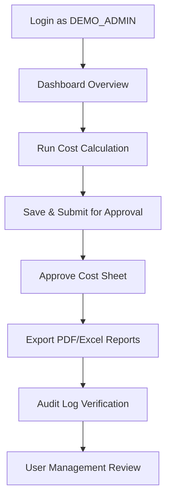

# JSW MCMS Demo Walkthrough Script

This script provides a step-by-step, 10-15 minute interactive walkthrough structure designed for internship evaluators and presentation examiners. It demonstrates key features of the JSW Metal Cost Management System (MCMS) using the presentation safety account (`DEMO_ADMIN`).

---

## Demo Credentials

* **Username/Email**: `demo.admin@jsw.in`
* **Password**: `MCMS@2026`
* **Role**: `ADMIN` (Provides access to calculations, approvals, audit logs, reports, and system user settings)

---

## 1. Setup & Pre-requisites (0 - 1 Minutes)

1. Ensure the system is running locally or in Docker.
2. Open the browser to the login screen at `http://localhost:5173`.
3. Keep the developer console closed to maintain a clean interface.
4. Have a PDF viewer ready to display exported reports.

---

## 2. Step-by-Step Walkthrough Flow

### Step 1: Secure Authentication & Role-Based Access (2 Minutes)

* **Speaker Action**:
  Type `demo.admin@jsw.in` and password `MCMS@2026` in the login fields, then click **Login**.

* **Speaker Script**:
  > "Welcome, esteemed examiners. I am presenting the JSW Metal Cost Management System (MCMS). We start by logging in with our dedicated presentation administrator credentials. MCMS utilizes secure JSON Web Token (JWT) credentials with automated expiry mechanisms. By logging in as an Admin, the system dynamically configures the dashboard modules, offering us access to raw material masters, user configuration tables, calculation worksheets, and enterprise audit logs. Let's sign in."

---

### Step 2: Dashboard Overview & Live Summary (2 Minutes)

* **Speaker Action**:
  Point to the dashboard cards, the live metal price tracker widgets, and the recent activity list.

* **Speaker Script**:
  > "Once authenticated, we land on the MCMS Executive Dashboard. This interface is built with premium visual styling, matching JSW corporate colors. It displays four core live metrics: Total cost calculations processed, pending worksheets requiring supervisor approval, active metal price histories, and system notifications. Below these indicators, we have the live price tracker displaying current market rates per kilogram for steel grades like IS 2062 and EN10149 S600MC. We can also view the recent activities feed detailing audit entries in real time."

---

### Step 3: Cost Calculation Worksheet Simulation (3 Minutes)

* **Speaker Action**:
  1. Click on **Calculator Workspace** in the sidebar.
  2. Fill in the form:
     * **Batch Name**: `JSW-EXAM-LOT-001`
     * **Mode Selection**: `Alloy Mode`
     * **Select Alloy**: `Structural Grade (High Tensile)`
     * **Quantity**: `10,000 kg`
  3. Click on **Calculate Cost**.

* **Speaker Script**:
  > "Now, let's execute a real-world costing simulation. We navigate to the Calculator Workspace. The system supports raw material composition calculations as well as complex predefined Alloy formulas. I am selecting 'Alloy Mode' and choosing 'Structural Grade (High Tensile)' with a target batch size of 10,000 kilograms. When I click 'Calculate Cost', the backend engine retrieves the active pricing coefficients, applies the grade multipliers (such as a 1.08x factor for IS 2062 E350C), adds additional processing extras, calculates the base metal value, applies the 18% GST slab, and yields the final computed cost. The results are rendered instantly without using mock data."

---

### Step 4: Cost Sheets & Approval Gateways (2 Minutes)

* **Speaker Action**:
  1. Click **Save as Draft**. Explain that it saves the current state without locking it.
  2. Click **Submit for Review**.
  3. Navigate to **Approvals** screen in the sidebar.
  4. Find the submitted calculation `JSW-EXAM-LOT-001`.
  5. Click **Approve**, type in the comment field: `Approved for immediate steel production run`, and submit.

* **Speaker Script**:
  > "To prevent accidental edits, MCMS supports strict draft state persistence. I have saved our costing worksheet as a draft, which allows cost engineers to refine estimates. Once finalized, we submit it for supervisor approval. Because we are logged in as an Administrator, we can proceed directly to the Approvals manager. Here, we see the pending `JSW-EXAM-LOT-001` batch. We review the composition breakdown, enter a validation comment, and click 'Approve'. This transitions the status to APPROVED and freezes the record for compliance."

---

### Step 5: Report Exporting (2 Minutes)

* **Speaker Action**:
  1. Go to the **Reports** tab.
  2. Select the calculation sheet we just approved.
  3. Click **Export PDF** (or **Export Excel**).
  4. Open the downloaded PDF file and briefly show the clean structural layout.

* **Speaker Script**:
  > "With our cost sheet approved, the system generates production-ready exports. By clicking 'Export PDF', MCMS dynamically creates a structured, high-resolution document featuring the JSW logo, batch metadata, detailed material cost breakdowns, tax details, and approval signature timestamps. The same data is exportable to Excel formats for downstream processing in plant inventory ERP modules."

---

### Step 6: System Audit Log & Accountability Verification (2 Minutes)

* **Speaker Action**:
  1. Click on **Audit Logs** in the sidebar.
  2. Point to the top lines, showcasing the `LOGIN`, `CREATE`, `APPROVE`, and `EXPORT` entries corresponding to our actions.

* **Speaker Script**:
  > "Accountability is critical in enterprise systems. Every action we have taken—our login, the calculation run, draft submissions, manager approvals, and report exports—is logged inside the System Audit Trail. The log details the active user, transaction type, entity identifier, client IP address, and metadata payloads. These logs are write-once records, ensuring complete transparency and complying with strict enterprise audit gates."

---

### Step 7: Summary & Closure (1 Minute)

* **Speaker Action**:
  Navigate back to the main dashboard.

* **Speaker Script**:
  > "In summary, the JSW Metal Cost Management System delivers a feature-complete solution that automates costing, enforces secure authorization hierarchies, maintains strict audit logging, and compiles compliant export matrices. The system is ready for production and local deployment. I am now open to your questions."
