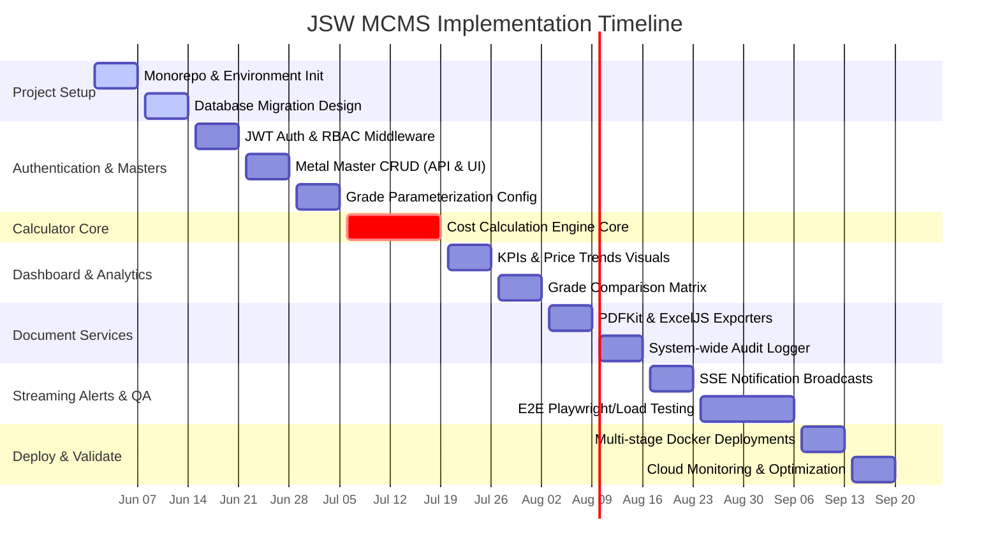
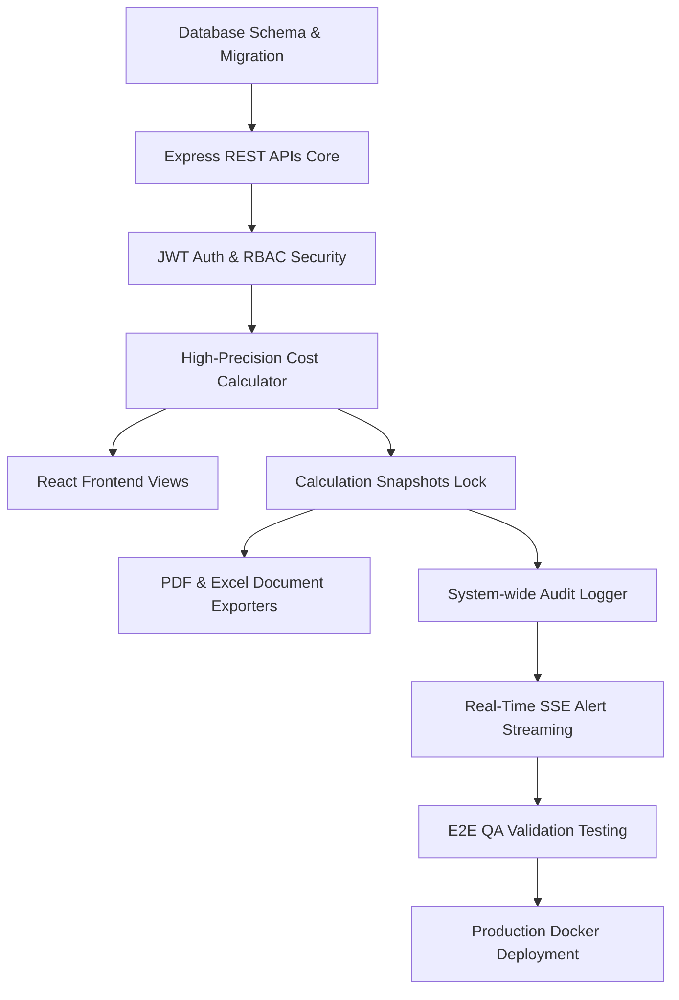

# 📅 ENTERPRISE IMPLEMENTATION PLAN
## Project Name: Metal Cost Management System (MCMS)
### Client: JSW Steel
**Document Version:** 1.0.0  
**Date:** May 31, 2026  
**Document Status:** Approved  
**Target Environment:** Centralized Web Platform (Workspaces Monorepo)

---

## 📋 1. Executive Summary

The **JSW Metal Cost Management System (MCMS)** is an industrial web application designed to centralize and automate cost calculation workflows for **JSW Steel**. This document outlines the authoritative, step-by-step implementation strategy for executing, testing, and deploying the MCMS platform.

### 1.1. Project Purpose & Scope Bounding
The primary objective is to replace fragmented spreadsheet workflows with a high-precision, centralized decision-support calculator. The project utilizes a high-performance light theme and leverages arbitrary decimal libraries (`Decimal.js`) to guarantee absolute mathematical accuracy across pricing estimates.

To ensure rapid delivery and system focus, the scope is strictly bounded. Core modules include:
*   **Metal & Pricing Masters** (Base metal registries and active contract pricing lists)
*   **Grade Parameterization System** (Chemical compositions and process multipliers)
*   **Cost Calculation Engine** (In-memory calculation previews and immutable transactional snapshot locks)
*   **Dashboard, Comparison Matrix, Auditing, and SSE Real-Time Notifications**

This system is strictly **not** a general ledger ERP platform. It excludes physical inventory tracking, supply chain logistics, direct vendor invoicing, and native mobile client architectures.

### 1.2. Engineering Methodology
To execute this project with speed and quality, JSW Steel adopts an **Incremental Agile Scrum** model. The engineering roadmap is structured into **8 bi-weekly sprints** spanning a total of **16 weeks**, culminating in a production deployment on containerized cloud nodes.

---

## ⏱️ 2. Project Timeline & Roadmaps

The overall timeline spans 16 weeks, moving from environment initialization to post-deployment validation.

### 2.1. Overall Milestone Timeline
```text
  [ WEEK 1-2 ]   ───► Phase 1 & 2: Project setup, monorepo init, and database seeding.
  [ WEEK 3-5 ]   ───► Phase 3, 4 & 5: JWT Session security, RBAC guards, and Metal/Grade Masters.
  [ WEEK 6-7 ]   ───► Phase 6: Core High-Precision Cost Calculator Workspace (Decimal.js).
  [ WEEK 8-9 ]   ───► Phase 7 & 8: Executive KPIs Dashboard & Side-by-side Comparisons.
  [ WEEK 10-11 ] ───► Phase 9 & 10: Server Report compilers (PDFKit/ExcelJS) & Audit logs.
  [ WEEK 12-14 ] ───► Phase 11 & 12: Real-time SSE alert broadcasing & E2E QA Test execution.
  [ WEEK 15-16 ] ───► Phase 13 & 14: Docker deployment, cloud monitoring, and performance checks.
```

### 2.2. Production Gantt Project Schedule
The following Gantt chart details parallel development streams, showing how database tasks, backend APIs, and frontend client views integrate across Sprints:



---

## ⚙️ 3. Comprehensive Phase-by-Phase Breakdown

---

### 🟢 Phase 1: Project Setup (Week 1)
*   **Objectives:** Initialize monorepo directory tree, configure build/compilation constraints, and set up Docker structures.
*   **Tasks:**
    *   Set up root `package.json` utilizing npm Workspaces.
    *   Setup workspace paths: `/apps/frontend`, `/apps/backend`, `/packages/config`, `/packages/types`, and `/packages/utils`.
    *   Configure shared TypeScript base configurations.
    *   Configure ESLint linter and Prettier rules across workspaces.
    *   Write Docker compose files to orchestrate local PostgreSQL databases during developer runs.
    *   Set up GitHub Actions base workflow to run linter checks and builds.
*   **Deliverables:** Clean, building npm workspaces codebase and containerized local DB services.
*   **Acceptance Criteria:** Monorepo builds successfully on local developer machines without dependency errors, and `docker-compose up` mounts the database environment securely.

---

### 🟢 Phase 2: Database Design & Migration (Week 2)
*   **Objectives:** Model and map relational entities, establish composite indexing targets, and seed starting industrial parameters.
*   **Tasks:**
    *   Write database schema configuration inside `/apps/backend/prisma/schema.prisma`.
    *   Define primary/foreign relationships for users, roles, metals, grades, calculations, prices, audits, notifications, and reports.
    *   Set up composite performance indexes (e.g. `@@index([metalId, active, effectiveFrom])`).
    *   Generate and run migration files against local PostgreSQL instance.
    *   Write seed script (`prisma/seed.ts`) populating standard JSW metal profiles (SS-304, CS-102), suppliers, and GST slabs.
*   **Deliverables:** Migrated PostgreSQL database schema and seed population datasets.
*   **Acceptance Criteria:** Prisma migration scripts compile and run without constraints violations, and raw SQL queries verify that the seed script successfully populates all master tables.

---

### 🟢 Phase 3: Session Security & RBAC Guards (Week 3)
*   **Objectives:** Build JWT authentication services and configure backend/frontend role guards.
*   **Tasks:**
    *   Configure backend token generator and user credential validators.
    *   Write Express `authenticateJWT` session verification middleware.
    *   Write Express `authorizeRoles` middleware to validate role permissions (ADMIN, PROCUREMENT, FINANCE, PRODUCTION).
    *   Implement user password hashing using bcrypt.
    *   Set up secure HTTP-Only cookie rotation pipelines to protect refresh tokens from cross-site scripting (XSS) vectors.
    *   Create client React protected route components.
*   **Deliverables:** Secure authentication and authorization systems covering API endpoints and frontend views.
*   **Acceptance Criteria:** Unauthenticated API requests return clear HTTP `401 Unauthorized` responses, role-restricted endpoints block non-permitted users with HTTP `403 Forbidden`, and client route guards redirect users without valid sessions back to the `/login` view.

---

### 🟢 Phase 4: Metal Master Module (Week 4)
*   **Objectives:** Build the raw metals master listing CRUD interfaces and pricing data schemas.
*   **Tasks:**
    *   Write backend routes, controllers, validations, and repository targets for `/api/metals`.
    *   Create the metals catalog screen on the React client.
    *   Configure forms to add and edit metal properties (name, unique code, measurement unit).
    *   Implement list search controls and category drop-downs.
    *   Add validations to prevent saving duplicate metal codes.
*   **Deliverables:** Master Metal registry covering UI view, API routes, and validations.
*   **Acceptance Criteria:** Administrators and procurement specialists can add, read, edit, and delete metal profiles, changes update the DB securely, and invalid codes trigger validation warnings.

---

### 🟢 Phase 5: Grade Config & Parameterization (Week 5)
*   **Objectives:** Nest grade parameters under parent metals and map multiplier coefficients.
*   **Tasks:**
    *   Write API endpoints (`POST /api/grades`, `GET /api/grades`).
    *   Define properties schemas (JSON properties storing tensile compositions, mechanical limits, chemical thresholds).
    *   Build grade configuration cards inside the React client.
    *   Implement forms to set grade multipliers and custom processing surcharges (extraPrice).
    *   Connect database constraints to prevent assigning duplicate grades to a parent metal.
*   **Deliverables:** Grade configuration module linked correctly to parent metals.
*   **Acceptance Criteria:** Users can successfully create and assign multiple grade coefficients under a parent metal, inputs are validated, and the data is stored correctly in the `grades` table.

---

### 🟢 Phase 6: High-Precision Cost Calculator Workspace (Week 6-7)
*   **Objectives:** Build the split-screen Calculation Workspace utilizing arbitrary decimal precision math libraries.
*   **Tasks:**
    *   Create `CalculationService` in Express utilizing the `Decimal.js` library.
    *   Implement the core costing logic:
        $$\text{ItemBaseCost} = (\text{Quantity} \times \text{LockedUnitPrice} \times \text{GradeMultiplier}) + \text{GradeExtraFee}$$
        $$\text{FinalCost} = \text{CalculatedBaseCost} + (\text{CalculatedBaseCost} \times \text{GstSlabRate})$$
    *   Add validation constraints to enforce quantity limits ($> 0$).
    *   Build the split-screen Calculator UI: left panel holds input fields, center panel manages surcharge inputs, and the right-side summary card displays the final cost.
    *   Configure a **200ms debounce handler** in the React client to update summary costs in real-time as users modify input fields.
    *   Configure calculation completes to lock active pricing parameters within permanent JSON database snapshot columns.
*   **Deliverables:** High-precision Calculation Workspace covering UI elements, preview APIs, and transaction-locking database scripts.
*   **Acceptance Criteria:** Calculations resolve with absolute mathematical accuracy (no binary floating-point drift), draft worksheets save and reload correctly, and completed calculations freeze pricing details to resist future master table updates.

---

### 🟢 Phase 7: Executive KPIs & Dashboards (Week 8)
*   **Objectives:** Generate dashboard analytics screens tailored to different user roles.
*   **Tasks:**
    *   Write backend aggregation endpoints (/api/dashboard/admin, /api/dashboard/production).
    *   Create dashboard widget grids inside the React client.
    *   Integrate interactive price trend charts using Recharts.
    *   Add a quick-action shortcut panel to start calculations, add metals, or run report exports.
    *   Add skeleton loaders to prevent layout shifts during page loads.
*   **Deliverables:** Responsive, role-aware dashboard screens.
*   **Acceptance Criteria:** Dashboards load in **< 2.0 seconds** under 100 concurrent requests, and widgets correctly adapt visual details according to the authenticated user's role.

---

### 🟢 Phase 8: Grade Comparison Matrix (Week 9)
*   **Objectives:** Implement side-by-side comparison tables to review dynamic pricing variations.
*   **Tasks:**
    *   Write API endpoints to fetch calculation histories.
    *   Build the comparison workspace table in the React client.
    *   Configure column alignments with sticky headers to support clean horizontal scrolling.
    *   Add visual highlight filters to color price differentials (e.g. green for cost savings, red for cost premiums).
*   **Deliverables:** Interactive comparison table for calculations, metals, and grades.
*   **Acceptance Criteria:** Users can select and display up to 4 calculations side-by-side, comparison columns align correctly, and delta indicators highlight cheaper alternative choices.

---

### 🟢 Phase 9: Reports & Exporter Services (Week 10)
*   **Objectives:** Build PDF, CSV, and Excel document generation and export services.
*   **Tasks:**
    *   Create server-side PDF compiler utilizing PDFKit.
    *   Write Excel sheet generation utility utilizing ExcelJS.
    *   Format tables, column widths, and cell data types, and apply professional JSW corporate colors to exported sheets.
    *   Create client report filter panel (date range pickers, metal categories, user lists).
    *   Implement paginated backend query scripts to optimize document creation times over large datasets.
*   **Deliverables:** Reports page and backend file compiler services.
*   **Acceptance Criteria:** Document exports execute successfully without errors, cell formats parse correctly in Excel (monetary cells, quantities), and compiled PDFs include JSW branding assets and QR codes.

---

### 🟢 Phase 10: System Audit Logging (Week 11)
*   **Objectives:** Automatically record and track all critical database modifications and security events.
*   **Tasks:**
    *   Create a global `AuditLogger` service inside Express.
    *   Integrate audit logging hooks into primary controllers (login/logout, price updates, metal/grade CRUD, finalized calculations).
    *   Format log details in a standardized JSON payload structure.
    *   Create the system log search page on the React client (strictly restricted to the `ADMIN` role).
*   **Deliverables:** System-wide audit service and administrative log reviewer UI.
*   **Acceptance Criteria:** Critical database modifications are recorded in the `audit_logs` table, and administrators can filter logs by dates, actions, and user IDs.

---

### 🟢 Phase 11: Real-Time SSE Notification Center (Week 12)
*   **Objectives:** Stream price changes, system alerts, and login failures directly to user screens.
*   **Tasks:**
    *   Implement Server-Sent Events (SSE) stream endpoints in Express.
    *   Build the notification banner component in the React client.
    *   Connect active browsers to the persistent SSE connection stream.
    *   Configure the database model to record user notification history and read states.
*   **Deliverables:** Real-time push notification service and user alert panel.
*   **Acceptance Criteria:** Modifying price tables immediately triggers a system alert across all active browser sessions, and the navigation bell badge updates its unread count without manual page refreshes.

---

### 🟢 Phase 12: QA Test Execution & Validation (Week 13-14)
*   **Objectives:** Execute all unit, integration, and end-to-end tests to verify system stability.
*   **Tasks:**
    *   Verify business service layers and cost calculation formulas using Vitest.
    *   Verify API routes and controller validations using supertest.
    *   Verify user workflows (e.g. login, calculations, comparisons) using Playwright.
    *   Assess backend performance under concurrent user loads using k6 scripts.
    *   Verify WCAG AA accessibility compliance (color contrast ratios, keyboard navigation flows).
*   **Deliverables:** Test reports and bug tracking sheets.
*   **Acceptance Criteria:** Unit test coverage is **> 80%**, API response times are **< 500ms** (95th percentile), and critical security or operational defects are fully resolved.

---

### 🟢 Phase 13: Production Deployment (Week 15)
*   **Objectives:** Deploy production instances, configure secure SSL certificates, and set up monitoring dashboards.
*   **Tasks:**
    *   Assemble production Docker containers utilizing multi-stage Alpine builders.
    *   Deploy PostgreSQL database and run production migrations.
    *   Configure SSL certificates (TLS 1.3) via Let's Encrypt.
    *   Configure reverse proxy rules in Nginx (enforce gzip level 6 compression, static cache parameters).
    *   Set up Winston logging directory rules and PM2 process managers.
*   **Deliverables:** Secure, live, production web application environment.
*   **Acceptance Criteria:** The application builds and deploys successfully on cloud servers, reverse proxy rules force HTTPS redirects, and the domain resolves correctly on standard web browsers.

---

### 🟢 Phase 14: Post-Deployment Monitoring (Week 16)
*   **Objectives:** Track production health, resolve immediate runtime issues, and gather user feedback.
*   **Tasks:**
    *   Monitor database transaction volumes and CPU states.
    *   Analyze server logs to locate and resolve early system bugs.
    *   Optimize slow queries by tuning Prisma index parameters.
    *   Gather usability feedback from production planning teams.
    *   Publish official project release notes and developer guidelines.
*   **Deliverables:** Post-deployment validation reports and official user manuals.
*   **Acceptance Criteria:** Production environment is stable with no database connection drops, logs show zero unhandled exceptions, and final project sign-off is completed.

---

## 📅 4. Sprint Plan & Milestones Roadmap

The timeline is divided into 8 bi-weekly sprints. Each sprint has specific, actionable deliverables:

```text
  [ SPRINT 1 ]  ───► Weeks 1-2:   Project setup, monorepo initialization, database schema & seed scripts.
  [ SPRINT 2 ]  ───► Weeks 3-4:   JWT authentication, RBAC middleware, and Metal Master CRUD.
  [ SPRINT 3 ]  ───► Weeks 5-6:   Grade configurations and high-precision calculator engine core.
  [ SPRINT 4 ]  ───► Weeks 7-8:   Calculation UI workspace, live cost summary panels, and completed snapshot locks.
  [ SPRINT 5 ]  ───► Weeks 9-10:  Executive KPIs dashboards, Recharts analytics, and side-by-side comparison tables.
  [ SPRINT 6 ]  ───► Weeks 11-12: Server-side PDF/Excel document generators and system-wide audit logging.
  [ SPRINT 7 ]  ───► Weeks 13-14: SSE notification centers and Playwright end-to-end QA validation testing.
  [ SPRINT 8 ]  ───► Weeks 15-16: Production Docker deployment, SSL, Nginx proxy, and user onboarding.
```

---

## 👥 5. Resource Plan & RACI Responsibility Matrix

To execute the roadmap smoothly, project responsibilities are divided across six core roles:

*   **Project Lead (PL):** Oversees project sprints, aligns deliverables with stakeholders, and manages schedule risks.
*   **Frontend Developer (FD):** Owns the React SPA development, Zustand store configurations, and Tailwind styling interfaces.
*   **Backend Developer (BD):** Owns Express routes, controller schemas, calculation domain services, and business rules validations.
*   **Database Engineer (DBE):** Owns entity modeling, schema optimizations, migrations, and composite index configurations.
*   **QA Engineer (QA):** Owns Vitest unit tests, Playwright end-to-end scripts, and accessibility compliance assessments.
*   **DevOps Engineer (DE):** Owns Docker containers, GitHub Actions CI/CD workflows, reverse proxy rules, and production deployment monitoring.

### RACI Matrix
*   **R** (Responsible): Performs the physical implementation work.
*   **A** (Accountable): Approves the task and holds ultimate ownership.
*   **C** (Consulted): Provides structural inputs and guidance.
*   **I** (Informed): Receives progress updates upon milestone completions.

| Phase Target Tasks | Project Lead | Frontend Dev | Backend Dev | DB Eng | QA Eng | DevOps Eng |
| :--- | :---: | :---: | :---: | :---: | :---: | :---: |
| **Monorepo Setup & CI** | C | I | I | I | I | **A / R** |
| **Database Schema Design** | C | I | C | **A / R** | I | I |
| **JWT Session & RBAC** | C | R | **A / R** | C | I | I |
| **Master Metals CRUD** | I | **R** | **R** | I | I | I |
| **Calculation Engine** | C | R | **A / R** | C | I | I |
| **Dashboard Widgets** | I | **A / R** | R | I | I | I |
| **Exporters & Auditing** | I | R | **A / R** | C | I | I |
| **QA Test Execution** | C | I | I | I | **A / R** | I |
| **Production Deploy** | C | I | I | I | I | **A / R** |

---

## 📋 6. Project Deliverables Matrix

| Phase | Milestone Name | Technical Deliverables | Location in Workspace | Verification |
| :--- | :--- | :--- | :--- | :--- |
| **P1** | Setup | Building monorepo, lint config. | `/package.json`, `/apps` | `npm run build` executes without errors. |
| **P2** | DB Design | Migrations, seed script, ERD. | `/apps/backend/prisma` | Schema validates, migrations run successfully. |
| **P3** | Session | Auth router, cookies refresh, RBAC. | `/apps/backend/src/middleware` | JWT validations reject invalid requests. |
| **P4** | Metals | Metal master dashboard UI & CRUD APIs.| `/apps/frontend/src/pages/metals` | Admin can add, edit, and search metals. |
| **P5** | Grades | Grade multi-coefficients setup UI. | `/apps/frontend/src/pages/grades` | Grades correctly link to parent metals. |
| **P6** | Calculator| Cost Workspace, preview, snapshot lock. | `/apps/backend/src/services` | Cost preview and snapshot database lock work. |
| **P7** | Dashboard | KPI widgets, Recharts price graphs. | `/apps/frontend/src/pages/dashboard` | Dashboard displays role-aware layouts. |
| **P8** | Comparison| Side-by-side matrices comparison. | `/apps/frontend/src/pages/compare` | Up to 4 calculations compare side-by-side. |
| **P9** | Reports | PDFKit receipts, ExcelJS exporters. | `/apps/backend/src/utils` | Reports export successfully in PDF/Excel format. |
| **P10**| Audits | System-wide audit logging, search. | `/apps/backend/src/middleware` | Operational actions log successfully to database. |
| **P11**| Alerts | SSE real-time notification streams. | `/apps/backend/src/services/sse` | Notifications broadcast automatically in real-time. |
| **P12**| QA | E2E browser and performance tests. | `/apps/backend/tests` | E2E passes and test coverage is > 80%. |
| **P13**| Deploy | Docker containers, SSL, domain setup. | `/Dockerfile`, `/infra/nginx.conf` | Application is accessible online via HTTPS. |

---

## 🔗 7. Project Dependency Matrix

Development tasks are mapped to prevent structural bottlenecks. For example, database and API layers must be built before client views can be integrated:



*   **Database to APIs Dependency:** API controllers cannot be built before database schema migrations are validated.
*   **APIs to Frontend Dependency:** The React client page components (Workspace, Masters, Reports) require active mock controllers or live APIs before full layout integration.
*   **Calculations to Reports Dependency:** Document exporters (PDF/Excel) require completed, locked snapshot calculations before reports can be compiled.
*   **Audit Logger to All Modules Dependency:** The global auditing middleware relies on other active business modules to capture logs.

---

## ⚡ 8. Risk Management & Mitigation Register

| Risk Category | Technical Hazard Details | Impact Level | Mitigation Strategy |
| :--- | :--- | :--- | :--- |
| **Technical** | Float-point rounding errors ($0.1 + 0.2 = 0.3000004$) lead to pricing inaccuracies in bulk estimations. | **HIGH** | Costing modules utilize **`Decimal.js`** arbitrary-precision libraries, avoiding JavaScript's native binary floating-point issues. |
| **Technical** | Admin price adjustments modify historical completed calculations, invalidating audit records. | **HIGH** | Completed calculations are locked into immutable **JSON snapshots**, shielding past records from future price master updates. |
| **Schedule** | Frontend and backend development bottlenecks delay deliverables. | **MEDIUM** | Standardize API request/response types in shared typescript packages first, allowing teams to develop with mock data in parallel. |
| **Security** | Session hijacking of JWT tokens. | **HIGH** | Short-lived JWT access tokens are stored in runtime memory, while refresh tokens are stored in secure **HttpOnly, SameSite=Strict cookies**. |
| **Deployment**| High concurrent requests exhaust the PostgreSQL transaction pool, causing connection timeouts. | **MEDIUM** | Configure pool managers server-side (e.g., Neon connection limits, pooled connections) to distribute loads. |

---

## 📈 9. Project Success Metrics & KPIs

To measure the operational quality of the MCMS platform, development is tracked against five performance metrics:

1.  **Code Coverage Targets:** QA executes automated testing suites on Vitest, enforcing a minimum **80%** test coverage threshold before release.
2.  **API Transaction Speed:** 95% of REST API read/write operations must resolve in **< 500ms** (excluding large document compiling).
3.  **Dashboard Load Time:** Dashboard widgets and charts must load and render completely in **< 2.0 seconds** under 100 concurrent requests.
4.  **Security Vulnerability Baseline:** Final security scans must report **zero critical dependencies vulnerabilities** before production builds.
5.  **User Acceptance Target:** Over **90%** of JSW Steel engineers and finance auditors must report successful task completions in UAT feedback.

---

## 🚀 10. Production Deployment Strategy

MCMS is deployed inside a containerized cloud environment using a reverse proxy to manage secure traffic and optimize performance.

### 10.1. Tiers Architecture Config
```text
                  HTTPS / TLS 1.3
                         │
                 [ Nginx Reverse Proxy ]
                         │
             ┌───────────┴───────────┐
             ▼                       ▼
     [ React client ]       [ Node.js Express ]
       (Static SPA)           (API Server on PM2)
             │                       │
             └───────────┬───────────┘
                         ▼
               [ PostgreSQL database ]
```

### 10.2. Production Deployment Steps
1.  **Container Building:** Assemble backend API server and frontend static assets using multi-stage production Alpine Dockerfiles.
2.  **Database Migration:** Run database migrations against the production PostgreSQL instance to build tables and structures.
3.  **Reverse Proxy Setup:** Configure Nginx rules to redirect insecure HTTP calls to HTTPS, manage SSL handshakes via Let's Encrypt, and enable gzip level 6 compression.
4.  **Logging & Process Management:** Deploy Winston logging systems on servers and manage Node instances via PM2 to ensure automatic service recovery during crashes.
5.  **Monitoring & Health Checks:** Set up alerts to monitor database transaction pools and CPU usage, ensuring immediate warning of potential server capacity issues.
