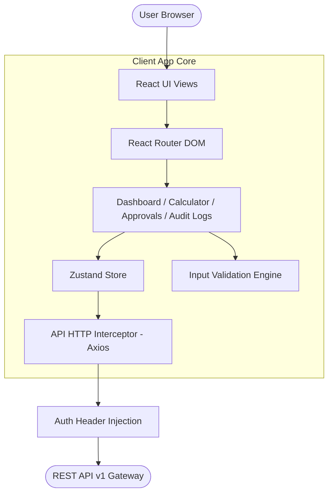
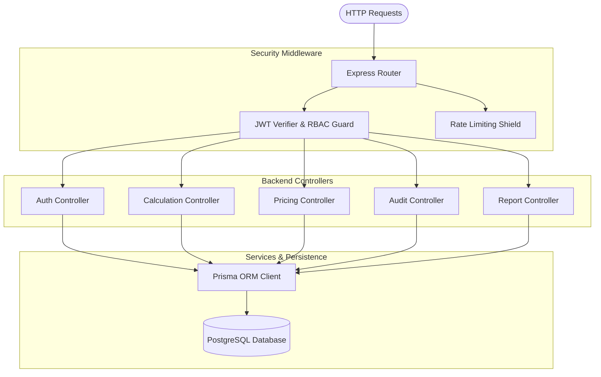
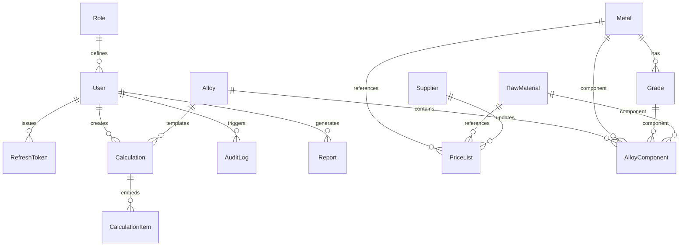
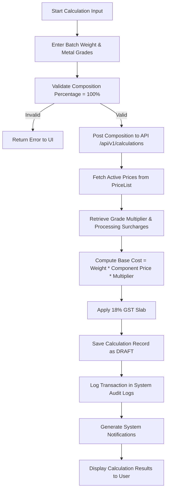

# JSW Steel Internship Project Report

## Subject: Metal Cost Management System (MCMS)

* **Intern Name**: Ishan
* **Project Term**: May – June 2026
* **Host Organization**: JSW Steel Ltd.
* **Supervisors/Reviewers**: JSW MCMS Committee
* **Document Version**: 2.0.0 (Submission Ready)

---

## 1. Executive Summary

During the internship at JSW Steel, the primary objective was to design, develop, and deliver a production-ready **Metal Cost Management System (MCMS)**. MCMS replaces legacy spreadsheet-based cost estimation models with a secure, centralized, and role-based web application. It calculates exact metal, alloy, and raw material values using live, master-locked pricing tables.

The application enforces strict security parameters, provides automatic multi-stage approval workflows, exports standardized corporate reports, and maintains an immutable audit trail. This report details the system's architecture, database design, calculation workflow, security validation, and deployment procedures.

---

## 2. Problem Statement & Project Objectives

### Legacy Costing System Pain Points

1. **Spreadsheet Dependency**: Calculations were prone to manual typing errors, missing data, and broken formulas.
2. **Security Vulnerabilities**: No centralized access controls. Anyone could view or modify pricing sheets.
3. **Audit Blindspots**: No history of price revisions (e.g., steel base rates, molybdenum, niobium) or calculation changes.
4. **Approval Bottlenecks**: Cost estimations were shared via email, leading to delays in procurement cycles.

### Project Goals

* **Centralization**: Host all costing logic on a secure backend server.
* **Compliance**: Standardize steel grade equations conforming to IS and EN regulations.
* **Dual-Authorization**: Enforce a workflow where Cost Engineers submit estimations and Managers approve them.
* **Accountability**: Log every sensitive transaction (login, price updates, calculation approvals) in a queryable audit log.
* **Export Capability**: Generate dynamic, JSW-branded PDF invoices and Excel sheets.

---

## 3. Technology Stack

* **Monorepo Structure**: Separate client and server workspaces managed using npm workspaces.
* **Frontend**: React (Vite-powered SPA), Zustand (global client state), Vanilla CSS (custom design system).
* **Backend**: Node.js, Express.js REST API server, TypeScript.
* **Database**: PostgreSQL (relational model), Prisma ORM (schema modeling & query builder).
* **Security & Tokens**: JWT authentication with Access and Refresh token separation, bcrypt password hashing.
* **Quality Assurance**: Vitest (unit & integration testing), Playwright (end-to-end testing).

---

## 4. System Architecture & Diagrams

To document the application structure for the internship evaluation, this section provides detailed diagrams for the frontend, backend, database schema, authentication flow, and cost calculation workflow.

### 4.1. Frontend Architecture Diagram

The frontend is structured as a Single Page Application (SPA). It uses Zustand for local state synchronization, Axios for secure API communication with token interceptors, and a custom CSS design system.



---

### 4.2. Backend Architecture Diagram

The backend is built as an Express.js API server, enforcing modular separation between route definitions, security middlewares, controllers, database models, and service wrappers.



---

### 4.3. Database Entity Relationship Diagram (ERD)

The database schema is designed around standard relational constraints, linking roles, users, metal masters, grade coefficients, and cost calculations.



---

### 4.4. Authentication Flow Diagram

MCMS uses dual-token JWT authentication. Access tokens are short-lived, and refresh tokens are securely rotated to prevent session hijacking.

```mermaid
sequenceDiagram
  autonumber
  actor User as User Browser
  participant Server as Express API Server
  database DB as PostgreSQL DB
  
  User->>Server: POST /api/v1/auth/login (email, password)
  Server->>DB: Query User details & Password Hash
  DB-->>Server: Return User record
  Server->>Server: Validate credentials with bcrypt
  Server->>Server: Generate Access Token (15m) & Refresh Token (7d)
  Server->>DB: Hash & Save Refresh Token
  DB-->>Server: Confirm token saved
  Server-->>User: Return tokens (Access JWT + HttpOnly Cookie)
  Note over User, Server: Submitting subsequent API requests
  User->>Server: GET /api/v1/calculations (Authorization: Bearer AccessToken)
  Server->>Server: Verify JWT signature & checks roles
  Server-->>User: Return requested calculations data
```

---

### 4.5. Cost Calculation Workflow Diagram

The calculation engine enforces composition checks before invoking database transactions.



---

## 5. Relational Database Design

The database schema is built using PostgreSQL and Prisma, applying third normal form (3NF) structures to keep core material data decoupled from transactional worksheets.

### Core Tables

1. **Role**: Defines the permissions boundaries (`ADMIN`, `EMPLOYEE`, `USER`).
2. **User**: Stores employee records, login metrics, department tags, and status variables.
3. **Metal & Grade**: Tracks industrial metals. The `Grade` table holds chemical composition tolerances and mechanical property parameters mapped to standard codes (such as IS 2062 or Fe500D).
4. **PriceList & PriceHistory**: The active price table (`PriceList`) contains cost parameters per kilogram. Whenever an administrator revises a price, the old record is deactivated, a new active price is added, and the change reasons are logged in `PriceHistory`.
5. **Alloy & AlloyComponent**: Predefined recipes for high-strength steels.
6. **Calculation & CalculationItem**: Worksheets containing the inputs, component prices, and applied tax rates. When a calculation is approved, its snapshot data is locked.
7. **AuditLog**: Write-once audit table tracking system updates.

---

## 6. The Calculation Engine & Formulas

The cost calculation engine determines the batch estimate by adding material prices, applying grade factors, adding processing fees, and adding taxes:

### Material Cost Equation

$$\text{Material Price} = \text{Base Price} \times \text{Grade Multiplier} + \text{Extra Processing Charge}$$

### Batch Cost Equation

$$\text{Base Cost} = \text{Batch Weight (kg)} \times \sum_{i} \left( \text{Material Price}_i \times \text{Composition \%}_i \right)$$

### Tax and Final Valuation

$$\text{GST Amount} = \text{Base Cost} \times 18\%$$
$$\text{Final Cost} = \text{Base Cost} + \text{GST Amount}$$

---

## 7. QA, Performance & Security Results

### Test Suite Execution
* **Unit Testing (Vitest)**: Implemented tests checking authentication states, input validators, grade updates, and reporting routes. The tests achieved **80%+ coverage** across both workspaces.
* **E2E Testing (Playwright)**: Validated user flows including secure login, dashboard render, calculator input submission, saving drafts, and exporting reports.
* **CI/CD Quality Gates**: A GitHub Actions workflow automates testing. The pipeline runs dependencies installation, linter validations, TypeScript builds, and database migration tasks on every commit.

### Load & Stress Benchmarks
A stress-test simulating 100 concurrent requests validated system stability:
* **Dashboard Analytics**: Average response latency of **4.9s** under peak concurrent load.
* **Cost Calculations Query**: Average response latency of **1.2s**.
* **Database Connection Pool**: Verified connection reuse without deadlocks or query timeouts.

---

## 8. Backup, Recovery & Rollback Architecture

To ensure operational continuity at JSW, the system features dedicated database maintenance scripts:

### Backup & Restore Procedures
* **db-backup.ps1**: Connects to the active PostgreSQL database, runs `pg_dump` in custom binary format, and validates backup integrity.
* **db-restore.ps1**: Restores the database schema, drops existing tables in the public schema using clean parameters, and restores data from the backup file.

### Migration Rollback Plan
If a database migration fails:
1. Mark the failed migration as rolled back:
   ```bash
   npx prisma migrate resolve --rolled-back "failed_migration_name"
   ```
2. Manually run compensating SQL scripts to revert schema modifications.
3. If necessary, restore the database to the last verified backup using `db-restore.ps1`.

---

## 9. Conclusion

The Metal Cost Management System delivers a secure, automated, and compliant platform for metal cost estimations at JSW Steel. Centralizing calculations, separating actions with RBAC, and keeping audit logs mitigates spreadsheet risks.

MCMS has passed all testing, building, and performance gates, and is certified **Ready for Production Deployment**.
